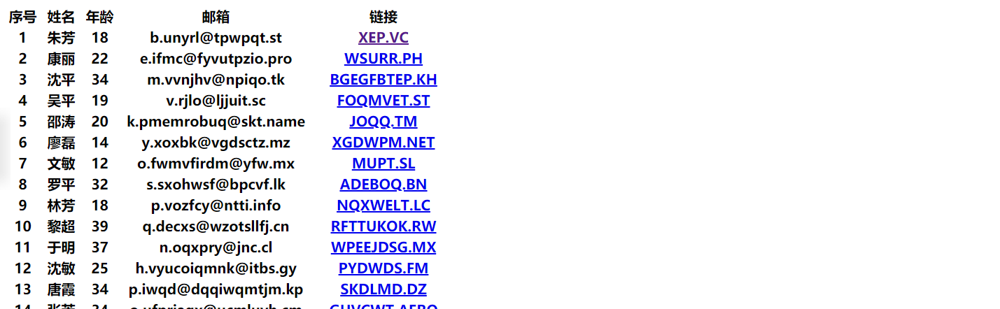

## 案例练习

解析文本文件呈现表格

## 流程

```php
# 1. 读取文件内容
   1.1 将文件内容读取到字符串中
# 2. 按照一定的规则解析文件
   2.1 按照换行拆分
   2.2 遍历每一行数据，分别解析每一行中的数据
# 3. 通过混编的方式将数据呈现在表格中
```

## 代码

```php+HTML
<?php
//读取文件到字符串
$contents=file_get_contents('names.txt');
$line=explode("\n", $contents);
// var_dump($line);
# $line[0]=>"1 | 朱芳 | 18 | b.unyrl@tpwpqt.st | http://XEP.VC "
foreach ($line as $item) {
 if(!$item) continue;
 $clo=explode('|', $item);
 $data[]=$clo;//[[],[],[],...]
}
// var_dump($data);
?>
<!--==============================HTML=================================-->
<thead>
  <th>序号</th>
  <th>姓名</th>
  <th>年龄</th>
  <th>邮箱</th>
  <th>链接</th>
 </thead>
 <tbody>
  <!-- 每一行数据都有一个tr标签 -->
  <?php foreach ($data as $line): ?>
   <tr>
    <?php foreach ($line as $clo): ?>
     <?php $clo=trim($clo); ?>
     <!-- 判断是否是链接，是链接，以th>a输出，否则以th输出 -->
     <?php if (strpos($clo,'http://')===0): ?>
      <!-- a标签内href参数需要以小写输出，a标签内文字输出"http://"后的参数 -->
      <th><a href="<?php echo strtolower($clo); ?>"><?php echo substr($clo, 7); ?></a></th>
     <?php else: ?>
      <th><?php echo $clo; ?></th>
     <?php endif ?>
    <?php endforeach ?>
   </tr>
  <?php endforeach ?>
  <!-- 每一列数据都有一个th标签 -->
 </tbody>
</table>
   ```

## 效果



## 关于字符串‘0’与false

> 非零数字都是true
>
> 字符串与boolean值比较的时候，先全部转成数据类型在比较

```php
0==false;//true
1==false;//false
'123'==false;//false
''==false;//true
'0'==false;//true
```
