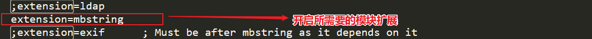
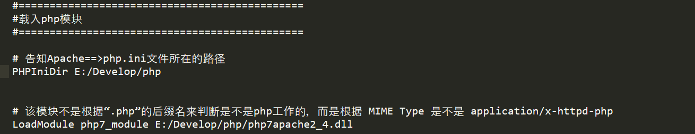

:::info
php与apache之间就是apache`唤醒`php的关系
:::

:::danger 注意: 每次修改了配置文件信息之后一定要重启Apache，否则不会生效
:::

## 在PHP的安装目录下创建一个`php.ini`文件

## 修改`php.ini`文件中的extension_dir的物理路径

```ini
;告知php到该目录下去寻找扩展
extension_dir = "E:/Develop/php/ext"
```

## 同时开启该文件中所需要的模块扩展



## 使用phpinfo()函数可以查看php配置信息


```php
# 由此可知php.ini默认文件位置是C:\WINDOWS
# 可以选择将php.ini文件移动到该目录下
# 但是更好的选择是修改Apache中指向该文件的路径，方便管理
```

## 打开Apache配置文件`httpd.conf`

```php
# 告知Apache==>php.ini文件所在的路径
PHPIniDir E:/Develop/php
```



> 使用
---

```php
# php所有的能力都是由函数来完成的
$str='hello';
# 获取字符串长度
echo $str.'======'.strlen($str);
echo '<br>';
echo '你好'.'======（中文字符是宽字符，一个汉字相当于三个罗马字符）=========='.strlen('你好');
echo '<br>';
echo '你好'.'=======(使用扩展mbstring模块之后，重启Apache，就能使用"mb_XXX"函数来执行了)======='.mb_strlen('你好');
```

> 浏览器渲染效果
---


