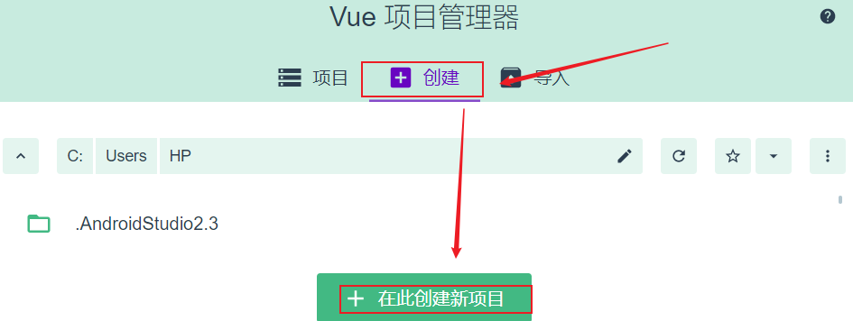
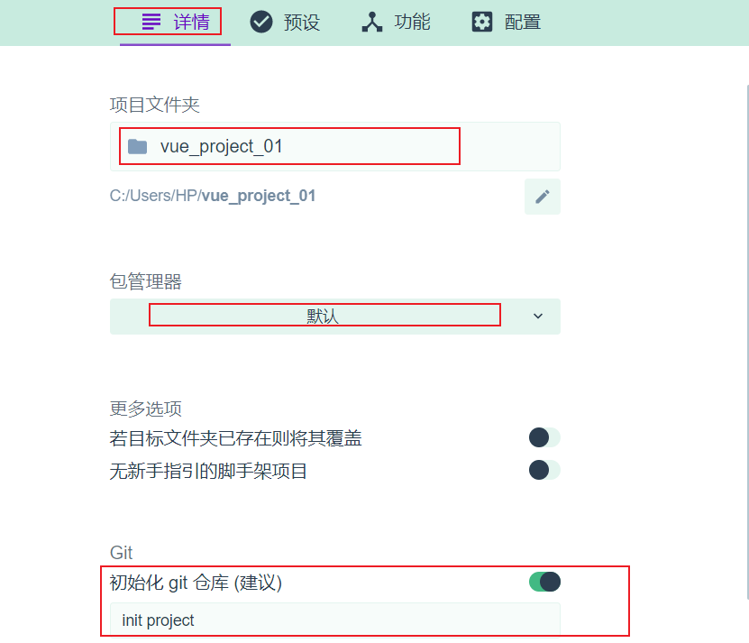
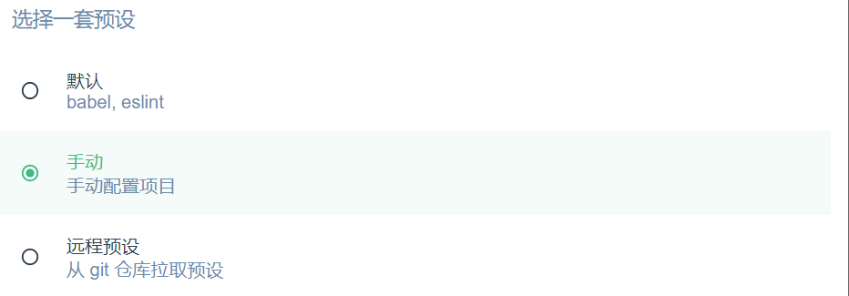
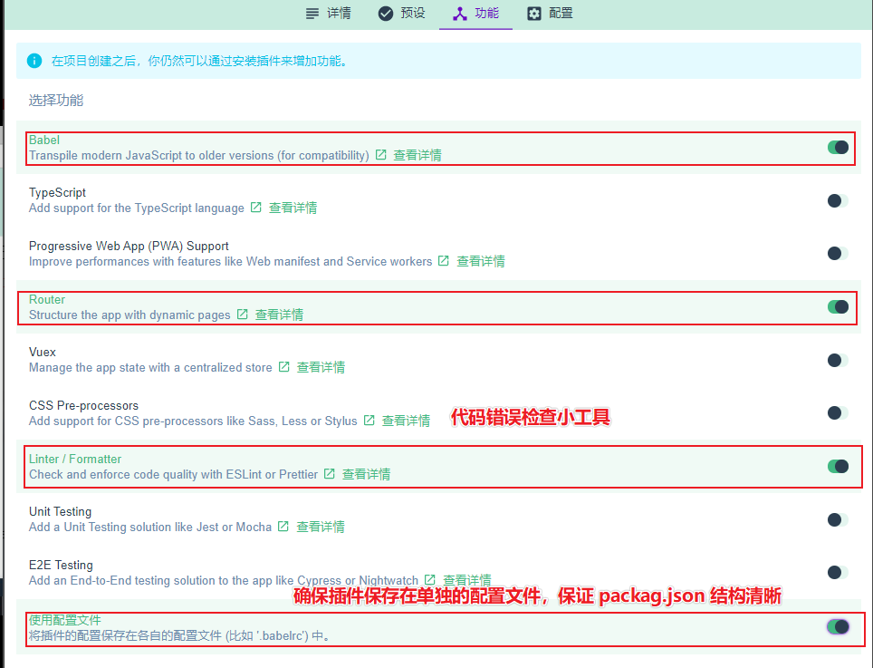
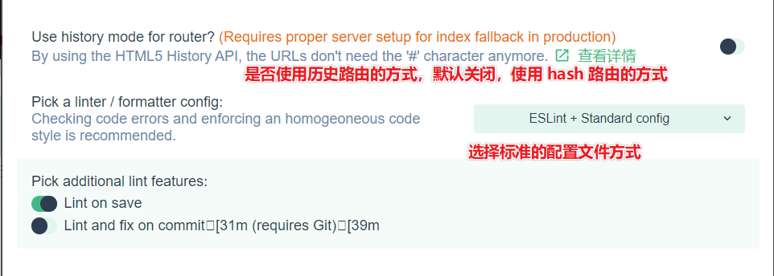
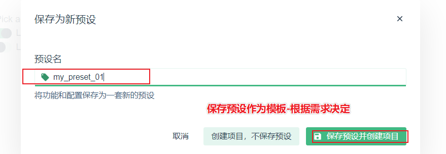
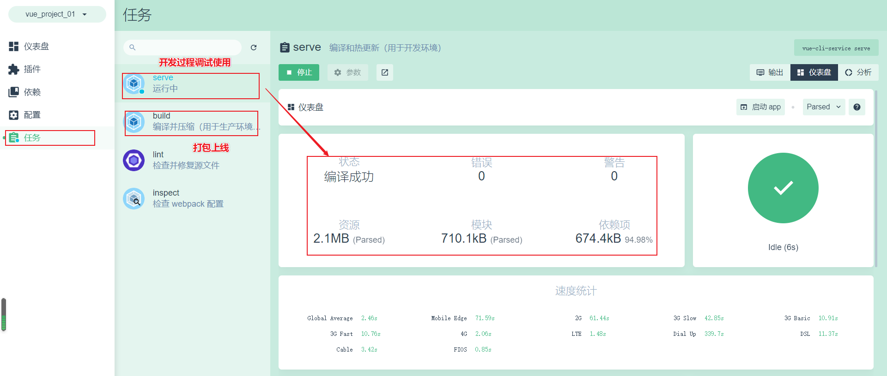
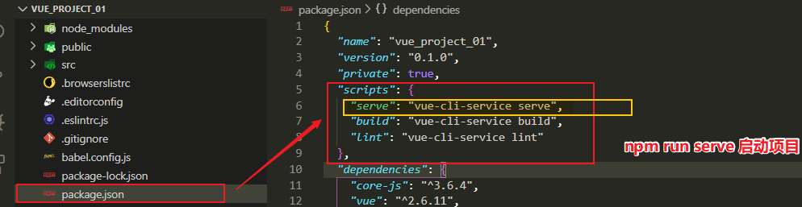
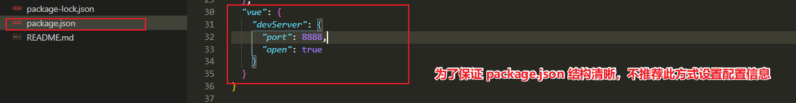
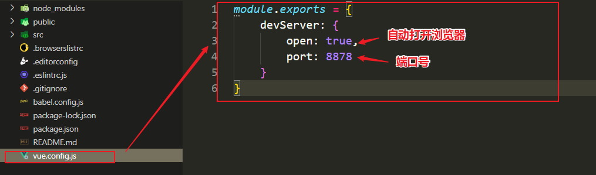

## Vue 脚手架基本用法

快速生成 Vue 项目基础架构

```js
- 安装 3.x 版本的 Vue 脚手架
npm install -g @vue/cli
// 或者 cnpm i @vue/cli -g
- 检查安装成功与否（脚手架版本号）
vue -V 
// @vue/cli 4.2.3
```

## 基于 3.x 版本的脚手架创建 vue 项目

```js
// 法一：交互式命令行
vue create my-project
// 法二：图形化界面
vue ui
// 基于 2.x 的旧版本创建
npm install -g @vue/cli-init
vue init webpack my-project
```

## 图形化界面















## Vue 脚手架生成地项目结构分析


## 通过 package.json 配置项目（不推荐）





## 通过单独的配置文件配置项目 （推荐）


