## v-bind 三种用法

1. 直接v-bind
2. 简化：`:`
3. 绑定的时候拼接绑定内容：`title="btnTitle + '，这是追加内容'"`

## v-on 绑定事件

## 表单控件使用

### 1. radio

使用 `v-model` 绑定参数，当`参数=value`的时候，该控件被选中

### 2. checkbox

使用 `v-model` 绑定参数，当 `参数=value` 的时候，该控件被选中

> 注意：使用 checkbox 的时候，存储数据应使用 数组
>
> 获取数据：默认获取以下类型数据，如不想获得  `__ob__` 监视器对象，可以使用 `toString()` 转成字符串

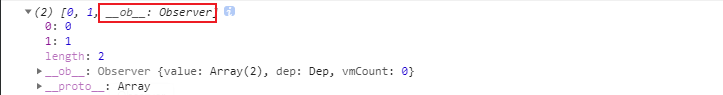

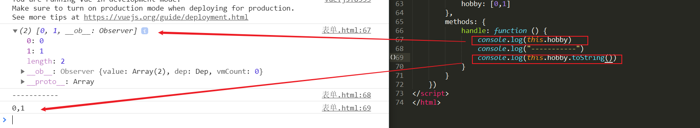

### 3. select - option

使用 `v-model` 绑定参数给 `select` 标签，对应的 多个`option` 标签的 `value` 应不同，当 `参数=value`时，相应的 `option` 被选中

> 该控件使用有两种情况： 1. 单选，使用数值存储即可
>
>              2. 多选，在select标签上添加参数 `multiple` ，对应的参数存储使用 数组

```html
<span>职业：</span>
<select v-model="occupation">
    <option value="0">请选择职业..</option>
    <option value="1">教师</option>
    <option value="2">软件工程师</option>
    <option value="3">动画特效师</option>
</select>
```

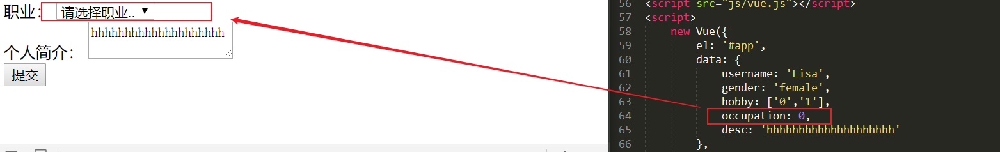

```html
<span>职业：</span>
<select v-model="occupation" multiple>
    <option value="0">请选择职业..</option>
    <option value="1">教师</option>
    <option value="2">软件工程师</option>
    <option value="3">动画特效师</option>
</select>
```

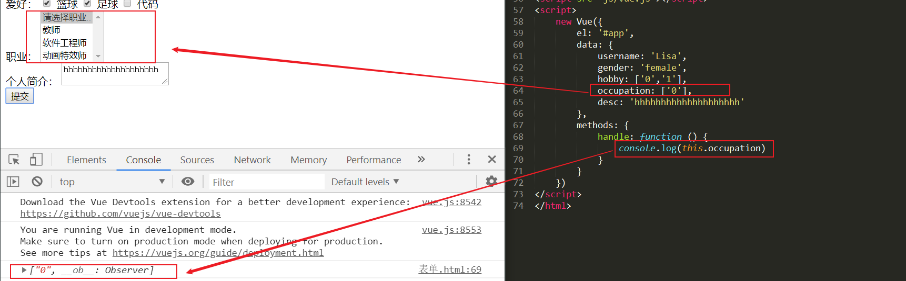

## 表单修饰符

> - .number：转化为数值
>
>   - input标签输入直接是字符串，使用 `.number` 就可以转化成数值，这样和数值进行运算的时候才不会变成字符串的拼接
>
> - .trim：去掉开始和结尾的空格
>
> - .lazy：将 input 时间切换为 change 事件（即在失去焦点或按下回车键才更新）
>

### `.number`

```html
<div id='app'>
    <input type="text" v-model="age">
    <button @click="handle">点击</button>
</div>
<script type="text/javascript" src="js/vue.js"></script>
<script type="text/javascript">
    var vm = new Vue({
        el: '#app',
        data: {
            age: ''
        },
        methods: {
            handle: function () {
                // console.log("age:" + this.age + '---' + this.age.length)
                // console.log("month:" + this.month)
                console.log(this.age + 13);
                // cosole.log(this.month)
            }
        }
    })
</script>
// 输入 14 => 1413 (字符串拼接)
```

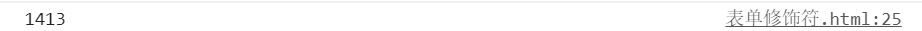

```html
<div id='app'>
+    <input type="text" v-model.number="age">
    <button @click="handle">点击</button>
</div>
<script type="text/javascript" src="js/vue.js"></script>
<script type="text/javascript">
    var vm = new Vue({
        el: '#app',
        data: {
            age: ''
        },
        methods: {
            handle: function () {
                // console.log("age:" + this.age + '---' + this.age.length)
                // console.log("month:" + this.month)
                console.log(this.age + 13);
                // cosole.log(this.month)
            }
        }
    })
</script>
// 输入 14 => 27 (数值运算)
```


### `.trim`

```html

<div id='app'>
    <label for="age">年龄</label>
    <input type="text" id="age" v-model.trim="age">
    <label for="month">月份</label>
    <input type="text" id="month" v-model="month">
    <!-- <p>{{month}}</p> -->
    <!-- <input type="text" v-model="month"> -->
    <button @click="handle">点击</button>
</div>
<script type="text/javascript" src="js/vue.js"></script>
<script type="text/javascript">
    var vm = new Vue({
        el: '#app',
        data: {
            age: '',
            month: ''
        },
        methods: {
            handle: function () {
                console.log("age:" + this.age + '---' + this.age.length)
                console.log("month:" + this.month + '---' + this.month.length)
            }
        }
    })
</script>
// 年龄使用.trim，月份不使用以作对比
```

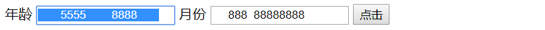

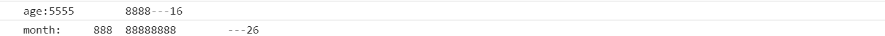

使用了 `.trim` 标识符的 `input` 在失去焦点的时候就执行该命令，马上删去开始和结尾的空格

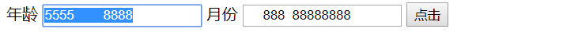

## 自定义指令

内置指令不满足需求的时候

### 过滤器

格式化数据，可多个使用，后一个过滤器是处理 `前一个过滤器产生的结果`

## 数组API

### 变异方法（修改原有数组）

- push()
- pop()
- shift()
- unshift()
- splice()
- sort()
- reverse()

### 替换数组（生成新数组）

- filter()
- concat()
- slice()

## 数组响应式变化

> 通过索引修改数组不会响应式变化
>
> - vm.list[1] = 'lemon'

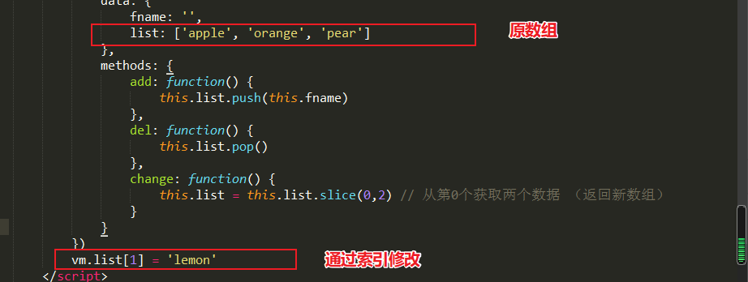

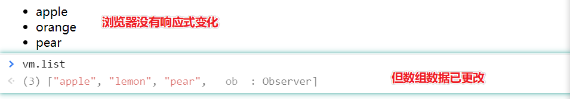

### 修改响应式数据

- Vue.set( vm.items, indexOfItem, newValue )
- vm.$set( vm.items, indexOfItem, newValue )
  - vm.items => 数组名称
  - indexOfItem => 数组索引 / 也可以修改对象的属性值
  - newValue => 数组的新值

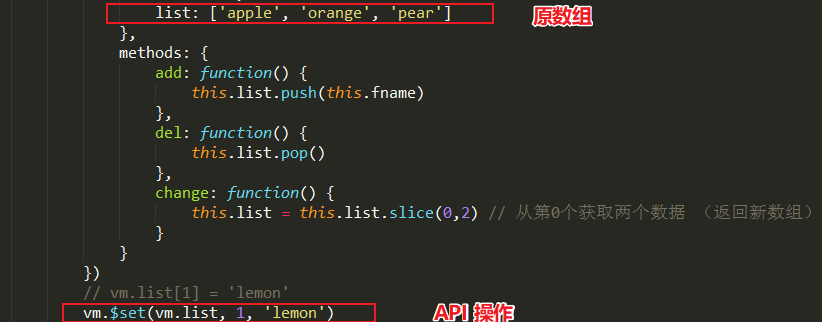

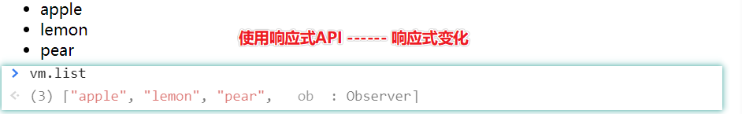

### 修改对象属性值

通过属性值修改数组不会响应式变化

#### vm.info.gender='male'

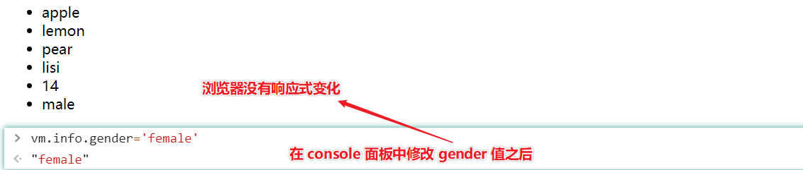

#### vm.$set(vm.info, 'gender', 'male')

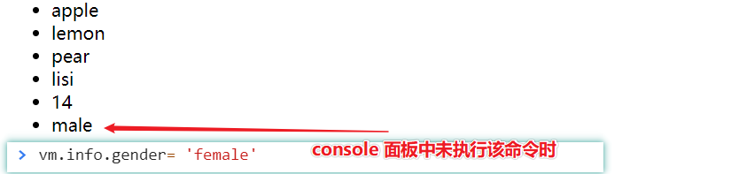

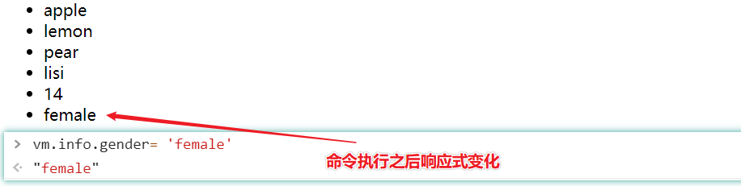
