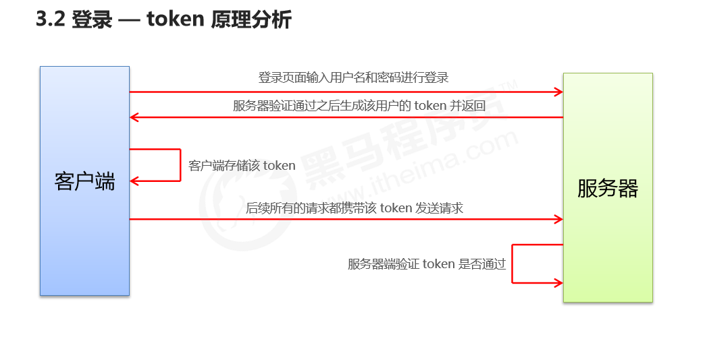

```js
 // 为路由对象，添加 beforeEach 导航守卫  
router.beforeEach(
    (to, from, next) => {    
        // 如果用户访问的登录页，直接放行    
        if (to.path === '/login') return next()    
        // 从 sessionStorage 中获取到 保存的 token 值    
        const tokenStr = window.sessionStorage.getItem('token')    
        // 没有token，强制跳转到登录页    
        if (!tokenStr) return next('/login') 
     next() 
 }) 
```

> next() // 放行
>
> next('/login') // 强制跳转
