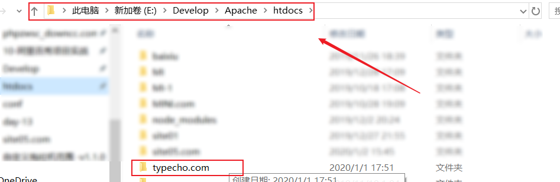
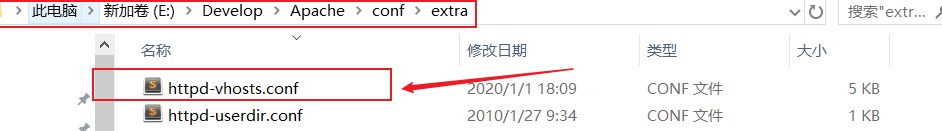
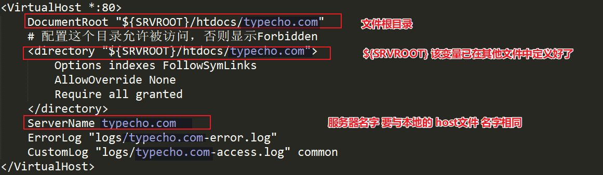
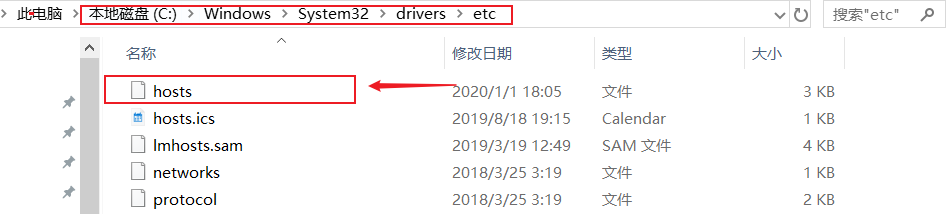
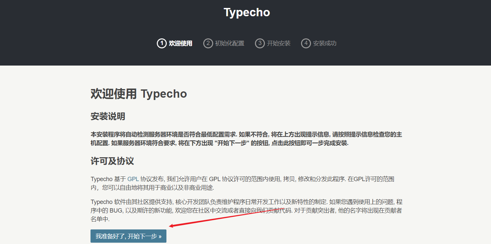
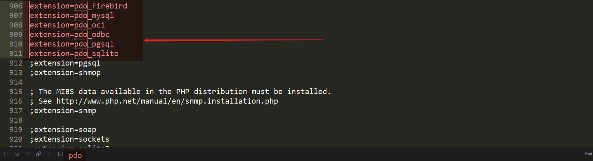
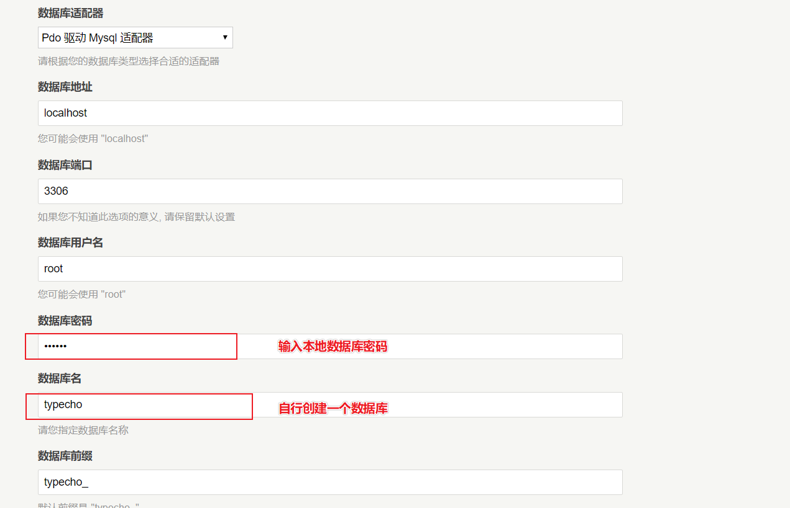

## 解压源码文件

- 将源文件放置到 `你想放的文件目录` 下

## 配置虚拟主机

- 打开 服务器软件 （我使用的是 Apache ）
- 在 `https-vhosts` 文件中设置配置信息

   

   

## 在本地hosts文件中设置 IP 地址

- 用记事本打开即可
- 
- 
- 保存文件

## 重启 Apache

即可在浏览器中访问 `typecho.com`

## 跟随提示接着往下执行

   

## 设置 PHP 扩展

要使用`数据库适配器`，需要开启 `php` 中的一些文件扩展-

- 打开 `php.ini` 文件，打开所有带 `pdo` 的扩展
- 

:::info 改完配置文件之后 一定要重启  Apache
:::

- 自行创建一个空的数据库即可，表的结构无需自己创建

   

- 直接访问即可

   
