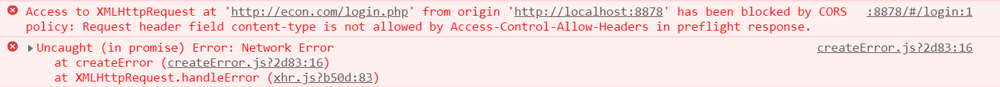

## 客户端发起预请求 OPTIONS，询问服务端支持的自定义请求头字段

```text
Request URL: http://econ.com/login.php
Request Method: OPTIONS
Status Code: 200 OK
Remote Address: 127.0.0.1:80
Referrer Policy: no-referrer-when-downgrade
```

## 服务器针对客户端发送支持的 HTTP 请求头字段

```text
Access-Control-Allow-Origin: http://localhost:8878
access-control-expose: authorsization
Connection: Keep-Alive
Content-Length: 126
Content-Type: text/html;charset=UTF-8
Date: Wed, 18 Mar 2020 09:33:01 GMT
Keep-Alive: timeout=5, max=100
Server: Apache/2.4.37 (Win64) OpenSSL/1.1.0i PHP/7.2.24
X-Powered-By: PHP/7.2.24
```

:::tip 解决方案，在服务端设置可接收请求的头信息 :::

```js
header('Access-Control-Allow-Headers: Content-Type,XFILENAME,XFILECATEGORY,XFILESIZE')
```
