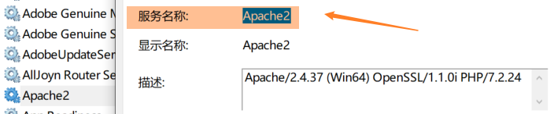
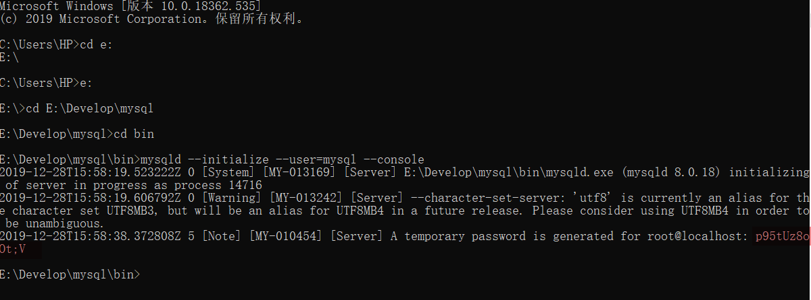
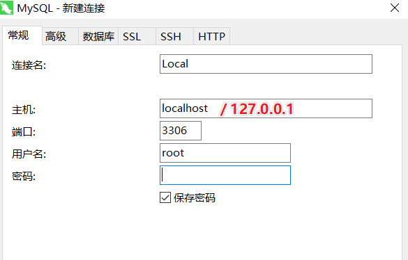
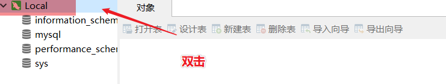
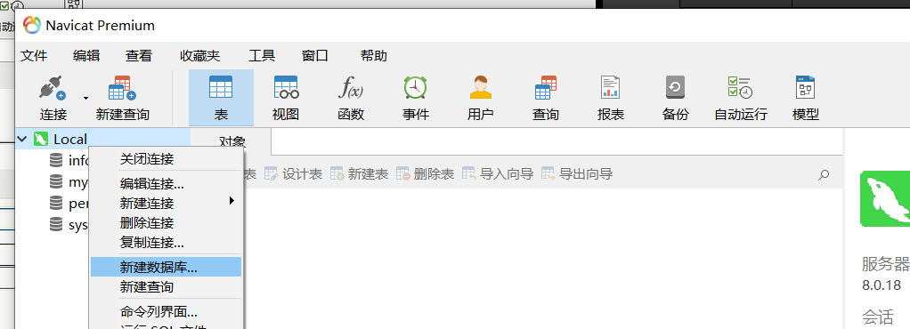

## 删除已有的服务

管理员身份打开命令行，使用 `sc [command] [serviceName]`操作服务

> sc delete MySQL  # 删除已有的 MySQL 服务 (其中服务的名字要在详情中查看)



## 删除安装目录下的 `data` 文件夹

## 重新初始化数据库

1. 命令行切换到安装目录下的 `bin`文件夹
  
    ```bash
    mysqld --initialize --user=mysql --console
    ```
  
2. 复制临时密码



p95tUz8oOt;V

## 安装服务

  ```bash
  mysqld --install MySQL
  ```

:::tip 提醒 `Service successfully installed.`，则服务安装成功
:::

## 启动服务

直接打开服务，右键启动；或者使用命令行

```bash
> net start [serviceName]
>
> net start MySQL # 一定要启动服务之后在执行下一步操作
```

## 修改密码

```bash
> mysql -u root -p
```

将之前的临时密码黏贴复制

```bash
> set password for root@localhost = password('123456') ;
```

:::danger 一旦忘记密码，基本是`不可能找回`的，因此，为避免遗忘，尽量将密码取得简单一些
注意：mysql5.7以后版本修改初始密码的语句为：

mysql> ALTER USER 'root'@'localhost' IDENTIFIED BY 'root密码';
> ALTER USER 'root'@'localhost' IDENTIFIED BY '123456';
:::

:::tip 提示 `Query OK, 0 rows affected (0.09 sec)` 即表示密码修改成功
:::

## 退出mysql环境，重新登陆即可

> exit; # 推出环境
>
> mysql -u root -p # 输入修改后的密码即可

## MySQL 使用可视化工具

### 创建连接


### 输入密码



### 双击创建连接，图标变绿 => 成功



### 新建数据库

注意：新建数据库的时候，选择字符集 utf8，排序规则 utf8_general_ci，以保证支持中文输入



:::tip
char 与 varchar 的区别：

var固定长度 = > 效率高（不用申请空间）

varchar 可变长度 （根据输入改变）
:::
