## 开始

1. 注册 sentry

2. 点击 `Qucik Start` 快捷创建项目，选择`项目对应的前端框架`及`项目所属的团队`

3. 新建完毕根据 `Configure SDK` 指引，在项目中做引入

   - Install 安装依赖（React）

     ```zsh
     # Using yarn
     yarn add @sentry/react

     # Using npm
     npm install --save @sentry/react
     ```

   - Configure

     ```react
     import { createRoot } React from "react-dom/client";
     import React from "react";
     import * as Sentry from "@sentry/react";
     import App from "./App";

     Sentry.init({
       dsn: "https://******.ingest.sentry.io/******",
       integrations: [new Sentry.BrowserTracing(), new Sentry.Replay()],
       // Performance Monitoring
       tracesSampleRate: 1.0, // Capture 100% of the transactions, reduce in production!
       // Session Replay
       replaysSessionSampleRate: 0.1, // This sets the sample rate at 10%. You may want to change it to 100% while in development and then sample at a lower rate in production.
       replaysOnErrorSampleRate: 1.0, // If you're not already sampling the entire session, change the sample rate to 100% when sampling sessions where errors occur.
     });

     const container = document.getElementById("app");
     const root = createRoot(container);
     root.render(<App />)
     ```

   - Verify（代码中手动创造一个 error）

     ```react
     return <button onClick={() => methodDoesNotExist()}>Break the world</button>;
     ```

   - Next Steps

     - [Source Maps](https://docs.sentry.io/platforms/javascript/guides/react/sourcemaps/): Learn how to enable readable
       stack traces in your Sentry errors.
     - [React Features](https://docs.sentry.io/platforms/javascript/guides/react/features/): Learn about our first class
       integration with the React framework.

## 数据上报

### 前端常见方案

1. 代码埋点：开发自行定义
2. 可视化埋点：第三方方案，通过配置，对 UI 通用类的元素进行设置
3. 无痕埋点：通过嵌入 SDK，来监控前端页面或者 http 请求的数据埋点

| -          | 代码埋点   | 可视化埋点  | 无痕埋点         |
| ---------- | ---------- | ----------- | ---------------- |
| 方式       | 手动开发   | 可视化圈选  | 嵌入 SDK         |
| 数据自定义 | 易         | 难          | 难               |
| 更新       | 需要更新   | 配置更新    | 无需更新         |
| 成本       | ++++       | ++          | +                |
| 场景       | 高度自定义 | UI 通用数据 | 生命周期数据埋点 |

一般情况下，通过`与后台约定好具体的数据格式`，前端在埋点采集的时候自动转换成接口需要的数据格式进行本地存储，然后进行上报

:::tip 实际项目中，在用户点击的时候记录用户信息及功能模块，传给后台

有效的数据埋点，既可用于单用户的链路操作的追踪，也可用于整体用户数据的统计，针对这些数据做相应的调整 :::

:::tip 用户日志自动化埋点

通常用来定位用户问题时使用，通常需要提前在代码中打印日志，通过全局代理、装饰器处理关键模块和方法等方式来进行日志的自动打
印

:::

## react 项目接入

### Sentry 注册与配置

#### 注册账号

[点击该链接注册 sentry 账号](https://sentry.io/auth/login/)

#### 登录账号并创建项目

- 新建项目

  - platform：`REACT`

  - ProjectName： `xxxxxx-dashboard-frontend`

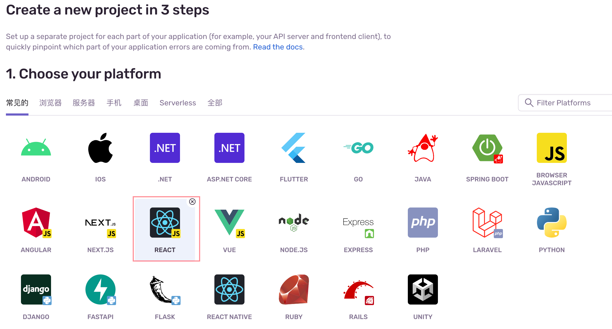

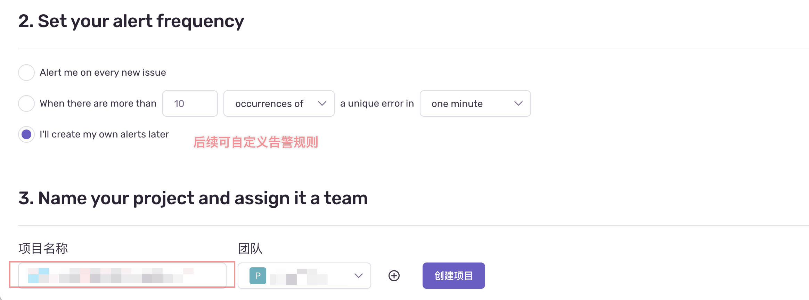

#### 获取项目 DSN （SENTRY_DSN）

`项目` >>> `设置` >>> `客户端密钥（DSN）`

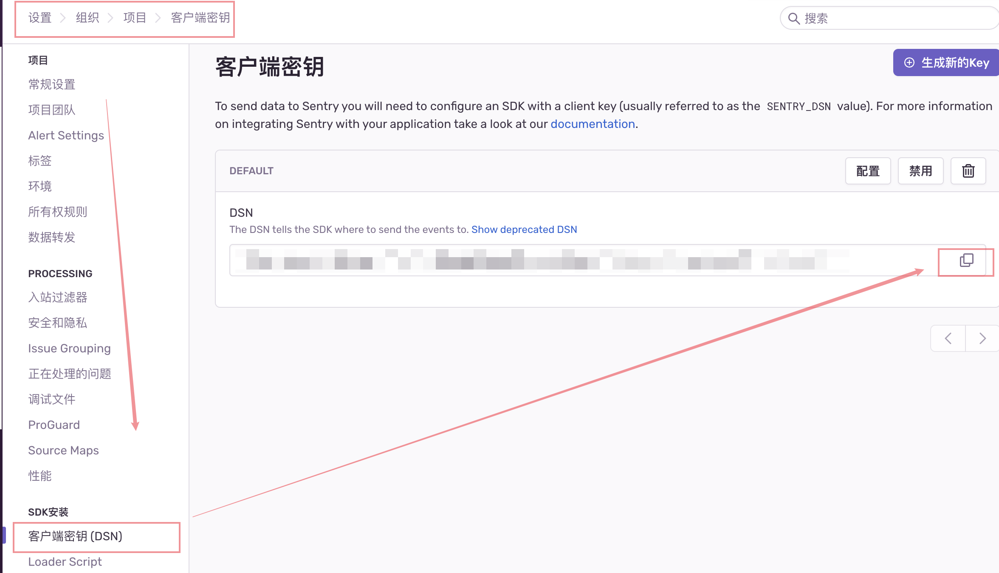

#### 获取项目 ORG（SENTRY_ORG）

`头像` >>> `组织设置` >>> `Organization Slug`

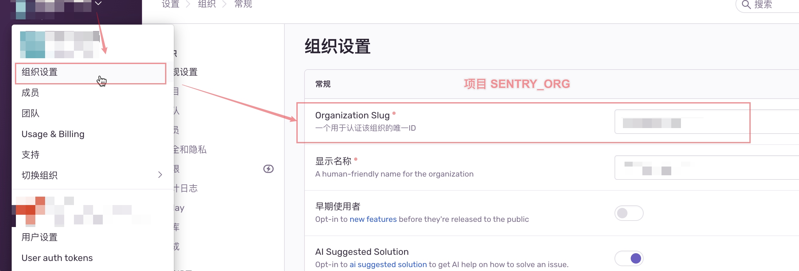

#### SENTRY_RELEASE_VERSION：`v1.0.1`（源码版本号：可自行维护）

#### 生成 API_AUTH_TOKEN 定位线上源码（SENTRY_AUTH_TOKEN）

:::tip 确保选中以下权限:

event:admin、event:read、member:read、org:read、project:read、project:releases、team:read、alerts:write、alerts:read、event:write、project:write
:::

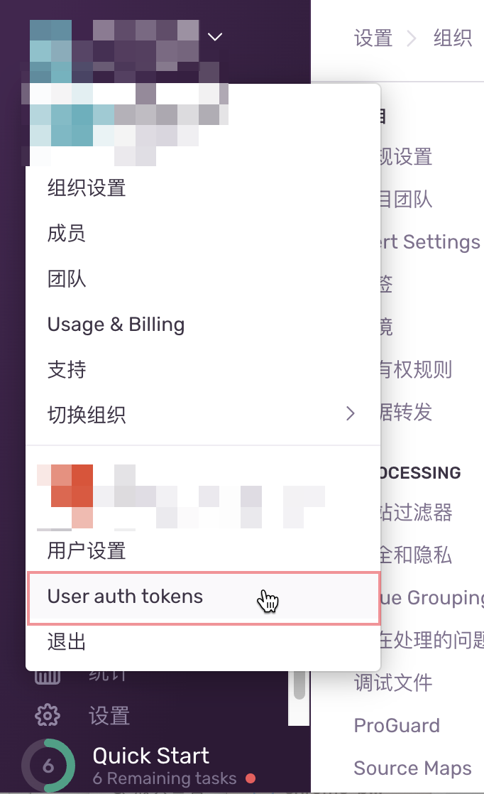

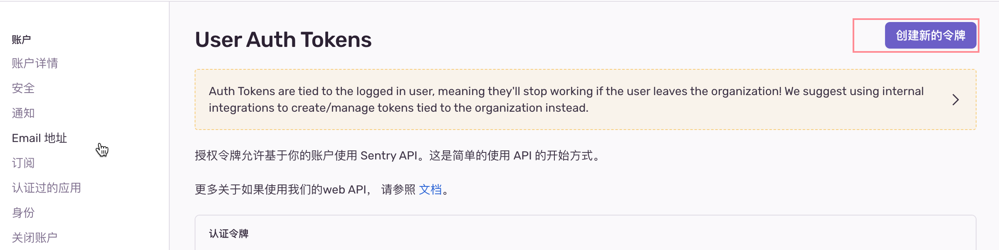

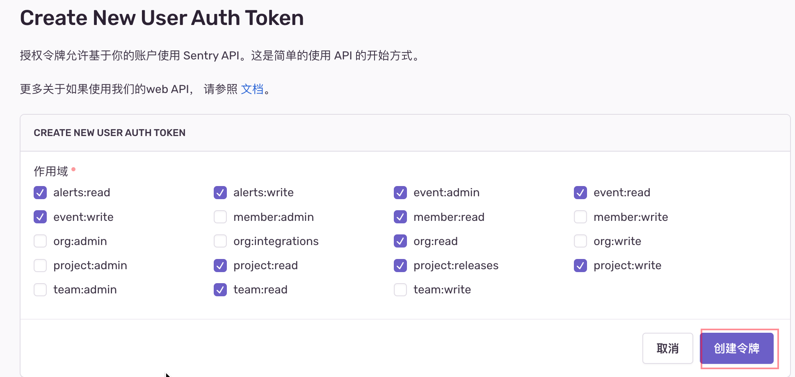

#### 获取以上 key 之后，可修改项目根目录下 .env 文件

```.env
SENTRY_DSN='******'

SENTRY_AUTH_TOKEN='*********'

SENTRY_RELEASE_VERSION='v1.0.1'

SENTRY_ORG='payssion',

SENTRY_PROJECT='payssion-dashboard-frontend',
```

### Sentry 配置 webhook 通知

:::tip

- `设置` >>> `项目` >>> 选择刚才创建的项目`payssion-dashboard-frontend`
- 滚动到页面最下方，选择`集成方式`，启动 `webhook`
- 同路径下，点击 `WebHooks`，粘贴飞书触发器 `webhook` 地址
  ：`https://www.feishu.cn/flow/api/trigger-webhook/8eaa13786b44a6d07e057f6223737be9`

:::

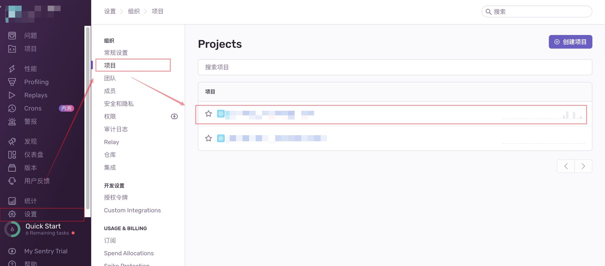

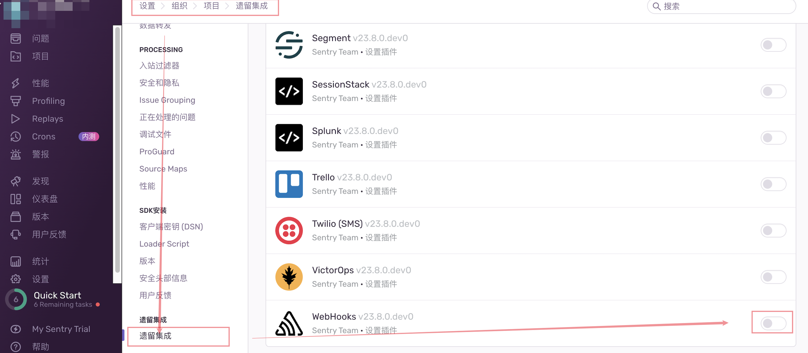

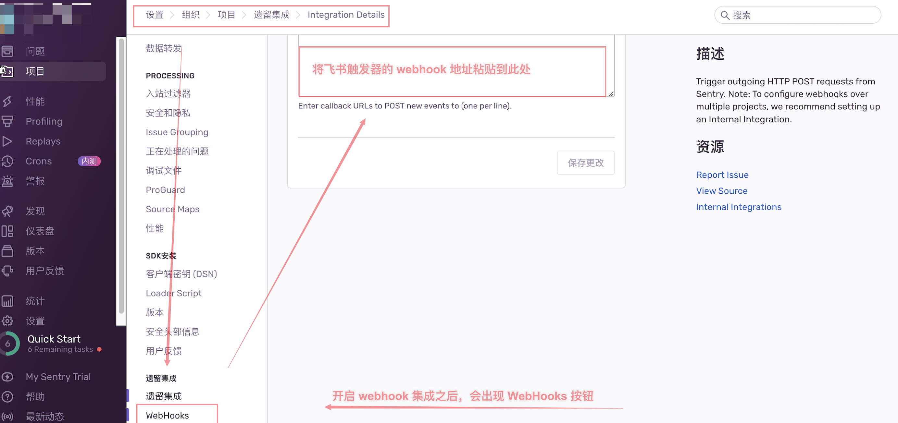

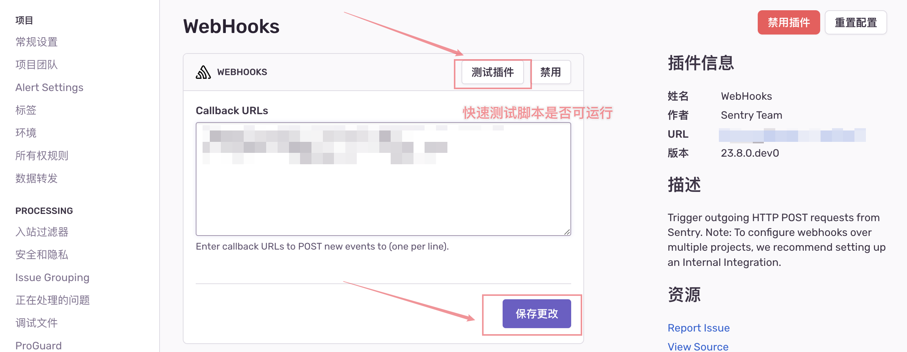
