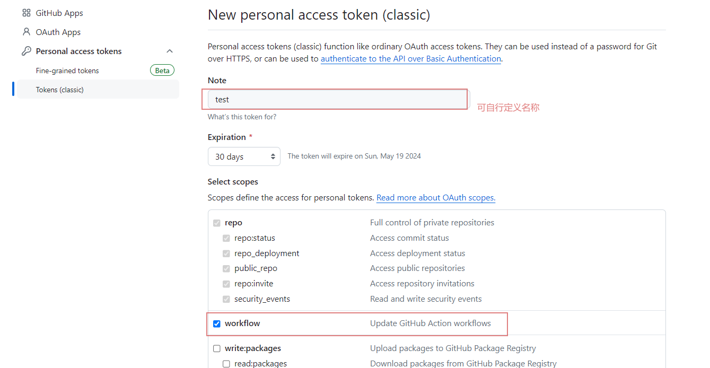

## 博客迁移

从 hexo 博客转移到 docusaurus 上

## docusarus 环境要求

- node 18+ （可以安装 nvm 管理多个 node 的切换）

## 安装 docusaurus

```shell
npx create-docusaurus@latest your-blog-project-name classic
```

:::tip

your-blog-project-name **必须** 定义为你的 github 名称

主要是为后续的 github 静态博客

e.g.: xxxx.github.io

:::

## docusaurus 项目结构

- blog 存放博客文章，默认会展示最新的几条博客
- docs 可以存放文档
- src 主要是针对博客本身做一些自定义操作
  - css 样式文件
  - pages 自定义页面
    - style.module.css 页面对应的样式文件
    - index.js 页面文件
- static 静态资源
  - img 图片
- docusaurus.config.js 配置文件（在这里可配置博客的一些基础信息）
- package.json 项目相关的一些三方依赖信息
- README.md 可以再此处补充你的项目信息
- sidebars.js 这里可以配置博客页面的侧边菜单信息（可以做一些超链接跳转）

## 安装依赖

```shell
npm install
```

## 本地启动

```shell
npm run start
```

## 手动构建

```shell
npm run build
```

## github 仓库 CI/CD 设置推送代码自动更新博客

## 配置 github 账户 ACCESS_TOKEN 为后续做准备





## 创建一个 workflow 来自动构建脚本


## 拷贝脚本到 workflow 文件中

### 脚本文件

```yml
name: Deploy Docusaurus Blog to GitHub Pages # 本次操作的名称定义

on:
  push:
    branches:
      - master # 可以根据实际情况修改分支名称（监听该分支的更新）

jobs:
  deploy:
    runs-on: ubuntu-latest

    steps:
      - name: Checkout repository
        uses: actions/checkout@v2

      - name: Set up Node.js # 安装 node 环境
        uses: actions/setup-node@v2
        with:
          node-version: '18'

      - name: Install dependencies # 下载依赖
        run: npm install

      - name: Build static files # 打包
        run: npm run build

      - name: Deploy to GitHub Pages # 发布到 gh-pages 分支
        uses: peaceiris/actions-gh-pages@v3
        with:
          github_token: ${{ secrets.ACCESS_TOKEN }} # 这个 ACCESS_TOKEN需要在 github 账户中去配置
          publish_dir: build
          user_name: yanadev
          user_email: 1245485816@qq.com
          commit_message: 'Deploy Docusaurus blog to GitHub Pages'
```


:::tip

至此，github 仓库的配置已经完成了

可以在本地做一些修改，推送到 main 分支检查是否能够正常更新

:::

## 一些自定义使用的 api

### useDocusaurusContext 站点的配置信息

- siteConfig 可以访问 docusaurus.config.js 中的 title 、tagline 等字段信息
- 对于 docusaurus.config.js 中不支持的字段，使用 customFields 自定义你需要的属性

```jsx
import React from 'react'
import useDocusaurusContext from '@docusaurus/useDocusaurusContext'

const Hello = () => {
  const { siteConfig } = useDocusaurusContext()
  const { title, tagline } = siteConfig

  return <div>{`${title} · ${tagline}`}</div>
}
```
