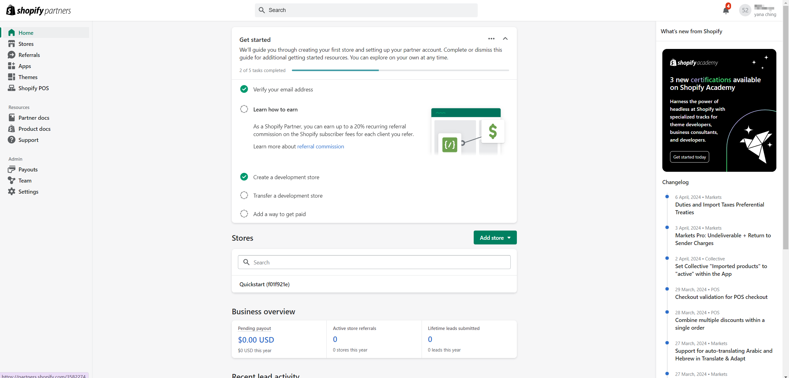
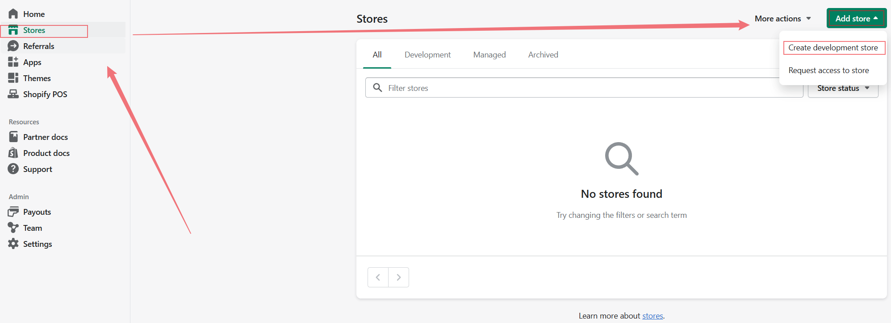
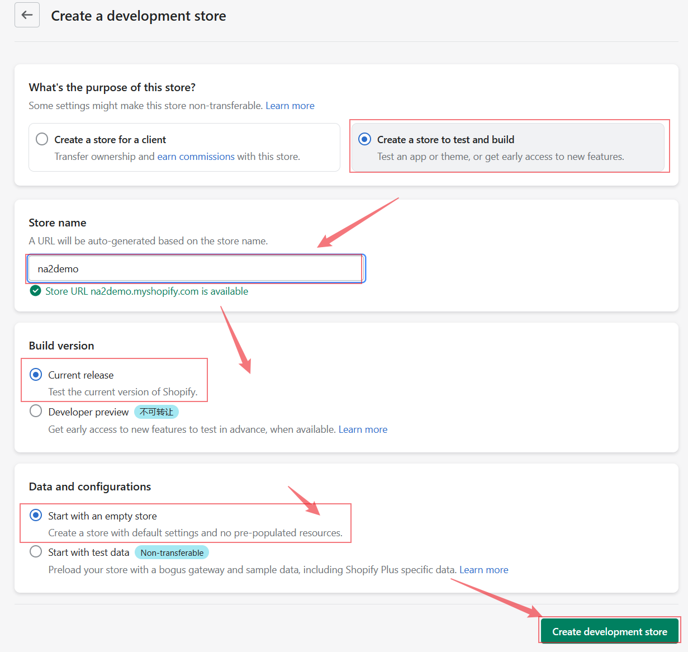
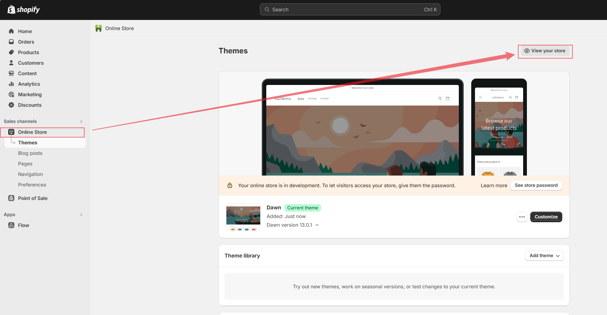
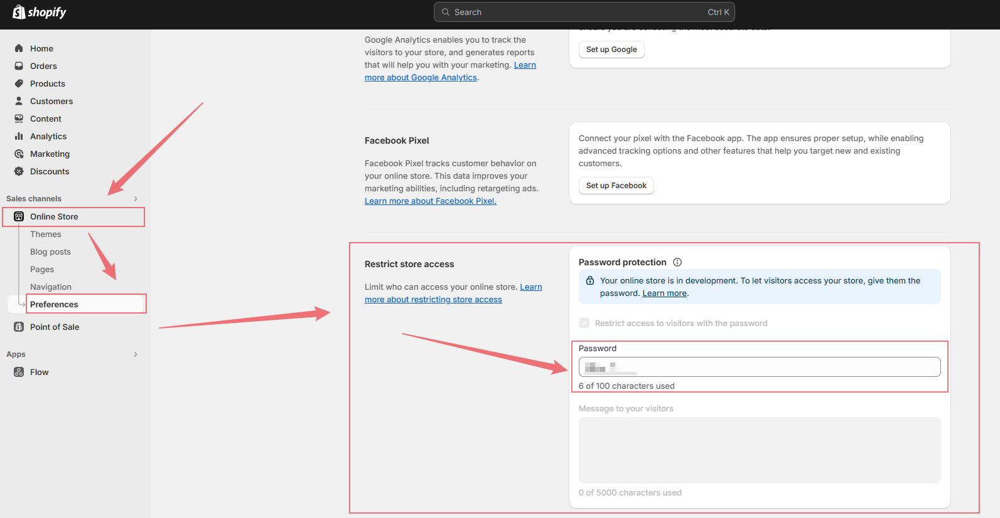
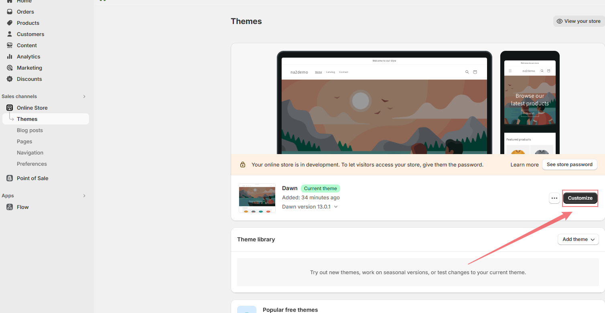

## 开发前准备

1. 注册一个 [shopify partner](https://www.shopify.com/partners) 的账户
2. 登录到用户后台 dashboard 中去,后台登陆的格式大概是 `https://partners.shopify.com/xxxxx?signup_intent=xxx`

    

3. 安装 @shopify/cli 和 @shopify/theme (这是基于已经有的项目做的初始化操作)
4. 运行 shopify 项目需要有 Ruby 的环境，所以还需要安装一下 Ruby（首选推荐安装 with devkit 版本的 Ruby）

## 关于 shopify 的 theme 与 app

theme 与 app 有不同的职责和作用：

:::info

主题（Theme）：主题是定义了商店外观和布局的模板文件集合。在 Shopify 主题开发中，您主要是对页面的 HTML 结构和 Liquid 模板进行操作，以实现商店的视觉效果和布局。**可以使用 HTML 和 Liquid 模板语言来动态生成页面内容，包括产品列表、购物车、结账页面等，从而实现页面的视图渲染和交互效果**。
:::

:::info
应用（App）：应用是为商店提供特定功能或服务的独立软件。在 Shopify 应用开发中，您可以使用后端技术（如 Node.js、PHP）和前端技术（如 JavaScript、HTML）来开发您的应用。您的应用可以**通过 Shopify API 与商店进行交互，例如获取商店数据、修改产品信息、处理订单等**。应用通常是独立于主题的，可以实现更多的功能和定制选项。
:::

总的来说，主题和应用在 Shopify 中具有不同的功能和作用。

-   主题主要负责定义商店的外观和布局
-   应用则负责为商店提供特定的功能和服务

通过主题和应用的结合，您可以为商店提供丰富多样的功能和个性化的外观，从而满足不同商家的需求。

## 创建一个开发商店

:::tips
商店创建完毕之后可以直接 install 一个默认的 theme，点击小眼睛就可以预览店铺效果了
:::

## 开发中的店铺有一个访问密码，可以把密码提供给团队进行写作

## 点击 customize 可在图形化操作界面修改店铺

:::tips
在这里可以快速定位模块所处的文件位置
:::

## 安装 shopify themekit 更好的管理 shopify 主题
