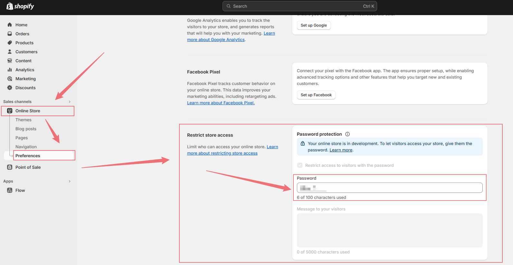

## 开发前准备

1. 注册一个 [shopify partner](https://www.shopify.com/partners) 的账户
2. 登录到用户后台 dashboard 中去,后台登陆的格式大概是 `https://partners.shopify.com/xxxxx?signup_intent=xxx`

    

3. 安装 @shopify/cli 和 @shopify/theme (这是基于已经有的项目做的初始化操作)
4. 运行 shopify 项目需要有 Ruby 的环境，所以还需要安装一下 Ruby（首选推荐安装 with devkit 版本的 Ruby）

## 关于 shopify 的 theme 与 app

theme 与 app 有不同的职责和作用：

:::info

主题（Theme）：主题是定义了商店外观和布局的模板文件集合。在 Shopify 主题开发中，您主要是对页面的 HTML 结构和 Liquid 模板进行操作，以实现商店的视觉效果和布局。**可以使用 HTML 和 Liquid 模板语言来动态生成页面内容，包括产品列表、购物车、结账页面等，从而实现页面的视图渲染和交互效果**。
:::

:::info
应用（App）：应用是为商店提供特定功能或服务的独立软件。在 Shopify 应用开发中，您可以使用后端技术（如 Node.js、PHP）和前端技术（如 JavaScript、HTML）来开发您的应用。您的应用可以**通过 Shopify API 与商店进行交互，例如获取商店数据、修改产品信息、处理订单等**。应用通常是独立于主题的，可以实现更多的功能和定制选项。
:::

总的来说，主题和应用在 Shopify 中具有不同的功能和作用。

-   主题主要负责定义商店的外观和布局
-   应用则负责为商店提供特定的功能和服务

通过主题和应用的结合，您可以为商店提供丰富多样的功能和个性化的外观，从而满足不同商家的需求。

## 创建一个开发商店


:::tip
商店创建完毕之后可以直接 install 一个默认的 theme，点击小眼睛就可以预览店铺效果了
:::


## 开发中的店铺有一个访问密码，可以把密码提供给团队进行写作



## 点击 customize 可在图形化操作界面修改店铺

:::tip
在这里可以快速定位模块所处的文件位置
:::


## 安装 shopify themekit 更好的管理 shopify 主题

```shell
theme get --password=<PASSWORD> --store=xxxx.myshopify.com --themeid=xxxxx
```

1. 在开发主题之前，必须生成一个 API key 去连接整个商店
2. 进入 partner 账户后台，点击 `Apps`，点击 `create app`，然后用 shopify partner 来创建 app：`create app manually`（通过 app 的密钥来开发主题）

    

    

    

    

3. 创建成功之后会直接进入该 app 的详情页面，点击 overview 查看这个 app 的 `client secret`(这就是 themekit 中所需要的 password 的值，直接拷贝使用)

    

4. 至于 store 这个值，点击店铺预览效果，新打开的窗口链接中就是我们想要的 store 的值

    

    

5. 接下来是关于 `themeid` 的属性值获取，点击 `online store`，点击想要的编辑的主题的 `customize` 按钮，跳转的链接中就可以直接获取这个值

    

    

6. 获取了以上数据之后就可以使用 themekit 的 api 来 **获取和编辑** 主题了

    ```shell
    theme get --password=<换成你的 clientID> --store=<换成你的 store 域名> --themeid=<换成你需要编辑的主题id>
    ```

## theme 开发——发布

1. 安装 @shopify/cli

    ```shell
    npm install -g @shopify/cli @shopify/theme
    ```

2. 获取主题代码

    :::tip
    本地创建主题
    :::

    使用 @shopify/cli 创建本地主题

    ```shell
    shopify theme init
    # 会要求你输入主题的名称

    cd <your-theme-name>
    ```

    :::tip
    拉去店铺主题进行开发
    :::

    ```shell
    shopify theme pull -store <store-name>
    ```

3. 本地运行

    ```shell
    shopify theme dev --store <your-store-name>

    # 启动完毕之后直接在命令行随便点击一下就可以获得本地预览的地址
    # 一般情况下，在 9292 端口不被占用的时候，都是 使用 http://localhost:9292 OR http://127.0.0.1:9292
    ```

4. 主题上传

    ```shell
    shopify theme push --unpublished
    # 这是将目前主题当作首次上传、未发布的主题

    shopify theme push
    # 这是针对已经上传的主题，更新主题的代码
    ```

5. 发布主题

    **PS: 一定要确保主题在本地开发完毕之后，才能发布主题**

    ```shell
    shopify theme publish
    ```

## 工程化项目

1. 安装 tailwind css 库
2. laravel mix 作为打包工具
   在 webpack.mix.config 中定义入口文件，将出口位置设置为 assets

    ```js
    let mix = require('laravel-mix')

    mix.js('src/js/app.js', 'assets').sass('src/js/app.scss', 'assets')
    ```

3. 文件目录限定
    - src
        - js
            - app.js
        - css
            - app.scss
4. app.scss 中重置网页 css

    ```scss
    body {
        font-family: 'Open Sans', sans-serif;
        font-size: 16px;
        line-height: 1.5;
        color: #333;
        background-color: #fff;
    }
    ```

5. 启动编译

    ```shell
    npx mix
    ```

6. 安装 tailwind

    ```shell
    # 安装依赖
    npm install -D tailwindcss

    # 初始化，获得一个配置文件 tailwind.config.js
    npx tailwindcss init


    # 如果报错 postcss not found，需要再安装一个 postcss
    ```

7. tailwindcss 配置 tailwind.config.js

    ```js
    module.exports = {
        // 监听文件变化来生成对应的 css
        content: [
            './config/*.json',
            './layout/*.liquid',
            './assets/*.liquid',
            './sections/*.liquid',
            './snippets/*.liquid',
            './templates/*.liquid',
            './templates/*.json',
            './templates/customers/*.liquid',
        ],
    }
    ```

8. 设置 larevel-mix 对 tailwind 代码做处理

    ```css
    /* app.scss */
    @tailwind base;
    @tailwind components;
    @tailwind utilities;
    ```

    ```js
    /* webpack.mix.js */
    let mix = require('laravel-mix')

    const tailwindcss = require('tailwindcss')
    mix.js('src/js/app.js', 'assets')
        .sass('src/js/app.scss', 'assets')
        .options({
            processCssUrls: false,
            postCss: [tailwindcss('tailwind.config.js')],
        })
    ```

9. 引入 Apline（jquery）

```js
/* app.js*/

import Alpine from 'alpinejs'
window.Alpine = Alpine

Alpine.start()
```
