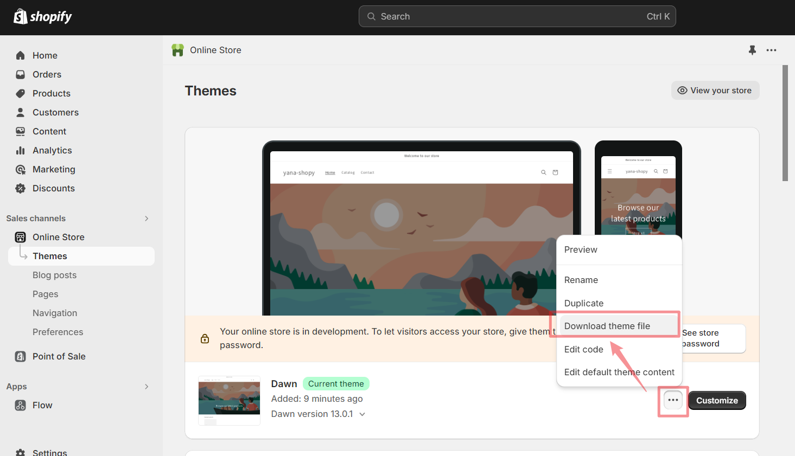
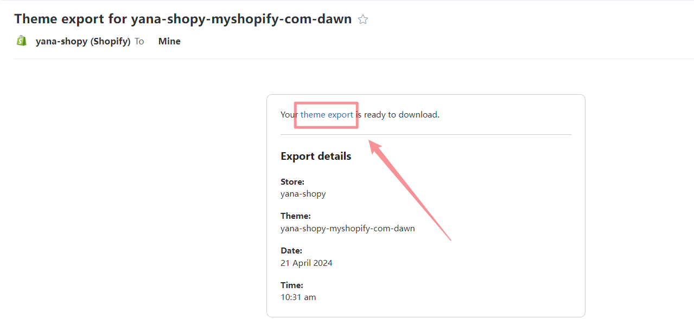

## 初始化项目

1. 安装脚手架 @shopify/cli

```bash
npm install -g @shopify/cli
```

2. 初始化项目，以 dawn 初始开始开发

```bash
shopify theme init
```

:::tip

如果这个步骤失败的话，则直接登录 shopify 账户，初始化店铺的主题之后，手动下载主
题代码

点击下载按钮之后，你会在邮箱收到一个主题文件，下载即可使用

:::





3. 本地开发预览

```bash
shopify theme dev --store <your-store-name>
```

4. 以未发布状态上传主题

```bash
shopify theme push --unpublished
```

5. 直接更新主题代码

```bash
shopify theme push
```

6. 发布主题

```bash
shopify theme publish
```

## git 仓库关联

```bash
# 初始化仓库
git init

# 在github 手动创建仓库之后，复制仓库地址
# 关联仓库
git remote add origin <your-repo-address>

# 提交所有更新
git add .
git commit -m 'init: init my shopify theme'

# 推送到远端
git push --allow-unrelated-hostoric origin master
```
