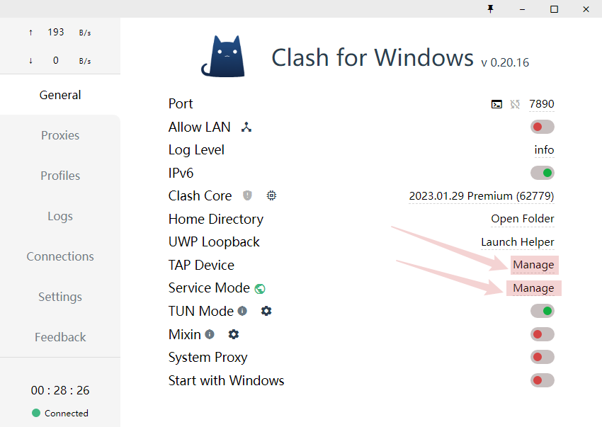
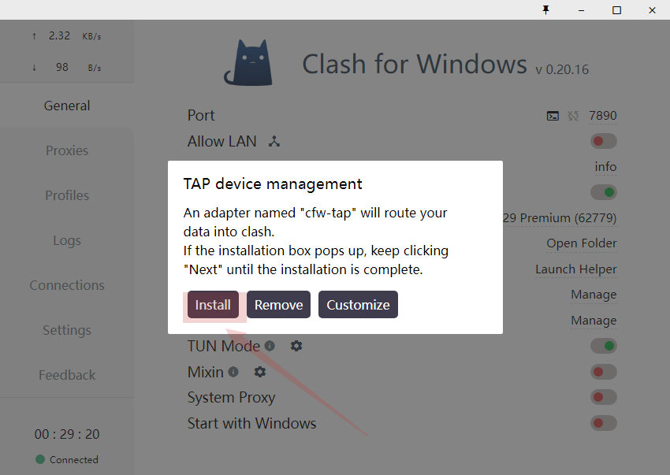
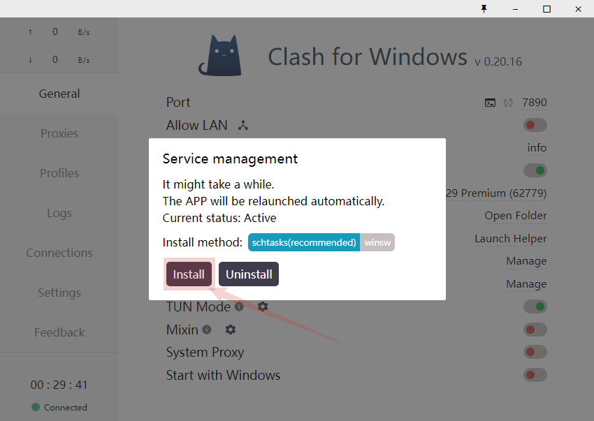
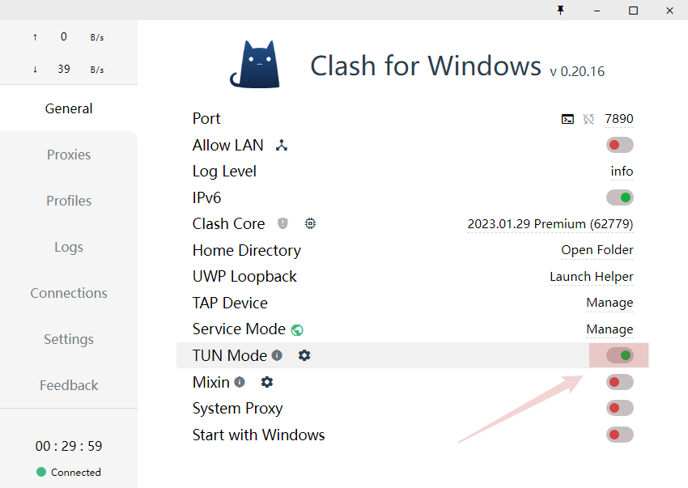
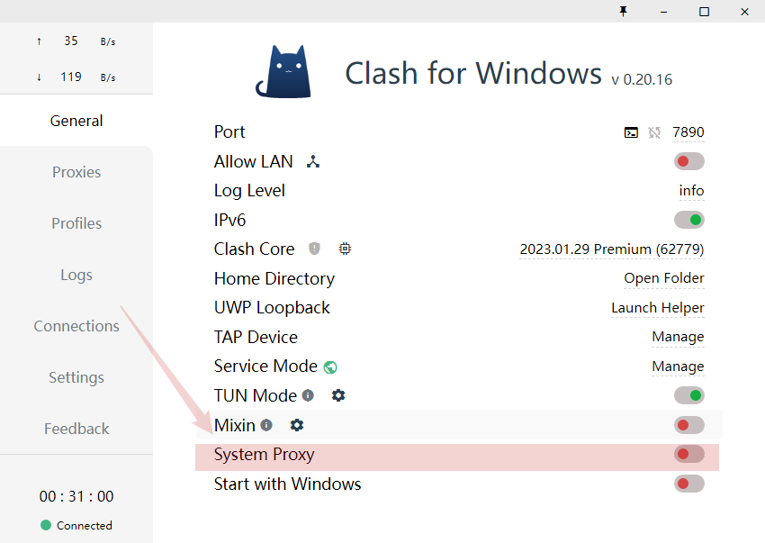
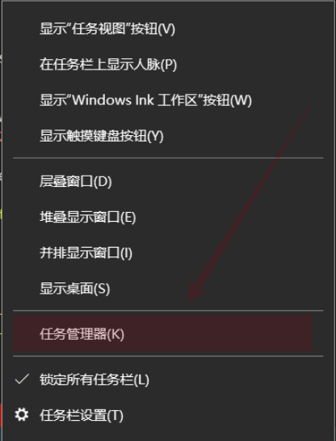
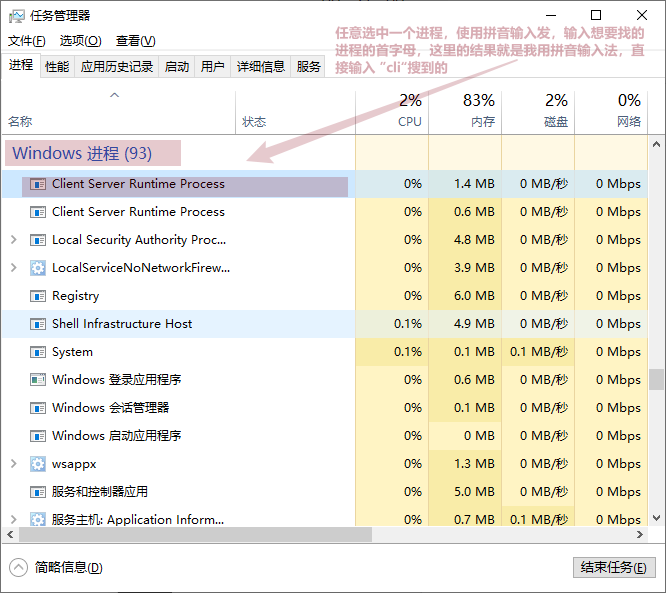

## 问题

```bash
 request to https://xxxxxx.myshopify.com/admin/api/unstable/themes/xxxxxxxxxx.json?fields=id%2Cname%2Crole%2Cprocessing failed
 reason: Client network socket disconnected before secure TLS connection was established
```

## 解决方法

安装一个 clash，用 **TUN Mode** 模式来解决这个问题

[download clash for windows](https://github.com/lantongxue/clash_for_windows_pkg/releases)

安装完毕之后，如果启动了但是还是没办法上网，关闭 clash 之后用管理员身份重新打开

## 使用 TUN Mode 之前需要先安装 services







## 接着启动 TUN 模式



## 开启或关闭代理



:::tip

然后重启启动 shopify 项目即可（必要情况下可关闭终端，重新创建一个终端）如果启动
之后发现还是不行的话， 有可能是尝试的多个 vpn 软件没有完全关闭，只能保留一个

:::

### 关闭进程小 tips




