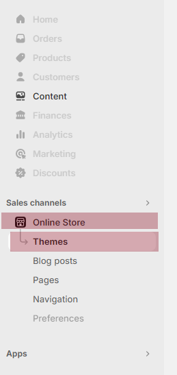
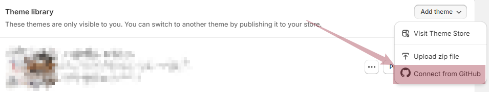

:::tip

一些 shopify/liquid 开发注意事项

:::

## 开发设置

### 新建主题与 github 分支绑定（最快，需要 github repo 操作权限）

这是最快最便捷的方式，但是如果无 github 仓库的操作权限，就无法进行这一步

:::tip

设置完毕之后基于该分支进行 开发推送 就可以实现 `主题编辑器操作` 和 `代码` 快速同步

- 总是有一些用主题编辑器来测试数据更快速的场景 [图片、富文本测试等]
- 不需要在编辑器改动数据之后再复制回 vscode 做同步了

:::

## 项目结构

尽量把 shopify 主题的文件保存在一个独立的文件夹中[确保在 github 与 shopify 同步失败的时候有别的选择来推送和拉取代码]
