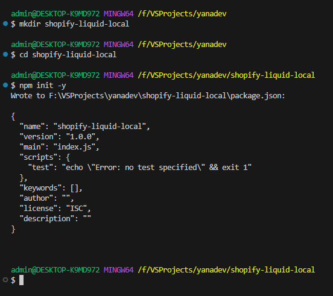
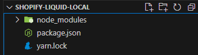
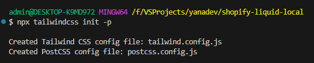
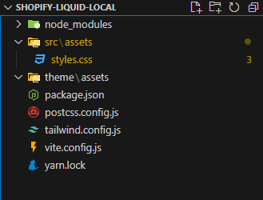
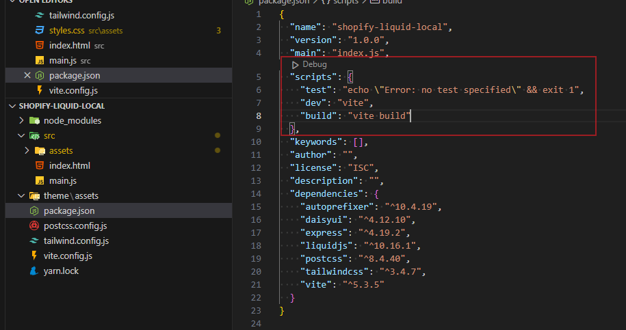
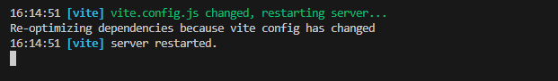
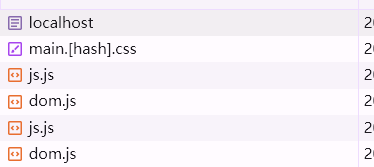
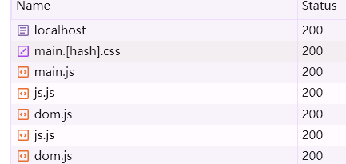

:::info

server 服务器只是一次尝试，发现还是需要 ruby 来自定义一些 filter 的开发

短时间内没法做，因此实际工作中还是无法真正提升开发体验

或许得创建 独立的 shopify app 用插件形式来操作主题更为灵活

:::

# 原因与目标

为优化开发体验，我们需要在本地搭建一个模拟 Shopify 主题开发的脚手架。

该脚手架将使用 Express 创建本地服务，结合 Vite 优化代码结构，并引入 Tailwind CSS、DaisyUI 和 Alpine.js 等依赖。

可以实现在本地进行 Shopify 主题开发，并在开发完毕后将项目推送到 Shopify

# 项目流程

## 本地开发

使用 Vite 进行开发和构建，将本地依赖（如 Tailwind CSS、DaisyUI 和 Alpine.js）处理成生产环境的资源包

使用 Express 创建一个本地服务器来渲染 Shopify Liquid 模板

在本地开发时，通过运行 node server.js 来预览和测试模板

## 构建生产资源

使用 Vite 构建生产环境资源包（如 CSS 和 JavaScript 文件），并将这些文件放入 theme/assets 目录中。

## 推送到 Shopify

开发完成后，将 theme 文件夹内容推送到 Shopify，使用 shopify theme push 或 Theme Kit 来部署。

# 项目结构

```lua
shopify-liquid-local/
├── node_modules/
├── public/
│   └── assets/
│       └── styles.css
├── src/
│   ├── assets/
│   │   └── styles.css
│   ├── index.html
│   └── main.js
├── theme/
│   ├── assets/
│   │   └── styles.css
│   ├── layout/
│   │   └── theme.liquid
│   ├── sections/
│   │   └── example-section.liquid
│   ├── snippets/
│   │   └── example-snippet.liquid
│   ├── templates/
│   │   └── index.liquid
│   ├── config/
│   └── locales/
├── .gitignore
├── tailwind.config.js
├── postcss.config.js
├── package.json
├── vite.config.js
└── server.js

```

# 项目初始化

```sh
mkdir shopify-liquid-local
cd shopify-liquid-local
npm init -y
```



# 安装依赖

### 如果安装依赖的时候加载速度太慢了，使用淘宝镜像

```sh
yarn config set registry https://registry.npmmirror.com

或者

npm config set registry https://registry.npmmirror.com
```

### 安装依赖

```sh
npm install express liquidjs tailwindcss postcss autoprefixer daisyui vite alpinejs

或者

yarn add express liquidjs tailwindcss postcss autoprefixer daisyui vite alpinejs
```

### 项目结构



# 配置 Tialwind CSS

```sh
npx tailwindcss init -p
```



```js
/* tailwind.config.js */
/** @type {import('tailwindcss').Config} */
module.exports = {
  content: ['./src/**/*.{html,js}'],
  theme: {
    extend: {},
  },
  plugins: [require('daisyui')],
}
```

src/styles.css 文件中增加 Tailwind CSS 的基本样式

```css
/* src/assets/styles.css */
@tailwind base;
@tailwind components;
@tailwind utilities;
```

# 配置 Vite

> 为了保证构建出来的资源在 shopify 固定使用，因此输出的文件名称也是固定的
>
> 且在执行生产打包的同时，直接将构建出来的 assets 更新到 theme 的 assets 中，减少手动操作，避免出错

## 安装并配置 babel：处理 commonjs 与 module js 冲突

```sh
npm install @babel/core @babel/preset-env @rollup/plugin-babel
或者
yarn add @babel/core @babel/preset-env @rollup/plugin-babel
```

## 安装 vite-plugin-static-copy 将构建后的资源同步复制到主题资源中

```sh
yarn add vite-plugin-static-copy --dev
```

## 根目录下创建 `vite.config.js`

```js
import autoprefixer from 'autoprefixer'
import path from 'path'
import tailwindcss from 'tailwindcss'
import { defineConfig } from 'vite'
import { viteStaticCopy } from 'vite-plugin-static-copy'

export default defineConfig({
  build: {
    rollupOptions: {
      input: {
        main: path.resolve(__dirname, 'src/main.js'),
      },
      output: {
        entryFileNames: 'assets/[name].js',
        chunkFileNames: 'assets/[name].js',
        assetFileNames: 'assets/[name].[ext]',
      },
    },
  },
  css: {
    postcss: {
      plugins: [tailwindcss(), autoprefixer()],
    },
  },
  plugins: [
    viteStaticCopy({
      targets: [
        {
          src: 'dist/assets/**/*',
          dest: '../theme/assets',
        },
      ],
    }),
  ],
})
```

# 配置项目结构

调整项目结构以适应 Vite 的构建流程

```sh
mkdir -p src/assets
mkdir -p theme/assets
```



# 在 src 目录下创建 main.js

```js
// src/main.js
import 'alpinejs'
import './assets/styles.css'
```

## 构建和运行项目 package.json

```json
"scripts": {
  "dev": "vite",
  "build": "vite build"
}
```



## 运行开发服务器(确定开发环境无误)

```sh
npm run dev
```



## 构建生产版本（确认生产环境无误

```sh
npm run build
```

## 设置 Express 服务器 /server/index.js

```js
// /server/index.js
import express from 'express'
import path from 'path'
import { fileURLToPath } from 'url'

const app = express()
const __filename = fileURLToPath(import.meta.url)
const __dirname = path.dirname(__filename)

app.use('/assets', express.static(path.join(__dirname, '../theme/assets')))

app.get('*', (req, res) => {
  res.sendFile(path.join(__dirname, '../public', 'index.html'))
})

const port = process.env.PORT || 3009
app.listen(port, () => {
  console.log(`Server is running on http://localhost:${port}`)
})
```

# 创建静态资源模板 index.html

```html
<!-- /public.index.html -->
<!DOCTYPE html>
<html lang="en">
  <head>
    <meta charset="UTF-8" />
    <meta name="viewport" content="width=device-width, initial-scale=1.0" />
    <title>Shopify Theme</title>
    <link rel="stylesheet" href="/assets/main.[hash].css" />
  </head>
  <body>
    <div id="app"></div>
    <!-- <script src="/assets/main.js"></script> -->
  </body>
</html>
```

## before



## after



# 设置 vite.config.js 代理，访问本地启动的服务

```diff
import autoprefixer from 'autoprefixer'
import path from 'path'
import tailwindcss from 'tailwindcss'
import { defineConfig } from 'vite'
import { viteStaticCopy } from 'vite-plugin-static-copy'

export default defineConfig({
  build: {
    rollupOptions: {
      input: {
        main: path.resolve(__dirname, 'src/main.js'),
      },
      output: {
        entryFileNames: 'assets/[name].js',
        chunkFileNames: 'assets/[name].js',
        assetFileNames: 'assets/[name].[ext]',
      },
    },
  },
  css: {
    postcss: {
      plugins: [tailwindcss(), autoprefixer()],
    },
  },
  plugins: [
    viteStaticCopy({
      targets: [
        {
          src: 'dist/assets/**/*',
          dest: '../theme/assets',
        },
      ],
    }),
  ],
+  server: {
+    proxy: {
+      '/': 'http://localhost:3009', // 代理到 Express.js 服务器
+    },
+  },
})

```

> 注意：这里的设置的代理端口要和你设置的服务 sever 中的端口保持一致，否则会报错

# 创建 liquid 模板

在 theme/templates 文件中创建 index.liquid

```html
<!-- theme/templates/index.liquid -->
<!DOCTYPE html>
<html lang="en">
  <head>
    <meta charset="UTF-8" />
    <meta name="viewport" content="width=device-width, initial-scale=1.0" />
    <title>{{ title }}</title>
    <link href="/assets/styles.css" rel="stylesheet" />
    <script type="module" src="/main.js"></script>
  </head>
  <body class="bg-gray-100">
    <div class="container mx-auto p-4">
      <h1 class="text-4xl font-bold">{{ title }}</h1>
      <p>{{ content }}</p>
      <button class="btn btn-primary" x-data="{ message: 'Hello from Alpine.js!' }" @click="alert(message)">
        Click me
      </button>
    </div>
  </body>
</html>
```

# 运行服务器

> 运行服务器并在本地预览 Liquid 模板的渲染效果

```sh
node server.js
```

# 推送到 Shopify

在本地开发完毕之后，将 theme/文件夹中的内容推送到 Shopify

> 使用 shopify cli 推送

```sh
shopify login --store your-store-name.myshopify.com
shopify theme push --theme-id your-theme-id --path=theme
```

在 theme 文件夹中创建 config.yml 文件

```yaml
development:
  password: your-theme-password
  theme_id: 'your-theme-id'
  store: your-store-name.myshopify.com
  directory: theme
```

# Alpine 模块化处理

## 项目结构

```lua
shopify-liquid-local/
├── src/
    ├── assets/
    │   └── styles.css
    ├── components/
    │   ├── componentA.js
    │   └── componentB.js
    ├── alpine-main.js
    └── main.js


```

## 创建 Alpine.js 组件

src/components/ 目录下创建各个 Alpine.js 组件

```js
// src/components/exampleComponent.js
export default function exampleComponent() {
  return {
    message: 'Hello from Alpine.js Component!',
    showMessage() {
      alert(this.message)
    },
  }
}
```

## 初始化并导入 Alpine.js 组件

> alpine-main.js: 这个文件专注于 Alpine.js 的组件定义和注册。
>
> 所有的 Alpine.js 组件逻辑集中在这里，使得文件结构更加清晰和模块化。
>
> main.js: 只需导入 alpine-main.js 文件来初始化 Alpine.js 组件，并引入其他需要的资源（如样式表）。

1. 创建 src/alpine-main.js ，统一管理 Alpine 组件的引入

```js
// src/alpine-main.js
import Alpine from 'alpinejs'

// Component A
function componentA() {
  return {
    message: 'Component A',
    showMessage() {
      alert(this.message)
    },
  }
}

// Component B
function componentB() {
  return {
    count: 0,
    increment() {
      this.count++
    },
  }
}

// Register components
window.Alpine = Alpine
Alpine.data('componentA', componentA)
Alpine.data('componentB', componentB)

// Start Alpine.js
Alpine.start()
```

2. 在 src/main 中导入 alpine-main.js

```js
// src/main.js
import './alpine-main.js' // Import Alpine.js components
import './assets/styles.css' // Import styles
```

## 使用

```html
<!-- src/index.html -->
<!DOCTYPE html>
<html lang="en">
  <head>
    <meta charset="UTF-8" />
    <meta name="viewport" content="width=device-width, initial-scale=1.0" />
    <title>Shopify Liquid Local</title>
    <link href="./assets/styles.css" rel="stylesheet" />
    <script type="module" src="/main.js"></script>
  </head>
  <body class="bg-gray-100">
    <div class="container mx-auto p-4">
      <h1 class="text-4xl font-bold">Hello, World!</h1>
      <p>This is a local preview of Liquid template rendering.</p>
      <div x-data="exampleComponent">
        <button class="btn btn-primary" @click="showMessage">Click me</button>
      </div>
    </div>
  </body>
</html>
```

# 样式结构优化

## 样式文件结构

```lua
src/
├── assets/
│   ├── styles/
│   │   ├── base.css        # 浏览器样式重置和基本样式
│   │   ├── variables.css   # 全局 CSS 变量（如颜色、字体等）
│   │   ├── components.css  # 组件级别样式
│   │   ├── layouts.css     # 布局样式
│   │   └── main.css        # 具体业务样式
│   └── styles.css          # 导入所有样式文件的主样式
└── main.js
```

## 重置浏览器样式 base.css

```css
/* src/assets/styles/base.css */

/* 重置一些浏览器默认样式 */
html,
body {
  margin: 0;
  padding: 0;
  box-sizing: border-box;
}

body {
  font-family: Arial, sans-serif;
  line-height: 1.6;
}

/* 添加其他基础样式 */
```

## 全局变量 variables.css

定义全局的 CSS 变量，例如颜色、字体大小等。这些变量可以在整个项目中使用。

1. 组件级别样式：创建 components.css 文件来定义各种组件的样式。
2. 布局样式：创建 layouts.css 文件来管理页面的布局样式。
3. 具体业务样式：创建 main.css 文件，包含特定业务逻辑的样式。

```css
/* src/assets/styles/components.css */

/* 组件样式示例 */
.btn-primary {
  background-color: var(--primary-color);
  color: #fff;
  padding: 10px 20px;
  border: none;
  border-radius: 5px;
  cursor: pointer;
}
```

```css
/* src/assets/styles/layouts.css */

/* 布局样式示例 */
.container {
  width: 80%;
  margin: 0 auto;
}
```

```css
/* src/assets/styles/main.css */

/* 具体业务样式示例 */
.header {
  background: var(--primary-color);
  color: #fff;
  padding: 20px;
}

.footer {
  background: var(--secondary-color);
  color: #000;
  padding: 10px;
}
```

## 主样式文件 styles.css:唯一一个在 main.js 中被引入的样式文件

用于导入所有其他样式文件

```css
/* src/assets/styles/styles.css */

/* 导入所有样式文件 */
@import './base.css';
@import './variables.css';
@import './components.css';
@import './layouts.css';
@import './main.css';
```

## 在 main.js 中引入主样式文件

```js
// src/main.js
import './alpine-main.js' // 导入 Alpine.js 组件
import './assets/styles/styles.css' // 导入所有样式
```

# vite 处理 css 和 js

## CSS

- 开发模式
  - vite 使用 `esbuild` 快速处理和解析 CSS 文件，支持 CSS 的模块化、Sass、Less 和 PostCSS 插件等功能
- 生产模式
  - vite 使用 `cssnano` 自动优化和压缩 CSS 文件，所有的 CSS 文件会被合并并处理为一个或者多个最终的输出文件，通常是
    `.css` 文件
- CSS 模块
  - 可通过 `:local` 选择器或者 `import styles from './styles.module.css'`
- PostCSS 插件
  - 在 `postcss.config.js` 中配置 PostCSS 插件以进一步处理 CSS

## JS

- 开发模式
  - vite 使用 `esbuild` 进行快速的 JavaScript 转译和热更新
- 生产模式
  - vite 使用 `Rollup` 进行打包，`Rollup` 会将所有 Javascript 文件打包成一个或者多个输出文件，并进行代码拆分和优化
- 代码拆分
  - vite 支持动态导入和代码拆分，以便在生产环境中进行懒加载和按需加载
- source map
  - 开发模式下，生成 source maps 以便于调试，生产模式下可以通过配置关闭 source maps 来减少文件体积

## 打包后代码的注释处理

### JS 注释

vite 在生产模式下使用 `Terser` 插件来压缩和优化 JS 代码，该插件可以自动去除不必要的注释

- comments: false：去除所有注释
- comments: 'some'：保留一些注释，例如版权注释
- comments: 'all'：保留所有注释

```js
// vite.config.js
export default {
  build: {
    terserOptions: {
      format: {
        comments: false, // 去除所有注释
      },
    },
    minify: 'terser', // 使用 Terser 进行压缩
  },
}
```

### CSS 注释

生产模式下会通过 cssnano 进行优化，默认会去除不必要的注释

- removeAll: true：去除所有注释
- removeAll: false：保留注释（仅移除不必要的注释）

```js
// postcss.config.js
module.exports = {
  plugins: [
    require('postcss-import'),
    require('tailwindcss'),
    require('autoprefixer'),
    require('cssnano')({
      preset: [
        'default',
        {
          discardComments: {
            removeAll: true, // 去除所有注释
          },
        },
      ],
    }),
  ],
}
```

## 最终的配置文件 vite.config.js

```js
// vite.config.js
import { defineConfig } from 'vite'
import { createHtmlPlugin } from 'vite-plugin-html'

export default defineConfig({
  build: {
    rollupOptions: {
      // Rollup 相关配置
    },
    terserOptions: {
      format: {
        comments: false, // 去除所有注释
      },
    },
    minify: 'terser', // 使用 Terser 进行压缩
  },
  css: {
    postcss: {
      plugins: [
        require('postcss-import'),
        require('tailwindcss'),
        require('autoprefixer'),
        require('cssnano')({
          preset: [
            'default',
            {
              discardComments: {
                removeAll: true, // 去除所有注释
              },
            },
          ],
        }),
      ],
    },
  },
  plugins: [
    createHtmlPlugin({
      minify: true, // 最小化 HTML
    }),
  ],
})
```
