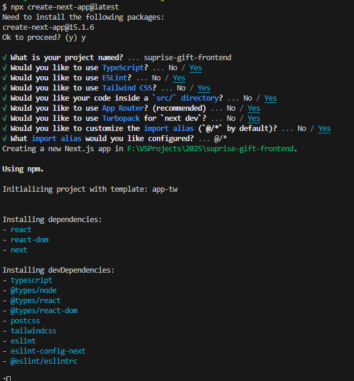

# 创建一个包含 React + Router + TS + Tailwind CSS 的项目

```zsh
npx create-next-app@latest
# 进入项目目录
cd suprise-gift-frontend
```



# 安装并配置 h5 相关的依赖

```zsh
# 路由管理
npm install react-router-dom

# css框架内 tailwind css
npm install -D tailwindcss postcss autoprefixer

# 配置 tailwind css
npx tailwindcss init

# 配置 tailwind.config.js 文件
module.exports = {
  content: [
    "./src/**/*.{js,jsx,ts,tsx}", // 确保 Tailwind 可以扫描到这些文件
  ],
  theme: {
    extend: {},
  },
  plugins: [],
}

# 创建一个 src/index.css 添加 tailwind 的默认样式
@tailwind base;
@tailwind components;
@tailwind utilities;

# 在入口文件 src/index.tsx 中引入这个 css 文件
import './index.css'

# 配置 h5 响应式布局
function App() {
  return (
    <div className="max-w-screen-sm mx-auto p-4">
      <h1 className="text-center text-2xl">Hello, React with TypeScript!</h1>
    </div>
  );
}

export default App;


# 启动开发服务器
npm start

# 打包生产版本
npm run build
```