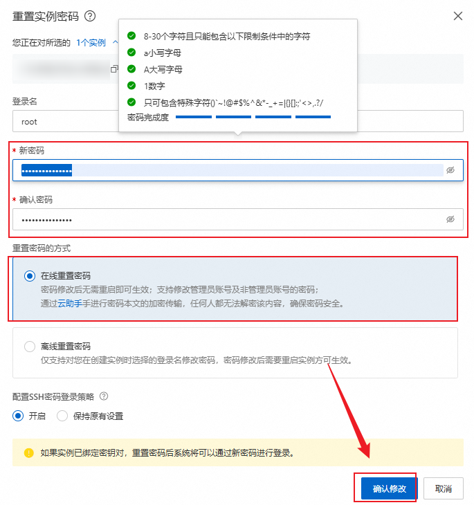
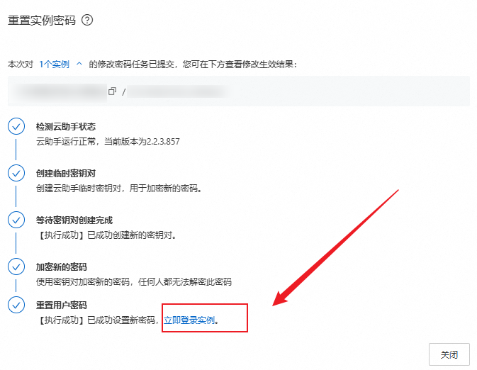
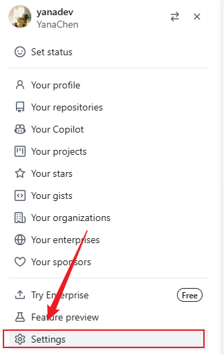
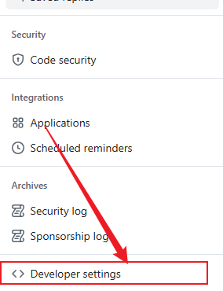
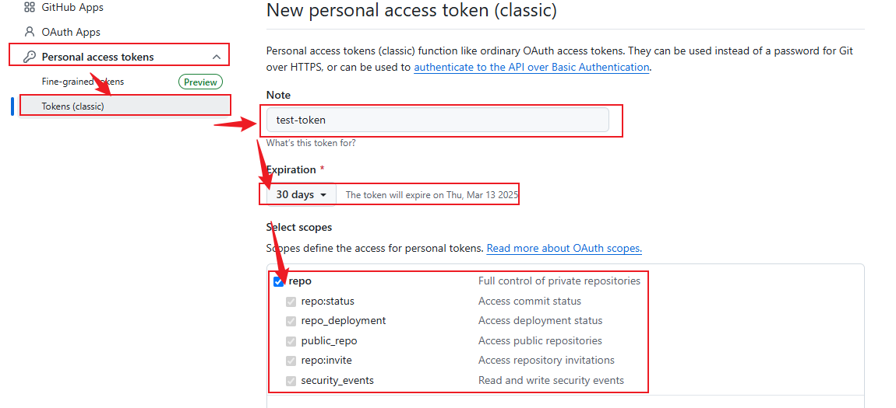
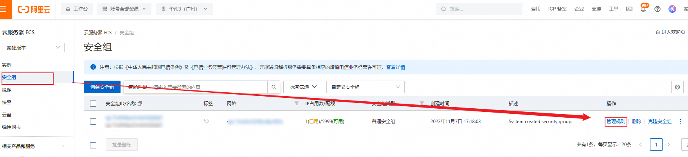
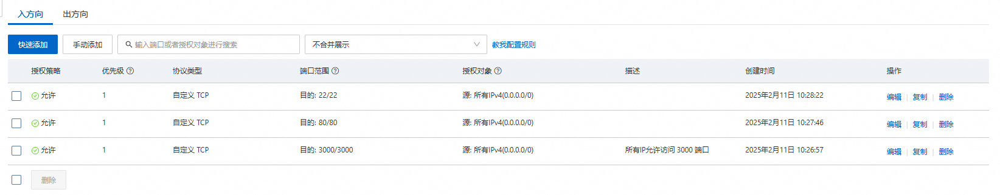
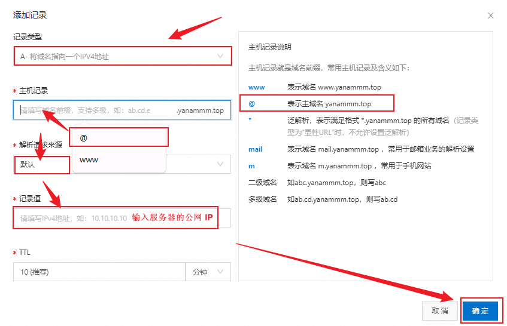
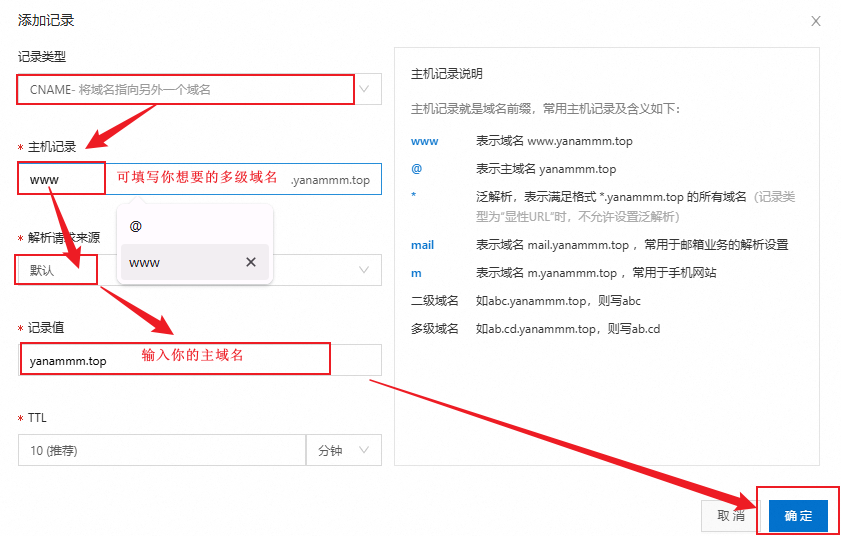

# 总览

本教程适用于 Ubuntu 20.04 / 22.04，主要包含以下内容：
✅ 购买并配置阿里云服务器（ECS）
✅ 使用 SSH 连接服务器
✅ 安装 Node.js、PM2、Nginx
✅ 上传并部署 React 项目
✅ 使用 Nginx 反向代理 & 配置 HTTPS

# 🚀 第 1 步：购买阿里云 ECS 服务器

1. 登录阿里云 👉 [阿里云官网](https://www.aliyun.com/)

2. 进入 ECS 控制台，选择 创建实例

   

   

   

   

:::info

计费方式：按量付费 or 包年包月（长期用推荐包年包月）
地域：选择靠近你的目标用户的地区
实例类型：2 核 4G（最少）
操作系统：Ubuntu 22.04 LTS（推荐）
存储：默认 40GB SSD
带宽：固定公网 IP，1-5 Mbps
:::

3. 创建完成后，进入 ECS 控制台，找到服务器公网 IP

```zsh
x.xxx.xx.xx
```


# 🖥 第 2 步：连接服务器

## 方式 1：直接通过阿里云登录到服务器






会开启一个网页直接登录到服务器


## 方式 2：Windows（使用 Xshell / PuTTY）

1. 下载 Xshell
2. 使用 SSH 连接

```zsh
ssh root@你的服务器IP
```

3. 输入密码

   

# 📦 第 3 步：安装 Node.js、PM2、Nginx

1. 更新服务器

```zsh
# 更新 linux 系统本地软件包索引并更新所有可以升级的软件包
apt update && apt upgrade -y
```

​ 


2. 安装 Node.js（使用 nvm）

```zsh
# 安装 nvm
curl -fsSL https://raw.githubusercontent.com/nvm-sh/nvm/v0.39.4/install.sh | bash
# 让上面的安装更改立即生效，无需推出终端
source ~/.bashrc

# 安装 node LTS 长期支持版本
nvm install --lts
node -v  # 检查是否安装成功
```


3. 安装 PM2（管理 Node.js 进程）

```zsh
# 更新 npm
npm install -g npm
# 安装 PM2 管理 node 进程
npm install -g pm2
# 设置 pm2 开机自启
pm2 startup
# 冻结进程,当服务器重启的时候， pm2 会自动恢复这些进程
pm2 save
```


4. 安装 Nginx

```zsh
# 更新 nginx，直接点击回车键 enter 继续就行
apt install nginx -y
# 启用 nginx 服务
systemctl enable nginx
# 启动 nginx
systemctl start nginx
nginx -v # 检查版本
```


# 📂 第 4 步：上传 React 项目

1. 安装 Git

```sh
apt install git -y
```

​ 

2. 克隆你的 React 项目

   :::info

   拉取项目的时候需要登录你的 github 账户，首先去创建一个 personal token 用于验证

   1. 登录 github

   2. 创建 token，确保有 repo 的权限

      在 settings / Developer Settings / Personal access tokens / Tokens (classic) / Generate new token / Generate new token (classic) 创建 token

   3. 创建完毕之后复制保存这个 personal token，用于登录服务器操作仓库代码

   :::

   

   

   

```zsh
cd /var/www
git clone https://github.com/your-repo.git surprise-gift-frontend
cd surprise-gift-frontend
```

3. 安装依赖 & 构建

```zsh
npm install
npm run build
```

# 🚀 第 5 步：使用 PM2 启动 React

1. 进入构建目录

```zsh
cd /var/www/surprise-gift-frontend
# 我这里项目打包出来的目录是 .next，如果你的是 dist，需要修改一下
```

2. 使用 serve 启动 React

```zsh
# 安装 serve
npm install -g serve

# 执行打包命令
npm run build

# 使用 serve 和 pm2 启动项目的 start 命令
pm2 start serve --name surprise-gift-frontend -- -s -l 3000
pm2 start npm --name surprise-gift-frontend -- build


# 保存进程到 pm2
pm2 save
```

4. 设置开机自启

```zsh
pm2 startup
```

# 🌐 第 6 步：配置 Nginx 反向代理

1️⃣ 创建 Nginx 配置

```zsh
nano /etc/nginx/sites-available/surprise-gift-frontend
```

2️⃣ 添加以下内容

```sh
server {
    listen 80;
    server_name your-domain.com;

    location / {
        proxy_pass http://localhost:3000;
        proxy_http_version 1.1;
        proxy_set_header Upgrade $http_upgrade;
        proxy_set_header Connection 'upgrade';
        proxy_set_header Host $host;
        proxy_cache_bypass $http_upgrade;
    }
}
```

3️⃣ 启用配置

```sh
# 设置软链接，这样就不需要手动复制配置文件到 sites-enabled（注意：如果要删除配置文件的时候，两个位置的配置文件都要删除，否则执行 nginx -t 的时候会报错）
ln -s /etc/nginx/sites-available/surprise-gift-frontend /etc/nginx/sites-enabled/
nginx -t # 检查配置是否正确
systemctl restart nginx
```

# 🔒 第 7 步：配置 HTTPS（可选）

1️⃣ 安装 Certbot（免费 SSL 证书）

```zsh
apt install certbot python3-certbot-nginx -y
```

2️⃣ 申请 HTTPS 证书

```zsh
certbot --nginx -d your-domain.com
```

如果成功，Nginx 配置会自动更新，网站会支持 HTTPS。
3️⃣ 配置自动续期

```zsh
certbot renew --dry-run
```

# 🔖 本地可访问，外部无法访问: 检查防火墙

确保你当前使用的端口允许访问

```zsh
# 确保服务器的 80 端口开放，可以通过一下命令检查
sudo ufw allow 80
sudo ufw allow 80/tcp    # 允许 80 端口
sudo ufw allow 3000/tcp  # 允许 3000 端口

sudo ufw status # 检查防火墙状态
```

:::info

如果在服务器防火墙都没有设置的情况下，依旧无法访问站点，但是本地可以正常访问，检查服务器的安全组设置是否没有开放对应的端口

:::





# 🧐 关于域名解析

1. 购买一个 域名之后，将服务器的公网 ip 映射到这个域名上

   

2. 设置多级域名访问主域名

   

   > 这样在服务器的 nginx 配置中 server_name 这一项可以输入多个配置好的 域名解析，都支持访问你的站点
   >
   > e.g. server_name yanammm.top www.yanammm.top

# 👀 域名备案

在站点还没有完成之前可以直接用 ip:端口的方式来访问，然后再去申请备案即可

# ✅ 最终测试

1. 在浏览器输入：

```zsh
http://你的服务器IP

# 或
https://your-domain.com
```

你应该能看到你的 React 项目成功运行！🎉

2. 检查 PM2 进程是否正常

```zsh
pm2 list
```

如果 react-app 进程是 online，说明项目在运行。
