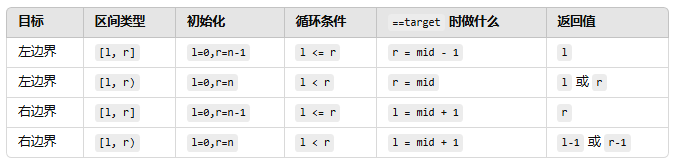
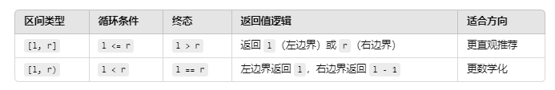

# 读题

## 有序、无重复数组

1. 二分法: 收缩左右区间，找到中位数；区间定义是不变量 (两种前置条件)

- `[a,b]` 此时 a = b 有意义，条件设置为 a ≤ b
- `[a,b)` 此时 a = b 无意义，条件设置为 a < b

- 取中位数，简单写法是 `(a+b)/2` 这种写法在 a、b 都是最大值的时候有内存溢出风险，所有改成 `求区间一般的长度加上头部位置`

  - a + (b - a) / 2

- 怎么明确用哪一种区间呢？
  - 寻找具体的值，用闭区间；寻找边界条件，用开区间
  - 寻找边界的时候，无论边界是否再范围内，都是返回左边区间
  - 二者其实都能用，只是寻找特定值用了开区间有可能漏掉最后一个值，需要额外再二分循环之外做一次判断（简单问题复杂化）

```js
/* 不推荐：非要用开区间寻找特定值的写法 */
int l = 0, r = nums.size();
while (l < r) {
    int mid = l + (r - l)/2;
    if (nums[mid] < target) l = mid + 1;
    else if (nums[mid] > target) r = mid;
    else return mid;
}
// 跳出循环后可能在 l 或 r，再额外判断一次
if (l < nums.size() && nums[l] == target) return l;
return -1;

```

### 题目

- 35.搜索插入位置(opens new window)---------------- left 就是你要的目标位置（内部循环明确了 left 一定是大于 middle 的）
- 34.在排序数组中查找元素的第一个和最后一个位置(opens new window)
- 69.x 的平方根(opens new window)
- 367.有效的完全平方数(opens new window)

:::info

[左闭右开] 模型找边界， mid 小就右移， mid 大就左收， left 就是你想要的位置。

:::

# 解题思路

## 35 搜索插入位置

1. 寻找插入位置 ==> 找到目标值，有的话，返回位置，没有的话，返回插入位置，
2. 明确寻找边界，用开区间, `[l, r)`
3. 循环启动条件 `l < r`
4. 开区间中位数取值 `mid = l + (r - l) >> 1（效果和除法一致，但是向下取整 2.5 -> 2）` 或
   `mid = l + Math.floor((r - l)/2)（直观，直接向下取整）` 或
   `mid = l + (r - l) / 2（可能出现小数点导致找不到元素 undefined）` （左开端+区间一半长度，不选择用 `(l+r)/2` 避免 l、r
   为最大值，内存溢出 ）
5. 开区间下定义左右边界: l = 0, r = nums.length（r 不包含，为确保不遗漏最后一个元素）
6. target > nums[mid] 时，收缩左边, l = mid + 1
7. target < nums[mid] 时，收缩右边, r = mid(r 不包含，不需要 -1)
8. 计算边界，相等情况不考虑，需要不断收缩边界，不然会得到错误答案
9. 注意在 while 循环外部返回 l
10. 为什么返回值一定是 l：当 l==r 时，边界收缩完毕；使用开区间 r 不包含，所以返回 l

## 34 在排序数组中查找元素的第一个和最后一个位置

1. 分解本质，求最左 start 和最右 end
2. `start<end && nums[start] == target && nums[end] == target`条件符合时返回 `[start, end]`，否则返回`[-1, -1]`
3. 封装求左边界、右边界函数，重点理解
4. 左边界重点理解，求得第一个符合的条件之后还要继续向 mid 的左边收缩
5. 右边界重点理解，求得第一个符合的条件之后还要继续向 mid 的右边收缩
6. 理解不同前置条件在跳出循环的时候的终态
7. `[l, r]` 前置条件对应的循环条件是 l <= r，跳出循环的条件对应的是 l > r（`[l, r]` 的补充条件是 l > r， 这就是终态）
8. `[l, r)` 前置条件对应的循环条件是 l < r，跳出循环的条件对应的是 l > r（`[l, r)` 隐藏着 l != r，所以终态一定是 l > r）
9. 所以对应的就是
10. `[l, r]` 求左边界，初始 `l = 0, r = nums.length - 1` 循环条件 `l <= r`, `nums[mid] > target` 对应 `r = mid - 1`;
    `nums[mid] < target`对应 `l = mid + 1`;` nums[mid] == target` 继续向左边收缩， `r = mid - 1`，终态是 `l > r`， 返回
    l 即可
11. `[l, r)` 求左边界，初始 `l = 0, r = nums.length`, 循环条件 `l < r`, `nums[mid] > target` 对应 `r = mid`;
    `nums[mid] < target` 对应` l = mid + 1`; `nums[mid] == target` 继续向左边收缩， `r = mid`,终态是 `l == r`，返回 l /
    r 都行
12. 对比之下求左边界使用开闭区间结果上没有区别
13. `[l, r]` 求右边界，初始 `l = 0, r = nums.length - 1` 循环条件 `l <= r`, `nums[mid] > target` 对应 `r = mid - 1`;
    `nums[mid] < target`对应 `l = mid + 1`;` nums[mid] == target` 继续向右边收缩， `l = mid + 1`，终态是 `l > r`， 返回
    最右边 r 即可
14. `[l, r)` 求右边界，初始 `l = 0, r = nums.length`, 循环条件 `l < r`, `nums[mid] > target` 对应 `r = mid`;
    `nums[mid] < target` 对应` l = mid + 1`; `nums[mid] == target` 继续向右边收缩， `l = mid + 1`,终态是 `l == r`(隐藏条
    件是 r 不包含那么 l 也不包含，所以返回 `l - 1` 或者` r - 1`),返回 `l - 1` 或者 `r - 1` 都行
15. 对比下，求右边界使用闭区间会更简单一点，不用取 `l - 1` 或者 `r - 1`





## 39 x 的平方根

> 为什么会想到用二分查找
>
> 1. 找一个最大整数使得 m \* m <= x
> 2. 问题有单调性（数越大平方越大）
> 3. 有范围 [0, x]
> 4. 符合 "有序区间中找最大、最小满足某个条件的值"
