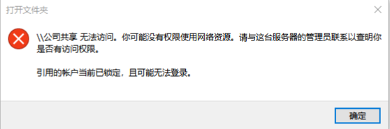
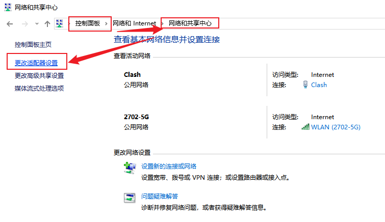
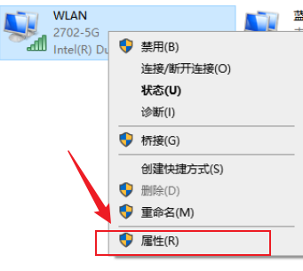
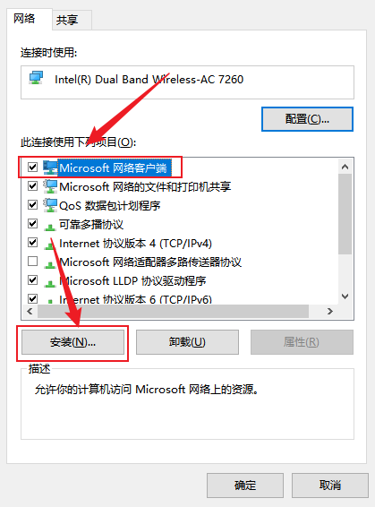
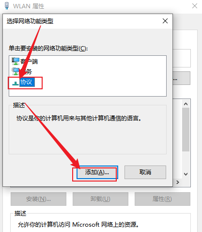
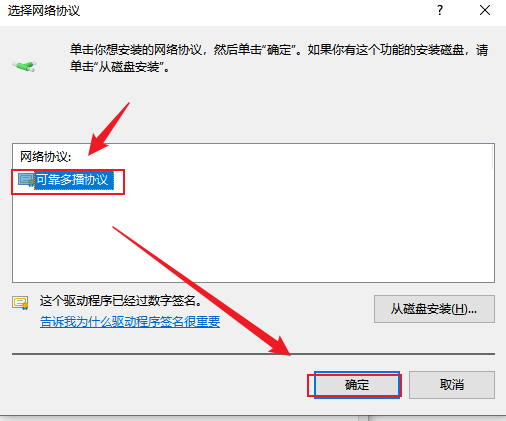
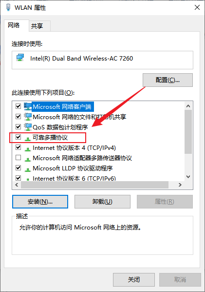
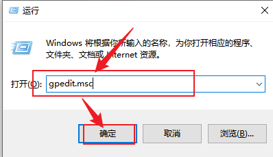
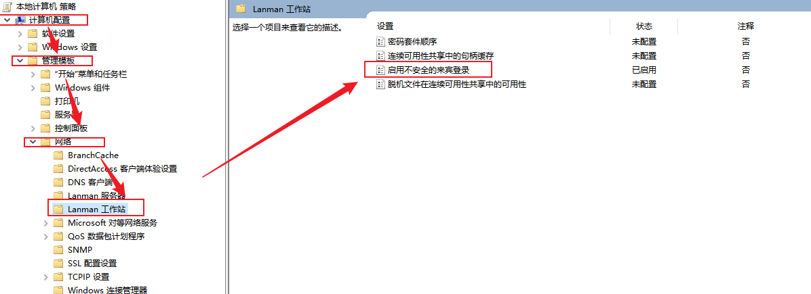
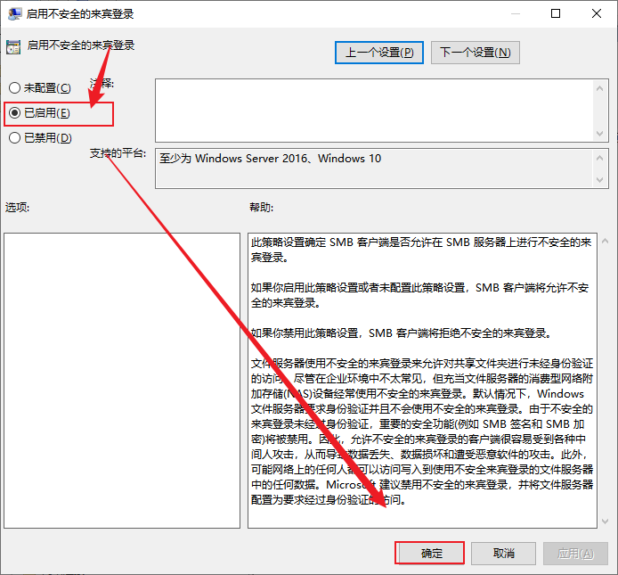

# windows 网络共享盘无法访问问题

1. 可以在网络看到局域网中的其他主机，双击连接会显示以下错误信息

# 解决

## step1. 首先确保当前网络/属性 是否安装了多播协议

> 如果显示的属性中已经有了可靠多播协议，那么就不需要执行以下的操作

1. 打开网络和共享中心

2. 右键查看当前网络连接属性

3. 为当前网络客户端安装协议

4. 选择协议并添加

5. 安装多播协议

6. 出现这个协议表示安装成功

一般到这里，就可以正常访问共享盘了

`win+r` 快捷键输出共享盘地址 `\\192.168.x.xx\`

如果输入访问还是报错 `你不能访问此共享文件夹，因为你组织的安全策略阻止未经身份验证的来宾访问`

## step2 修改组织安全策略修复 "组织的安全策略阻止未经身份验证的来宾访问"

1. `win + r` 输入 `gpedit.msc`

2. 找到“启用不安全的来宾登录”设置

3. 双击将该配置从 “未配置” 修改为 “已启用”

