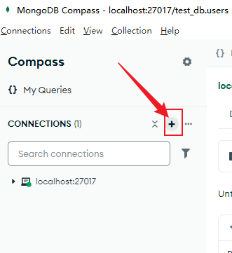
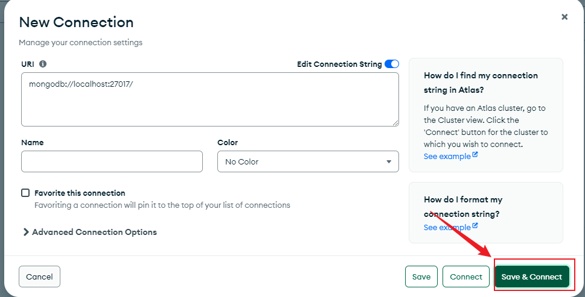
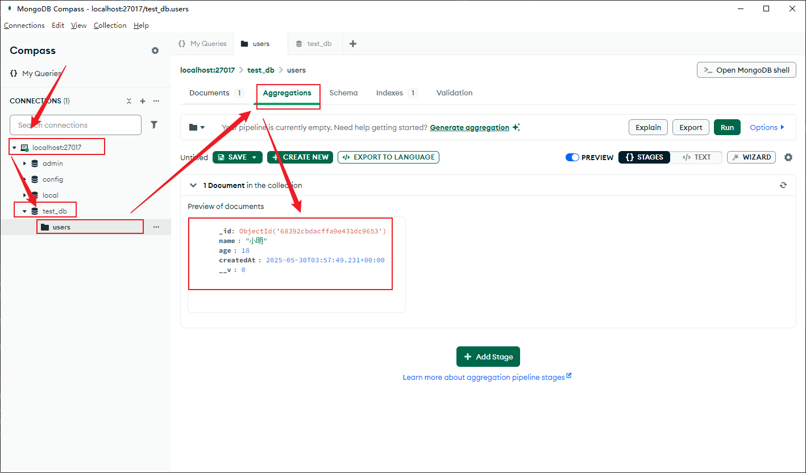
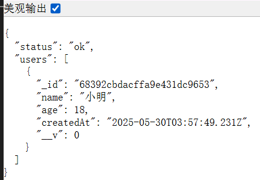
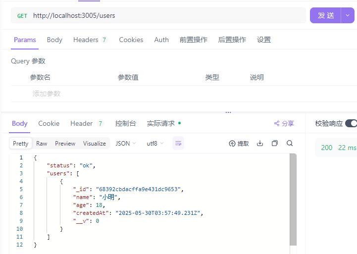
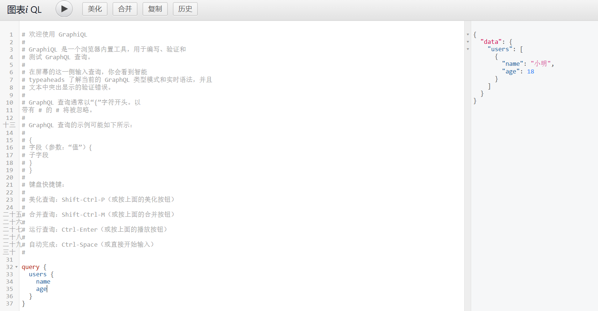
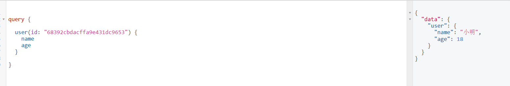
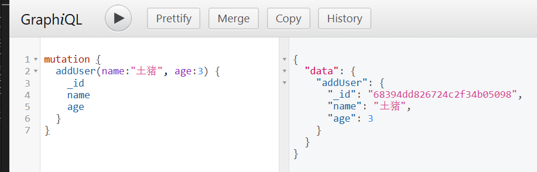
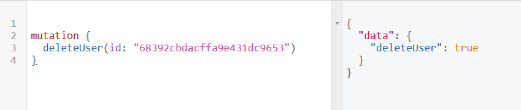

# 项目初始化

```bash
# 创建文件夹
mkdir surprise-gift-api

# 进入文件夹
cd surprise-gift-api

# 初始化依赖包
npm init -y

# 安装 express
npm install express
```

# 搭建并测试服务（直接用 json 测试）

## 创建 server.js 文件编写接口逻辑

```js
// path: /
// file: server.js

const express = require('express')
const app = express()

// 让 express 解析 json
app.use(express.json())

app.get('/ping', (req, res) => {
  res.json({ message: 'pong' })
})

app.post('/save', (req, res) => {
  const data = res.body
  console.log('收到数据', data)
  res.json({ statue: 'ok', received: data })
})

app.listen(3005, () => {
  console.log('🚀 服务已启动:http://localhost:3005')
})
```

## 启动服务

在终端中启动服务

```bash
node server.js
```

## 测试服务

### GET 请求

能看到终端输出

```arduino
🚀 服务已启动:http://localhost:3005
```

浏览器访问该网址 `http://localhost:3005/ping`，可以看到返回数据

```json
{“message”：“pong”}
```

### POST 请求

用 Postman 发 POST 请求到 /save，Body 中输入 JSON：

```json
{
  "name": "小明",
  "age": 18
}
```

返回

```json
{
  "status": "ok",
  "received": {
    "name": "小明",
    "age": 18
  }
}
```

# 连接数据库

## 安装 mongoose 依赖

```bash
npm install mongoose
```

## 新建模型文件 models/User.js

```bash
# 创建文件夹同时创建文件夹内部的文件
mkdir -p models && touch models/User.js

# 创建文件夹
mkdir models

# 进入文件夹
cd models

# 创建文件
touch User.js
```

```js
// models/User.js
const mongoose = require('mongoose')

const userSchema = new mongoose.Schema({
  name: String,
  age: Number,
  createdAt: {
    type: Date,
    default: Date.now,
  },
})

module.exports = mongoose.model('User', userSchema)
```

## 准备（软件安装）

1.  MongoDB Community Edition 本地数据库软件(安装的时候选择完整安装方式 compass 会被捆绑下载)
2.  MongoDB Compass 图形化数据库管理工具【连接本地或远程的 MongoDB 实例】





## 调整 server.js 处理 post 请求保存到数据库（创建用户）

本地用 mongodb compass 创建一个本地 cluster，默认地址就是 `mongodb://localhost:27017`

增加后缀 `mongodb://localhost:27017/test_db` 就是保存的数据库

```js
const express = require('express')

// 引入 mongoose 和创建好的模型
const mongoose = require('mongoose')
const User = require('./models/User')

// 连接数据库
mongoose.connect('mongodb://localhost:27017/test_db')

// 监听连接事件
mongoose.connection.on('connected', () => {
  console.log('✅ 已连接 MongoDB')
})

const app = express()

// 让 express 解析 json
app.use(express.json())

app.get('/ping', (req, res) => {
  res.json({ message: 'pong' })
})

app.post('/save', async (req, res) => {
  const { name, age } = req.body
  try {
    const newUser = await User.create({ name, age })
    res.json({ statue: 'ok', saved: newUser })
  } catch (err) {
    res.status(500).json({ status: 'error', messgae: err, message })
  }
})

app.listen(3005, () => {
  console.log('🚀 服务已启动:http://localhost:3005')
})
```

使用 postman 发起请求就可以看到数据库中有数据了



## server.js 中获取所有用户数据（api：获取所有用户）

```js
// 获取所有用户接口
app.get('/users', async (req, res) => {
  try {
    const users = await User.find().sort({ createdAt: -1 }) // 最新的在前
    res.json({ status: 'ok', users })
  } catch (err) {
    res.status(500).json({ status: 'error', message: err.message })
  }
})
```

- 重启服务之后，在浏览器直接访问 `http://localhost:3005/users`
- 或者用 postman 测试访问 `http://localhost:3005/users`





# 接入 GraphQL：支持前端自由选择需要的字段

- 查询语句不允许使用单引号
- 入参字段需要标明入参的字段名称

## 安装依赖

```bash
npm install express-graphql graphql
```

## server.js 中引入 GraphQL 接口

```js
// 引入 graphQL 支持前端自由选择返回字段

const { graphqlHTTP } = require('express-graphql')
const { buildSchema } = require('graphql')

// ...

const schema = buildSchema(`
    type User {
        _id:ID
        name: String
        age:Int
        createdAt: String
    }
    type Query {
        users: [User]
    }
`)

// 定义 resolvers （处理函数）
const root = {
  users: async () => {
    return await User.find().sort({ createdAt: -1 })
  },
}

app.use(
  '/graphql',
  graphqlHTTP({
    schema,
    rootValue: root,
    graphiql: true,
  })
)
```

直接在浏览器打开 `http://localhost:3005/graphql`,可以看到一个图形化的界面支持你动态去筛选需要的字段



## 创建 GraphQL 接口示范

### 查询单个用户

```diff

const schema = buildSchema(`
  type User {
    _id: ID
    name: String
    age: Int
    createdAt: String
  }

  type Query {
    users: [User]
+    user(id: ID!): User
  }
`)


const root = {
  users: async () => await User.find().sort({ createdAt: -1 }),
+  user: async ({ id }) => await User.findById(id),
}

```

#### 调试

```graphql
query {
  user(id: "68392cbdacffa9e431dc9653") {
    name
    age
  }
}
```



### 新增用户（Mutation）

1. 扩展 schema 添加 mutation 类型

```diff
const schema = buildSchema(`
    type User {
        _id:ID
        name: String
        age:Int
        createdAt: String
    }
    type Query {
        users: [User]
        user(id: ID!): User
    }

+    type Mutation {
+        addUser(name: String!, age: Int!): User
+    }
`)
```

2. 添加 addUser 处理函数

```diff

// 定义 resolvers （处理函数）
const root = {
    users: async () => await User.find().sort({ createdAt: -1 }),
    user: async ({ id }) => await User.findById(id),
+    addUser: async ({ name, age }) => {
+        const newUser = new User({ name, age })
+        return await newUser.save()
+    }
}

```

#### 调试

```graphql
mutation {
  addUser(name: "土猪", age: 3) {
    _id
    name
    age
  }
}
```



### 删除用户（Mutation）

1. 扩展 schema

```diff
const schema = buildSchema(`
    type User {
        _id:ID
        name: String
        age:Int
        createdAt: String
    }
    type Query {
        users: [User]
        user(id: ID!): User
    }

    type Mutation {
        addUser(name: String!, age: Int!): User
+        deleteUser(id: ID!): Boolean
    }
`)
```

2. 添加处理函数

```diff
const root = {
    users: async () => await User.find().sort({ createdAt: -1 }),
    user: async ({ id }) => await User.findById(id),
    addUser: async ({ name, age }) => {
        const newUser = new User({ name, age })
        return await newUser.save()
    },
+    deleteUser: async ({ id }) => {
+        const res = await User.deleteOne({ _id: id })
+        return res.deletedCount > 0
+    }
}
```

#### 调试

```graphql
mutation {
  deleteUser(id: "68392cbdacffa9e431dc9653")
}
```



### 更新用户（Mutation）

1. 扩展 schema

```diff
const schema = buildSchema(`
    type User {
        _id:ID
        name: String
        age:Int
        createdAt: String
    }
    type Query {
        users: [User]
        user(id: ID!): User
    }

    type Mutation {
        addUser(name: String!, age: Int!): User
        deleteUser(id: ID!): Boolean
+        updateUser(id: ID!, name: String, age: Int): User
    }
`)
```

2. 添加处理函数

```diff
// 定义 resolvers （处理函数）
const root = {
    users: async () => await User.find().sort({ createdAt: -1 }),
    user: async ({ id }) => await User.findById(id),
    addUser: async ({ name, age }) => {
        const newUser = new User({ name, age })
        return await newUser.save()
    },
    deleteUser: async ({ id }) => {
        const res = await User.deleteOne({ _id: id })
        return res.deletedCount > 0
    },
+    updateUser: async ({ id, name, age }) => {
+        const updated = await User.findByIdAndUpdate(
+            id,
+            { name, age },
+            { new: true }
+        )
+        return updated
+    }
}

```

#### 调试

```graphql
mutation {
  updateUser(id: "6839527aca23b0ebfdf2a239", name: "xxx", age: 45) {
    _id
    name
    age
    createdAt
  }
}
```


