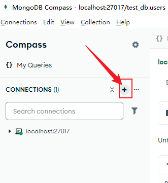
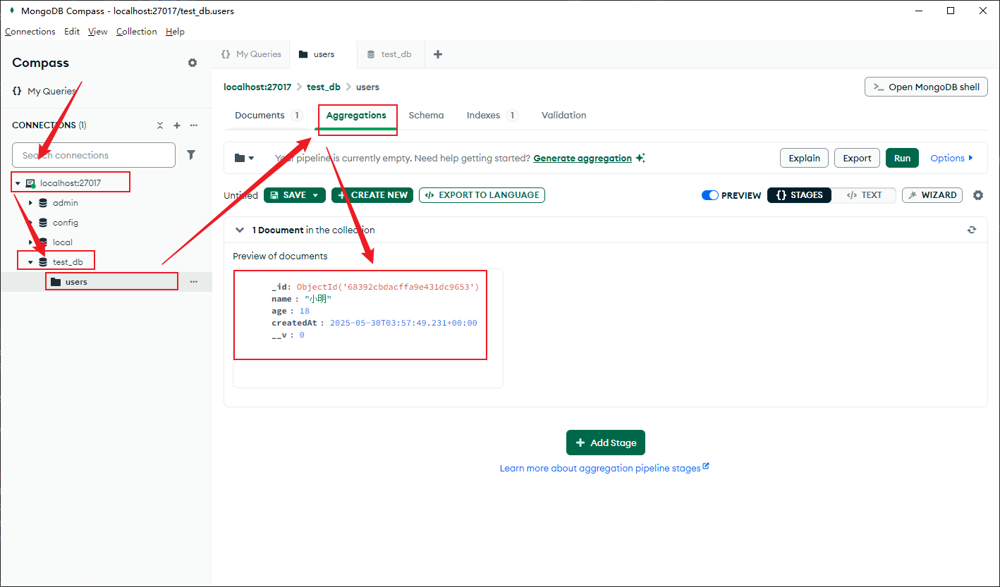
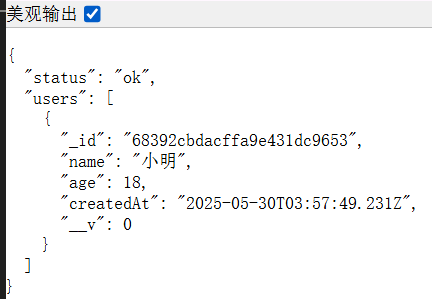
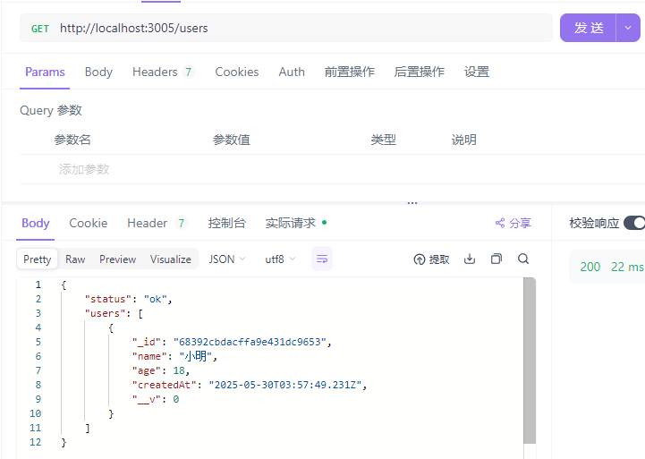
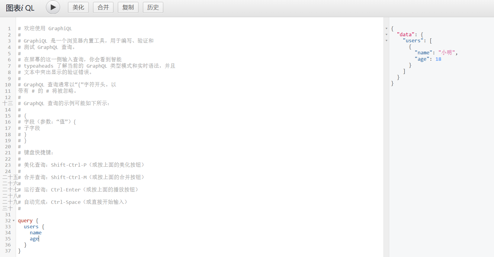
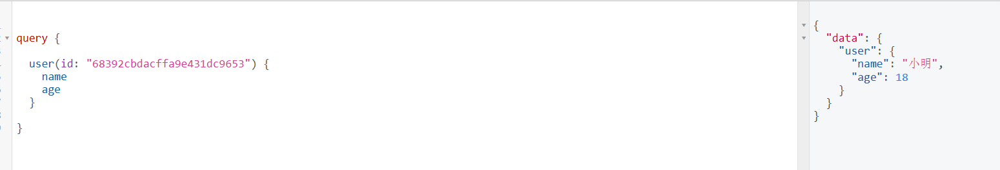
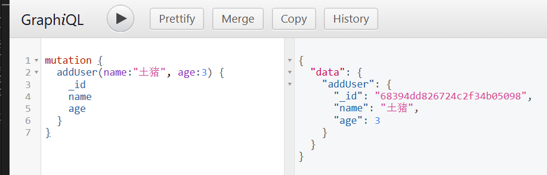
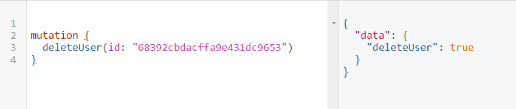
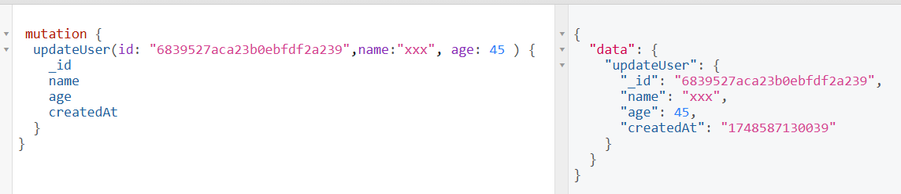

# 项目初始化

```bash
# 创建文件夹
mkdir surprise-gift-api

# 进入文件夹
cd surprise-gift-api

# 初始化依赖包
npm init -y

# 安装 express
npm install express
```

# 搭建并测试服务（直接用 json 测试）

## 创建 server.js 文件编写接口逻辑

```js
// path: /
// file: server.js

const express = require('express')
const app = express()

// 让 express 解析 json
app.use(express.json())

app.get('/ping', (req, res) => {
  res.json({ message: 'pong' })
})

app.post('/save', (req, res) => {
  const data = res.body
  console.log('收到数据', data)
  res.json({ statue: 'ok', received: data })
})

app.listen(3005, () => {
  console.log('🚀 服务已启动:http://localhost:3005')
})
```

## 启动服务

在终端中启动服务

```bash
node server.js
```

## 测试服务

### GET 请求

能看到终端输出

```arduino
🚀 服务已启动:http://localhost:3005
```

浏览器访问该网址 `http://localhost:3005/ping`，可以看到返回数据

```json
{“message”：“pong”}
```

### POST 请求

用 Postman 发 POST 请求到 /save，Body 中输入 JSON：

```json
{
  "name": "小明",
  "age": 18
}
```

返回

```json
{
  "status": "ok",
  "received": {
    "name": "小明",
    "age": 18
  }
}
```

# 连接数据库

## 安装 mongoose 依赖

```bash
npm install mongoose
```

## 新建模型文件 models/User.js

```bash
# 创建文件夹同时创建文件夹内部的文件
mkdir -p models && touch models/User.js

# 创建文件夹
mkdir models

# 进入文件夹
cd models

# 创建文件
touch User.js
```

```js
// models/User.js
const mongoose = require('mongoose')

const userSchema = new mongoose.Schema({
  name: String,
  age: Number,
  createdAt: {
    type: Date,
    default: Date.now,
  },
})

module.exports = mongoose.model('User', userSchema)
```

## 准备（软件安装）

1.  MongoDB Community Edition 本地数据库软件(安装的时候选择完整安装方式 compass 会被捆绑下载)
2.  MongoDB Compass 图形化数据库管理工具【连接本地或远程的 MongoDB 实例】




## 调整 server.js 处理 post 请求保存到数据库（创建用户）

本地用 mongodb compass 创建一个本地 cluster，默认地址就是 `mongodb://localhost:27017`

增加后缀 `mongodb://localhost:27017/test_db` 就是保存的数据库

```js
const express = require('express')

// 引入 mongoose 和创建好的模型
const mongoose = require('mongoose')
const User = require('./models/User')

// 连接数据库
mongoose.connect('mongodb://localhost:27017/test_db')

// 监听连接事件
mongoose.connection.on('connected', () => {
  console.log('✅ 已连接 MongoDB')
})

const app = express()

// 让 express 解析 json
app.use(express.json())

app.get('/ping', (req, res) => {
  res.json({ message: 'pong' })
})

app.post('/save', async (req, res) => {
  const { name, age } = req.body
  try {
    const newUser = await User.create({ name, age })
    res.json({ statue: 'ok', saved: newUser })
  } catch (err) {
    res.status(500).json({ status: 'error', messgae: err, message })
  }
})

app.listen(3005, () => {
  console.log('🚀 服务已启动:http://localhost:3005')
})
```

使用 postman 发起请求就可以看到数据库中有数据了



## server.js 中获取所有用户数据（api：获取所有用户）

```js
// 获取所有用户接口
app.get('/users', async (req, res) => {
  try {
    const users = await User.find().sort({ createdAt: -1 }) // 最新的在前
    res.json({ status: 'ok', users })
  } catch (err) {
    res.status(500).json({ status: 'error', message: err.message })
  }
})
```

- 重启服务之后，在浏览器直接访问 `http://localhost:3005/users`
- 或者用 postman 测试访问 `http://localhost:3005/users`





# 接入 GraphQL：支持前端自由选择需要的字段

- 查询语句不允许使用单引号
- 入参字段需要标明入参的字段名称

## 安装依赖

```bash
npm install express-graphql graphql
```

## server.js 中引入 GraphQL 接口

```js
// 引入 graphQL 支持前端自由选择返回字段

const { graphqlHTTP } = require('express-graphql')
const { buildSchema } = require('graphql')

// ...

const schema = buildSchema(`
    type User {
        _id:ID
        name: String
        age:Int
        createdAt: String
    }
    type Query {
        users: [User]
    }
`)

// 定义 resolvers （处理函数）
const root = {
  users: async () => {
    return await User.find().sort({ createdAt: -1 })
  },
}

app.use(
  '/graphql',
  graphqlHTTP({
    schema,
    rootValue: root,
    graphiql: true,
  })
)
```

直接在浏览器打开 `http://localhost:3005/graphql`,可以看到一个图形化的界面支持你动态去筛选需要的字段



## 创建 GraphQL 接口示范

### 查询单个用户

```diff

const schema = buildSchema(`
  type User {
    _id: ID
    name: String
    age: Int
    createdAt: String
  }

  type Query {
    users: [User]
+    user(id: ID!): User
  }
`)


const root = {
  users: async () => await User.find().sort({ createdAt: -1 }),
+  user: async ({ id }) => await User.findById(id),
}

```

#### 调试

```graphql
query {
  user(id: "68392cbdacffa9e431dc9653") {
    name
    age
  }
}
```



### 新增用户（Mutation）

1. 扩展 schema 添加 mutation 类型

```diff
const schema = buildSchema(`
    type User {
        _id:ID
        name: String
        age:Int
        createdAt: String
    }
    type Query {
        users: [User]
        user(id: ID!): User
    }

+    type Mutation {
+        addUser(name: String!, age: Int!): User
+    }
`)
```

2. 添加 addUser 处理函数

```diff

// 定义 resolvers （处理函数）
const root = {
    users: async () => await User.find().sort({ createdAt: -1 }),
    user: async ({ id }) => await User.findById(id),
+    addUser: async ({ name, age }) => {
+        const newUser = new User({ name, age })
+        return await newUser.save()
+    }
}

```

#### 调试

```graphql
mutation {
  addUser(name: "土猪", age: 3) {
    _id
    name
    age
  }
}
```



### 删除用户（Mutation）

1. 扩展 schema

```diff
const schema = buildSchema(`
    type User {
        _id:ID
        name: String
        age:Int
        createdAt: String
    }
    type Query {
        users: [User]
        user(id: ID!): User
    }

    type Mutation {
        addUser(name: String!, age: Int!): User
+        deleteUser(id: ID!): Boolean
    }
`)
```

2. 添加处理函数

```diff
const root = {
    users: async () => await User.find().sort({ createdAt: -1 }),
    user: async ({ id }) => await User.findById(id),
    addUser: async ({ name, age }) => {
        const newUser = new User({ name, age })
        return await newUser.save()
    },
+    deleteUser: async ({ id }) => {
+        const res = await User.deleteOne({ _id: id })
+        return res.deletedCount > 0
+    }
}
```

#### 调试

```graphql
mutation {
  deleteUser(id: "68392cbdacffa9e431dc9653")
}
```



### 更新用户（Mutation）

1. 扩展 schema

```diff
const schema = buildSchema(`
    type User {
        _id:ID
        name: String
        age:Int
        createdAt: String
    }
    type Query {
        users: [User]
        user(id: ID!): User
    }

    type Mutation {
        addUser(name: String!, age: Int!): User
        deleteUser(id: ID!): Boolean
+        updateUser(id: ID!, name: String, age: Int): User
    }
`)
```

2. 添加处理函数

```diff
// 定义 resolvers （处理函数）
const root = {
    users: async () => await User.find().sort({ createdAt: -1 }),
    user: async ({ id }) => await User.findById(id),
    addUser: async ({ name, age }) => {
        const newUser = new User({ name, age })
        return await newUser.save()
    },
    deleteUser: async ({ id }) => {
        const res = await User.deleteOne({ _id: id })
        return res.deletedCount > 0
    },
+    updateUser: async ({ id, name, age }) => {
+        const updated = await User.findByIdAndUpdate(
+            id,
+            { name, age },
+            { new: true }
+        )
+        return updated
+    }
}

```

#### 调试

```graphql
mutation {
  updateUser(id: "6839527aca23b0ebfdf2a239", name: "xxx", age: 45) {
    _id
    name
    age
    createdAt
  }
}
```



# 优化项目结构

```lua
surprise-gift-api/
├── graphql/
│   ├── schemas/
│   ├── resolvers/
│   └── index.js
├── routes/
│   ├── auth.js         <-- 登录接口
│   ├── upload.js       <-- 文件上传接口
│   └── ...
├── controllers/
│   └── authController.js
├── models/
├── config/
├── server.js

```

- ✅ 清晰模块分层：GraphQL 与 REST 各自为政，不冲突
- ✅ 拓展灵活：不需要为了 GraphQL 去强行改造所有功能
- ✅ 维护方便：团队成员可以专注于 GraphQL 或 REST 的逻辑，不干扰

```plaintext
          ┌───────────────┐
          │ 客户端请求     │
          │ 1. REST API   │
          │ 2. GraphQL API│
          └───────┬───────┘
                  │
          ┌───────▼────────┐
          │   Express 服务器│
          └───────┬────────┘
                  │
    ┌─────────────┴─────────────┐
    │                           │
┌───▼─────┐                ┌────▼─────┐
│ REST 路由│                │ GraphQL │
│ (/api/auth/...)           │ (/graphql)│
└───┬─────┘                └────┬─────┘
    │                           │
┌───▼────────┐            ┌─────▼───────────┐
│ 控制器函数  │            │ GraphQL schema  │
│ (authController.js)       │ + resolvers    │
└───┬────────┘            └─────┬───────────┘
    │                           │
┌───▼────────┐            ┌─────▼───────────┐
│ 数据库模型  │            │ 解析查询 + 查询DB │
│ (User.js)  │            │ 通过 mongoose 查询 │
└───┬────────┘            └─────────────────┘
    │
┌───▼─────────┐
│  返回结果    │
└─────────────┘
```

- 客户端：可以是浏览器、移动端或 Postman。

- Express 服务器：统一入口，监听请求。

- REST 路由：

  - 请求路径以 /api/auth 开头的由 routes/auth.js 负责。
  - 经过 authController.js 处理业务逻辑。
  - 通过 models/User.js 访问数据库。

- GraphQL 路由：

  - 请求路径 /graphql 由 express-graphql 处理。
  - 根据 GraphQL schema 定义的查询字段，调用对应的 resolver。
  - resolver 查询数据库，返回数据。

- 返回结果：无论 REST 还是 GraphQL，最后数据都返回给客户端。

## 依赖

```json
{
  "name": "surprise-gift-api",
  "version": "1.0.0",
  "main": "index.js",
  "scripts": {
    "test": "echo \"Error: no test specified\" && exit 1"
  },
  "keywords": [],
  "author": "",
  "license": "ISC",
  "description": "",
  "dependencies": {
    "bcrypt": "^6.0.0",
    "dotenv": "^16.5.0",
    "express": "^5.1.0",
    "express-graphql": "^0.12.0",
    "graphql": "^15.10.1",
    "graphql-date-scalars": "^0.2.0",
    "mongoose": "^8.15.1"
  }
}
```

## 结构

```lua
surprise-gift-api/
├── graphql/                <-- graphql 接口
│   ├── mutations/          <-- 定义 graphql 接口 要处理修改逻辑的方法
│   ├── schemas/          <-- 定义 graphql 接口 要返回给客户端的数据类型
│   ├── resolvers/        <-- 定义 graphql 接口 要处理查询逻辑的方法
│   └── index.js       <--综合处理 graphql 要处理的 query 和 mutation 操作
├── routes/
│   ├── auth.js         <-- 登录接口
│   ├── upload.js       <-- 文件上传接口
│   └── ...
├── controllers/
│   └── authController.js   <-- restful 接口处理函数
├── models/
│   └── User.js       <-- 定义数据库库表
├── config/
│   └── db.js       <-- 数据库连接配置
├── server.js
```

## server.js

- 顶部引入 `dotenv` 支持读取 `.env` 环境变量文件
- 引入 express 用于创建服务器监听请求
- 使用 `graphql-express` 库的 graphqlHTTP 处理 graphQL http 请求
- 统一引入 `graphql` ，自动读取 `/graphql/index.js` 中创建的 GraphQLSchema
- 引入 `config/db.js` 中定义的数据库连接函数，在 server.js 中执行该连接函数
- 连接成功之后，开启一个 express 服务，使用 `express.json()` 中间件，支持解析 json
- 若是普通的 restful 请求，直接使用 `app.use(path, routerMethods)`,设置监听路径和对应的路由处理函数即可
- graphql 统一使用 `app.use('/graphql, graphqlHTTP({schema, graphql: true}))`
- 接着直接启动服务即可

```js
require('dotenv').config()
const express = require('express')

// 引入 graphQL 支持前端自由选择返回字段
const { graphqlHTTP } = require('express-graphql')
const { buildSchema } = require('graphql')

const schema = require('./graphql')
const connectDB = require('./config/db')
const authRoutes = require('./routes/auth')

const app = express()

connectDB()

// 让 express 解析 json
app.use(express.json())

// REST 路由

app.use('/api/auth', authRoutes)

// GraphQL 路由
app.use(
  '/graphql',
  graphqlHTTP({
    schema,
    graphiql: true,
  })
)

const PORT = process.env.PORT || 4000

app.listen(PORT, () => {
  console.log(`🚀 服务已启动:http://localhost:${PORT}`)
})
```

## config/db.js

```js
const mongoose = require('mongoose')
const connectDB = async () => {
  try {
    await mongoose.connect(process.env.MONGO_URI)
    console.log('✅ MongoDB connected')
  } catch (error) {
    console.log(error.message)
    process.exit(1)
  }
}

module.exports = connectDB
```

## /graphql/resolvers/userResolver.js

```js
const User = require('../../models/User')
const { GraphQLList } = require('graphql')
const UserType = require('../schemas/userSchema')

const userResolver = {
  users: {
    type: new GraphQLList(UserType),
    resolve() {
      return User.find()
    },
  },
}

module.exports = userResolver
```

## /graphql/schemas/userSchema.js

```js
const { GraphQLObjectType, GraphQLID, GraphQLString, graphql } = require('graphql')
const { DateTimeType } = require('graphql-date-scalars')

//  用来暴露信息给客户端

const UserType = new GraphQLObjectType({
  name: 'User',
  fields: () => ({
    id: { type: GraphQLID },
    username: { type: GraphQLString },
    phone: { type: GraphQLString },
    role: { type: GraphQLString },
    loginCode: { type: GraphQLString },
    loginCodeExpires: { type: DateTimeType }, // 时间戳
    createdAt: { type: DateTimeType },
    updatedAt: { type: DateTimeType },
  }),
})

module.exports = UserType
```

## /graphql/index.js

```js
const { GraphQLObjectType, GraphQLSchema } = require('graphql')
const userResolver = require('./resolvers/userResolver')
const RootQuery = new GraphQLObjectType({
  name: 'RootQueryType',
  fields: {
    ...userResolver,
  },
})

module.exports = new GraphQLSchema({
  query: RootQuery,
})
```

## /models/User.js

```js
const mongoose = require('mongoose')

const userSchema = new mongoose.Schema(
  {
    username: {
      type: String,
      required: [true, '用户名不能为空'],
      default: () => {
        return 'user_' + Math.random().toString(36).substring(2, 8) + +Date.now()
      },
    },
    phone: {
      type: String,
      unique: true,
      required: [true, '手机号是必填项'],
    },
    password: {
      type: String,
      required: [true, '密码是必填项'],
      default: '123456',
    },
    role: {
      type: String,
      enum: ['client', 'admin'],
      default: 'client',
    },
    loginCode: String,
    loginCodeExpires: Date,
  },
  {
    timestamps: true, // ✅ 自动添加 createdAt 和 updatedAt 字段
  }
)

module.exports = mongoose.model('User', userSchema)
```
