## 整体架构图

```zsh
CSV / 外部数据
     ↓
你的 App
     ↓
1. 创建 Metaobject（结构数据）
2. 创建 Product
3. 绑定 Metafield → Metaobject
     ↓
Shopify Store
     ↓
Theme (Liquid)
读取并展示
```

## App 开发完整流程

1. 创建 app

    ```zsh
    npm create @shopify/app@latest
    ```

2. 配置权限

    ```zsh
    scopes = "write_products,read_products,write_metaobjects,read_metaobjects,write_metafields"
    ```

3. 创建 metaobject definition（表结构，只需要执行一次）

    ```ruby
    mutation {
    metaobjectDefinitionCreate(definition: {
        name: "Material",
        type: "material",
        fieldDefinitions: [
        {
            name: "Name",
            key: "name",
            type: "single_line_text_field"
        },
        {
            name: "Description",
            key: "description",
            type: "multi_line_text_field"
        }
        ]
    }) {
        metaobjectDefinition {
        id
        }
    }
    }
    ```

4. 创建 metaobject（核心数据）

    ```ruby
    mutation {
        metaobjectCreate(metaobject: {
            type: "material",
            fields: [
            { key: "name", value: "Cotton" },
            { key: "description", value: "Soft fabric" }
            ]
        }) {
            metaobject {
            id
            handle
            }
        }
    }
    ```

5. 创建 Product

    ```ruby
        mutation {
            productCreate(input: {
                title: "T-shirt",
                status: ACTIVE
            }) {
                product {
                id
                }
            }
            }
    ```

6. 将 Metaobject 捆绑到 Product 上（用 Metafield 引用 Metaobject）

    ```ruby
    mutation {
    metafieldsSet(metafields: [
        {
        ownerId: "PRODUCT_ID",
        namespace: "custom",
        key: "material",
        type: "metaobject_reference",
        value: "METAOBJECT_ID"
        }
    ]) {
        metafields {
        id
        }
    }
    }
    ```

7. 批量化：CSV -> APP -> 批量执行

    **CSV 示范**

    ```text
    title,material
    T-shirt,Cotton
    Hoodie,Wool
    ```

    **APP 逻辑**

    ```js
    for (row of csv) {

        // 1. 查找 / 创建 Metaobject
        material = findOrCreateMetaobject(row.material)

        // 2. 创建 Product
        product = createProduct(row.title)

        // 3. 绑定 metafield
        attachMetaobject(product.id, material.id)

    }
    ```

    **优化（作缓存）**

    ```js
    const cache = {
        "Cotton": metaobjectId
    }
    ```

    **主题中读取**

    ```liquid
    

    {{ material.name }}
    {{ material.description }}
    
    ```

## APP 功能

- CSV 上传
  - 上传文件
  - 解析
- Metaobject 管理
  - 自动创建
  - 去重
- 商品导入
  - 批量创建
  - 绑定 metaobject
- 日志系统
  - 成功/失败
  - 导入报告

---

进阶需求

- Bulk API（大规模）
  - 1000+ 商品用 bulkOperation
- Metaobject 预同步
  - 导入所有 Metaobject
  - 再导入商品
- Theme App Extension
  - 做 block
  - 自动显示 metaobject，不修改主题代码

## Shopify 本地开发与自动化工具需求文档

### 项目目标

构建一个基于 Shopify 的本地开发与自动化工具系统，用于：

- 主题开发（Theme Development）
- 店铺初始化（Store Setup Automation）
- 商品数据管理（Product & Metafield Automation）
- 批量修改自定义属性，减少后台手动操作

### 模块划分

#### 模块1：开发环境管理

1. 目标：快速创建和管理测试店铺
2. 功能：

    - 创建 Development Store
    - 管理多个店铺配置（token、URL）
    - 支持快速切换店铺

3. 技术要求：

    - Shopify CLI
    - Node.js 环境
    - JSON 配置管理

4. 示例配置

```json
{
  "stores": [
    {
      "name": "store1",
      "url": "xxx.myshopify.com",
      "token": "shpat_xxx"
    }
  ]
}
```

## shopify partner 创建店铺

1. 注册 Partner 账号，链接 <https://partners.shopify.com/>
2. 登录后进入后台，看到 Partner Dashboard （合作伙伴后台）
3. 左侧菜单创建店铺，Stores/Add store
4. 注意选择店铺类型为 development store
5. 表单内容
    - store name 随便写唯一即可
    - store purpose 选择 testing apps（测试应用） or Building a store（建站）都可以
    - Country/Region 建议选择美国

6. 点击 Create development store，即可自动创建并登录后台
7. 得到一个 admin.shopify.com/xxxx，可以上产品/安装插件/改主题/测试支付（测试模式）

## 主题系统开发

1. 目标： 本地开发 shopify 主题 + 实时预览
2. 功能

    - 初始化本地主题项目
    - 本地运行开发服务器
    - 实时同步修改
3. 技术栈

    - shopify cli
    - liquid + Alpine
    - git 版本管理
4. 命令行

```zsh
    shopify theme init my-theme
    cd my-theme
    shopify theme dev
```

## 店铺初始化系统

1. 目标：意见初始化新店铺，避免重复手动配置
2. 功能：

    - 自动创建 Metafield Definitions
    - 初始化产品属性结构
    - 可重复执行（幂等）
    - 多店铺复用
3. 示范 Metafield 定义 `scripts/initStore.js`

```json
{
  "product_metafields": [
    {
      "namespace": "custom",
      "key": "material",
      "type": "single_line_text_field"
    },
    {
      "namespace": "custom",
      "key": "style",
      "type": "single_line_text_field"
    }
  ]
}
```

## 商品自动化系统

1. 目标：通过 GraphQL 批量管理商品和自定义属性
2. 功能需求：
    - P0（必须实现）：
        - 批量添加 Metafields
        - 批量修改 Metafields
        - 条件筛选商品（tag / type）
    - P1（增强）：
        - 批量创建产品
        - 批量修改价格和库存
    - P2（进阶）：
        - 自动铺货（外部数据源）
        - 多店铺商品同步
3. 脚本结构

```zsh
scripts/
  initStore.js
  updateMetafields.js
  bulkProducts.js
```

## 通用能力

- 多店铺支持（配置文件管理 token 和 URL）
- 日志系统（成功/失败记录，API 错误输出）
- 限流控制（批处理或延时，避免速率限制）

## 开发阶段

1. 基础

    - 创建 Development Store
    - 安装 Shopify CLI
    - 创建 Custom App
    - 成功调用 GraphQL API

2. 核心

    - 编写 initStore.js 脚本初始化店铺
    - 批量操作 Metafields 脚本完成

3. 增强

    - 批量创建商品
    - 批量修改价格和库存

4. 高级

    - 多店铺管理
    - 自动铺货系统

## 注意事项

- API 限流：批处理请求或延时处理
- Metafield 定义必须先创建，否则后台不显示
- 数据结构规范：namespace 和 key 统一
- ownerId 必须使用 GID 格式

## 项目结构

```zsh
project/
│
├── config/
│   └── stores.json
│
├── scripts/
│   ├── initStore.js
│   ├── updateMetafields.js
│   └── bulkProducts.js
│
├── utils/
│   └── shopifyClient.js
│
├── theme/
└── package.json
```

## 开发环境

1. 安装 ruby 环境

<https://rubyinstaller.org/downloads/>

1. 安装脚手架

```zsh
npm install -g @shopify/cli @shopify/theme
```

## 实操部分

### 顺序

- 创建测试店铺
- 创建 custom app 确保 Metafield 数据
- 自定义主题

### 创建测试店铺

登录 partner 账号之后，/stores/add store 创建测试店铺

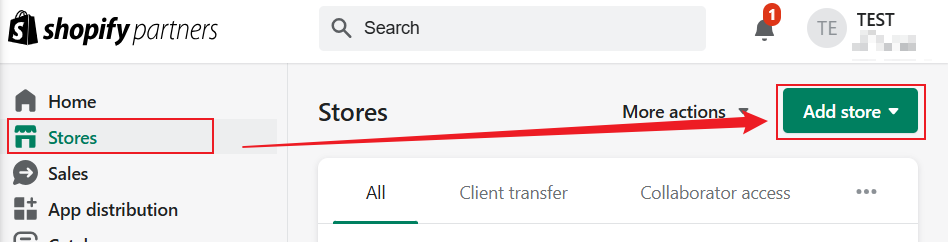
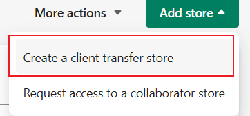
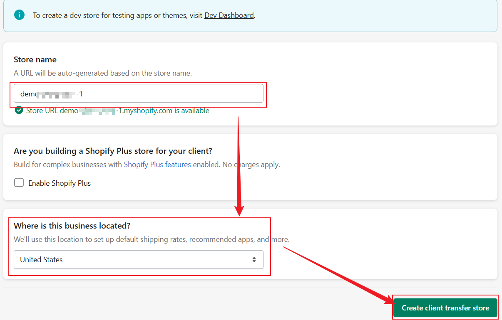

### 创建 custom app + 打通 API

shopify 后台 settings/Apps/Develop apps

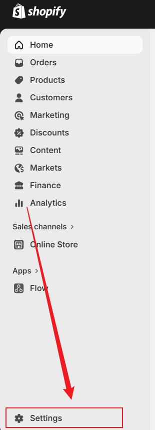

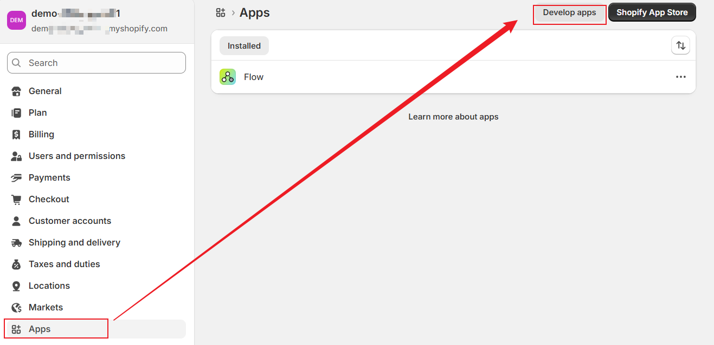

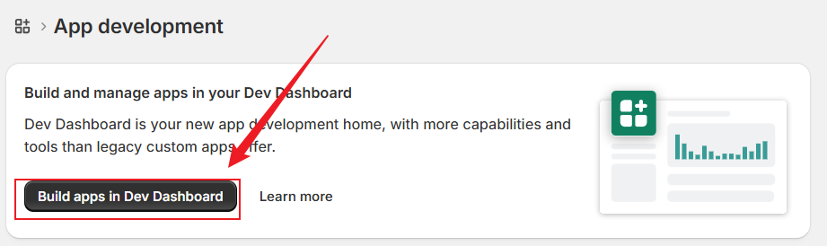

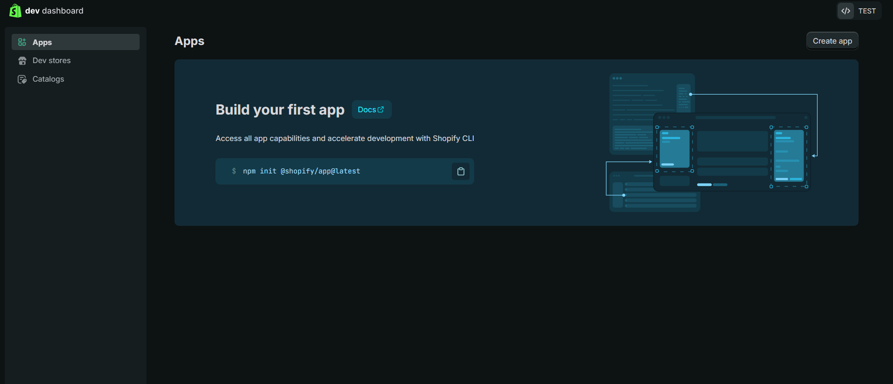

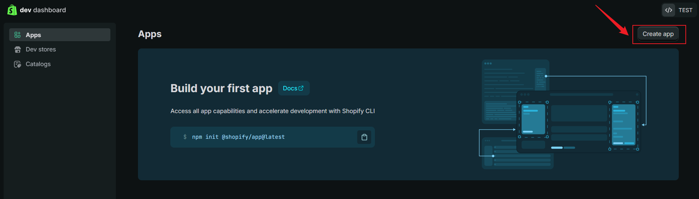

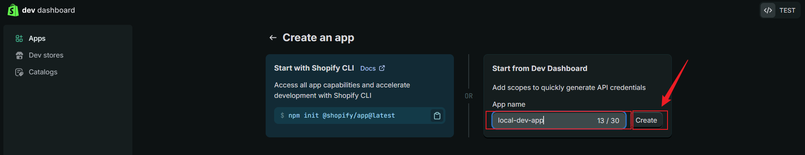

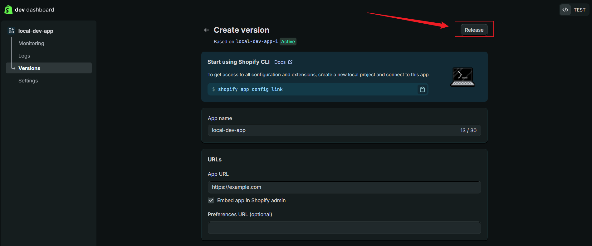

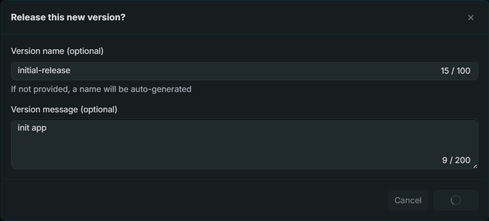

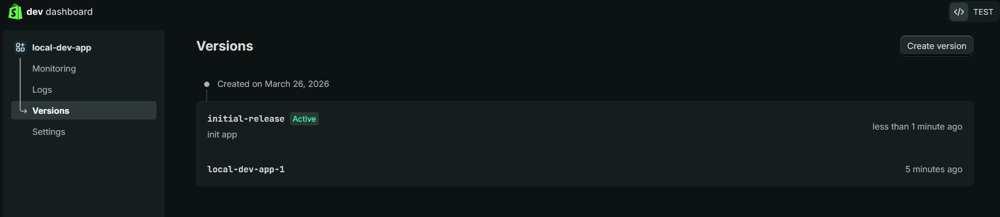

- 本地初始化项目并连接在线的app

```zsh
shopify app init --template=https://github.com/Shopify/shopify-app-template-react-router    
?  Which organization is this work for?
✔  TEST

?  Create this project as a new app on Shopify?
✔  No, connect it to an existing app

?  Which existing app is this for?
✔  local-dev-app
```

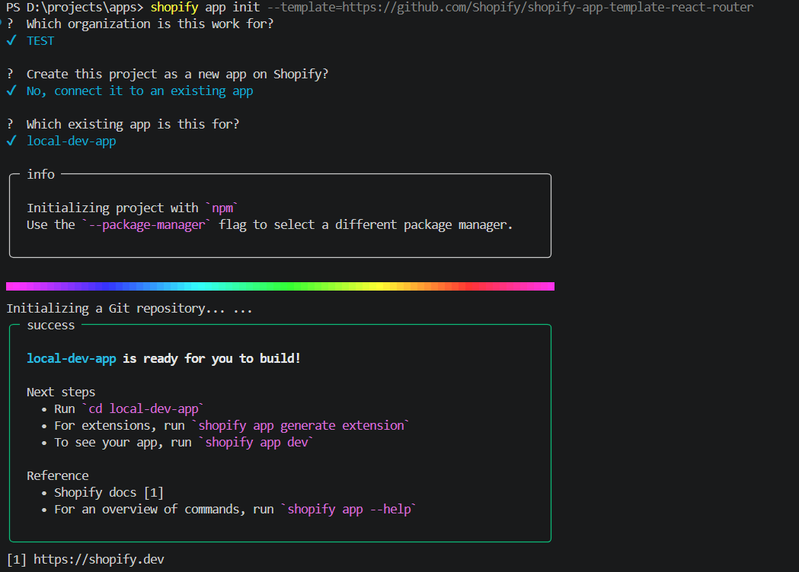

- 设置 app 的 distribution 为 custom

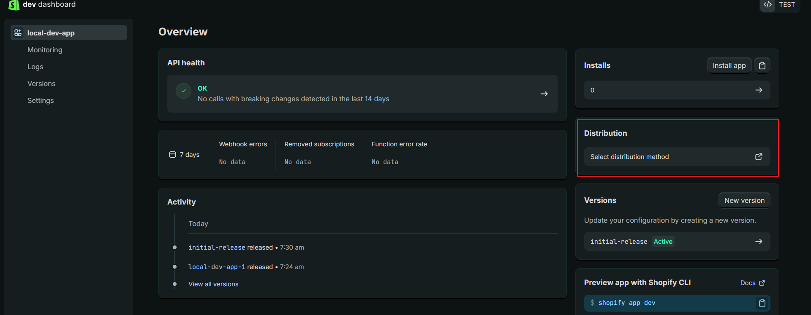

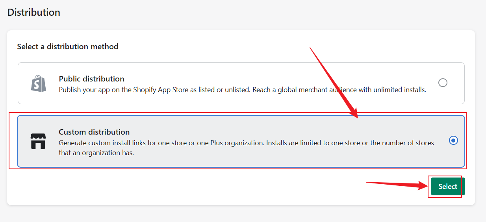

- 填写测试店铺的域名，授权店铺安装 custom app

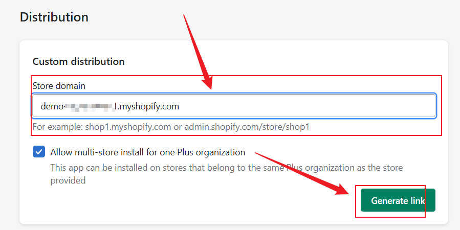

- 获取 custom app 安装链接

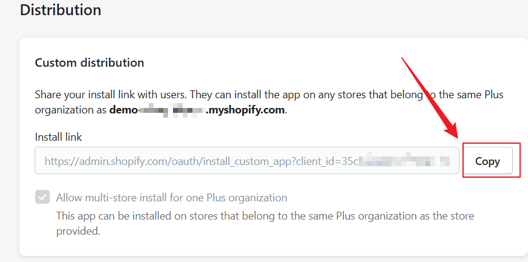

- 访问链接，安装即可

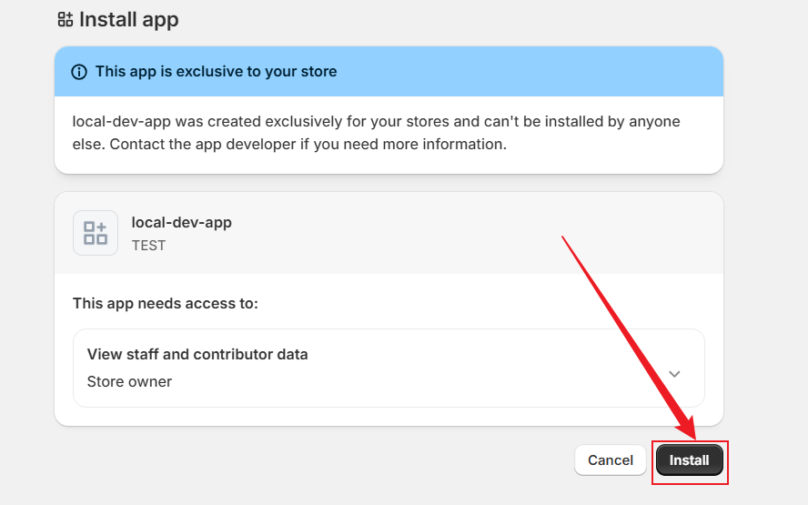

- app 同步完毕之后，创建测试店铺，安装自定义app
- 登录ngrok创建账号，获得 auth 之后，使用 ngrok 创建公共隧道

```zsh
# 安装
npm install -g ngrok

# 执行并获得一个 url，e.g. https://abc123.ngrok.io
ngrok http 3000

# 本地运行app
shopify app dev --tunnel-url=https://abc123.ngrok.io
```

## shopify 模板架构

- 后端：Node + Remix（现在叫 React Router）
- 前端：React
- 存储：Prisma（SQLite / Postgres）
- SDK：@shopify/shopify-app-react-router

项目核心入口是 `/app`

### 重点理解

1. API 调用入口 `shopify.server.ts`，授权+服务入口

    ```js
    import { authenticate } from "../shopify.server";

    const { admin } = await authenticate.admin(request);
    ```

2. 路由等于一个接口 + 页面

    ```zsh
        # 创建一个页面相当于一个接口和页面
        /app/routes/aa.xxx.tsx
    ```

3. 项目本身是前后端一体，可以在同一个文件中写 loader(GET) 和 action(POST)
