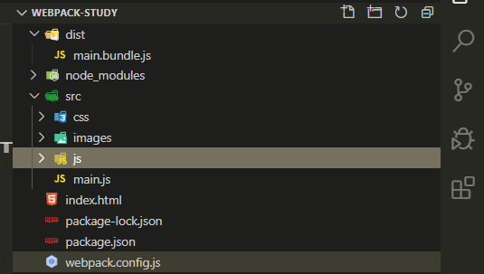
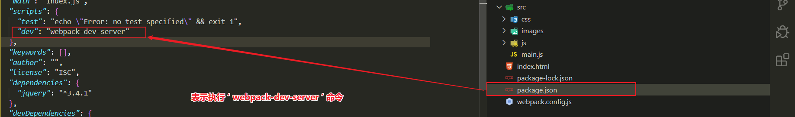
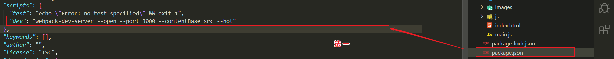
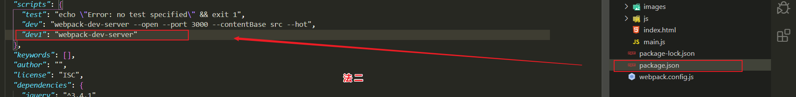
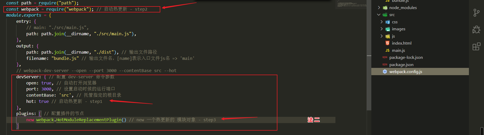
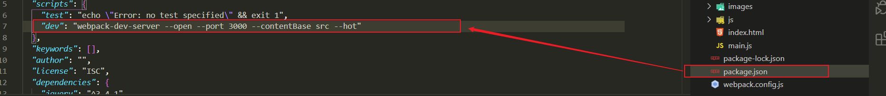

## 总览

### 安装包

运行 npm install webpack webpack-cli –D 命令，安装 webpack 相关的包

### 初始配置

在项目根目录中，创建名为 webpack.config.js 的 webpack 配置文件，并配置初始信息如下：

```js
module.exports = {
  mode: 'development', // mode 用来指定构建模式
}
```

### 设置启动脚本

在 package.json 配置文件中的 scripts 节点下，新增 dev 脚本，脚本配置如下：

```json
{
  "scripts": {
    "dev": "webpack" // script 节点下的脚本，可以通过 npm run 执行
  }
}
```

### 启动调试

在终端中执行行 `npm run dev`，启动 webpack 进行项目打包

## 配置入口与出口

:::info webpack 的 4.x 版本中默认约定：

- 打包的入口文件为 src -> index.js
- 打包的输出文件为 dist -> main.js :::

:::tip 添加一下配置可修改打包的入口及出口 \_\_dirname 是当前文件所在的目录 :::

```js
module.exports = {
  entry: path.join(__dirname, './src/index.js'), // 打包入口文件的路径
  output: {
    path: path.join(__dirname, './dist'), // 输出文件的存放路径
    filename: 'bundle.js', // 输出文件的名称
  },
}
```

## 设置自动打包

### 包安装

运行 npm install webpack-dev-server –D 命令，安装支持项目自动打包的工具

### 设置自动打包脚本

```json
"scripts": {
    "dev": "webpack-dev-server" // script 节点下的脚本，可以通过 npm run 执行
}
```

### 设置 script 脚本引用路径

将 src -> index.html 中，script 脚本的引用路径，修改为 "/buldle.js"

> 默认打包出来的文件名称为 bundle.js, 此时使用需要手动引入

### 打包调试

运行 npm run dev 命令，重新进行打包在浏览器中访问 `http://localhost:8080` 地址，查看自动打包效果

:::info webpack-dev-server 会启动一个实时打包的 http 服务器 webpack-dev-server 打包生成的输出文件，默认放到了项目根目录
中，而且是虚拟的、看不见的 :::

## webpack 是什么？

1. webpack 是 模块加载器兼打包 工具
2. 能把各种资源，例如 JS（含 JSX）、coffee、样式（含 less/sass）、图片等作为 `模块` 来使用和处理
3. 核心：`依赖分析`，把依赖分析出来了，其他都是细枝末节了

## webpack 安装的两种方式

:::tip 前提：需要先安装 `node` 和 `npm` 为了方便管理项目，最好在项目中也包含一份独立的 `webpack` :::

1. 运行 `npm i webpack -g` 全局安装 webpack，这样就能在全局使用 webpack 的命令了
2. 在项目根目录中运行 `npm i webpack --save-dev` 安装到项目依赖中

## webpack 使用

```javascript
npm init -y    // 初始化一下
npm i jquery -S // 下载jquery
在 main.js 文件中导入 jquery等依赖文件
import $ from 'jquery' // 使用 $ 变量接收 'jquery'文件（ES6）
// 终端中使用webpack命令
webpack  要打包的文件的路径   打包好的输出文件路径
```

:::tip 运行结果 :::

```bash

Hash: feae129c8a9046214e9d  -- 打包后随机生成的字符，可当做版本管理
Version: webpack 4.41.6    -- webpack 版本
Time: 379ms
Built at: 2020-02-18 6:37:08 PM
    Asset     Size  Chunks                    Chunk Names
bundle,js  279 KiB       0  [emitted]  [big]  main
Entrypoint main [big] = bundle,js
[1] ./main.js 478 bytes {0} [built]
    + 1 hidden module
```

## 配置文件(最基本使用案例)

使用`webpack.config.js`配置文件，设置 `webpack` 命令

“隔行变色”案例重点： 将 `main.js` 文件打包成 `main.bundle.js`

文件路径：



:::tip index.html :::

```html
<!DOCTYPE html>
<html lang="en">
  <head>
    <meta charset="UTF-8" />
    <meta name="viewport" content="width=device-width, initial-scale=1.0" />
    <meta http-equiv="X-UA-Compatible" content="ie=edge" />
    <title>Document</title>
    <script src="./dist/main.bundle.js"></script>
    <!-- <script src="index.js"></script> -->
    <!-- 注意：不推荐直接在这里引用任何包和任何CSS文件 -->
  </head>
  <body>
    <ul>
      <li>这是第1个li</li>
      <li>这是第2个li</li>
      <li>这是第3个li</li>
      <li>这是第4个li</li>
      <li>这是第5个li</li>
      <li>这是第6个li</li>
      <li>这是第7个li</li>
      <li>这是第8个li</li>
      <li>这是第9个li</li>
      <li>这是第10个li</li>
    </ul>
  </body>
</html>
```

:::tip main.js :::

```javascript
// 这个 main.js 是我们项目的 JS 入口文件

// 1. 导入jquery
// import *** from *** 是 ES6 中导入模块的方式
// 由于 ES6 的代码太高级了，浏览器解析不了，所以，该行执行会报错
//  导入 jquery
import $ from 'jquery' // 使用 $ 变量名接收jquery文件

$(function () {
  $('li:odd').css('backgroundColor', 'pink')
  $('li:even').css('backgroundColor', function () {
    return '#' + '#e2e22e'
  })
})
```

:::tip webpack.config.js :::

```javascript
const path = require('path')
module.exports = {
  entry: {
    main: './src/main.js',
    // path: path.join(__dirname, "./src/index.js"),
  },
  output: {
    path: path.join(__dirname, './dist'), // 输出文件路径
    filename: '[name].bundle.js', // 输出文件名，[name]表示入口文件js名 => 'main'
  },
}
```

## webpack-dev-server 实现自动打包编译

### 安装方式一：直接安装包

运行 npm i webpack-dev-server -D 把工具安装到项目的本地开发依赖

:::tip 由于只是在本项目中，本地安装的 webpack-dev-server ，因此无法把它当做脚本命令在 powershell 终端中直接运行（只有安
装到 全局 -g 的工具，才能在 终端 中正常执行）

webpack-dev-server 打包生成的 bundle.js 以虚拟形式托管到了 项目的根目录（电脑内存中而非磁盘）中虽然看不到但是，可以认为
和 dist src node_module 平级 :::



```bash
npm run dev // 在终端中执行该命令
ctrl+C  // 退出 webpack-dev-server
```



### 安装方式二：以配置文件方式保存（webpack.config.js）

1. 修改`webpack.config.js`文件，新增`devServer`节点如下：

   ```js
   devServer:{
       hot:true,
       open:true,
       port:4321
   }
   ```

2. 在头部引入`webpack`模块：

   ```js
   var webpack = require('webpack')
   ```

3. 在`plugins`节点下新增：

   ```js
   new webpack.HotModuleReplacementPlugin()
   ```

   

   

## webpack-dev-server 常用命令

- webpack-dev-server --open // 保存的时候自动打开窗口
- webpack-dev-server --host 127.0.0.1 // 配置 IP 地址
- webpack-dev-server --port 3000 // 设置端口 3000
- webpack-dev-server --open --port 3000 // 设置端口号为 3000 并自动打开
- webpack-dev-server --contentBase src // 打开目录 src
- webpack-dev-server --hot // 热处理：只更新部分修改的代码，不重新生成文件，减少损耗；同时实现页面异步更新（不刷新页面但
  修改页面内容(样式)）



## 使用 html-webpack-plugin 插件配置启动页面

由于使用 `--contentBase` 指令的过程比较繁琐，需要制定启动的目录，同时需要修改 index.html 中的 script 标签的 src 属性，因
此更加推荐使用 `html-webpack-plugin` 插件配置启动页面

1. 运行 `cnpm i html-webpack-plugin --save-dev` 安装到开发依赖
2. 修改 `webpack.condig.js` 配置文件如下

```js
// 导入处理路径的模块
var path = require('path')
// 导入自动生成 HTML 文件的插件
var htmlWebpackPlugin = reuqire('html-webpack-plugin')
module.exports = {
  entry: path.resolve(__dirname, 'src/js/main.js'), // 项目入口文件
  output: {
    // 配置输出选项
    path: path.resolve(__dirname, 'dist'), // 配置输出的路径
    filename: 'bundle.js', // 配置输出的文件名
  },
  plugins: [
    // 添加 plugins 节点配置插件
    new htmlWebpackPlugin({
      template: path.resolve(__dirname, 'src/index.html'), // 模板路径
      filename: 'index.html', //自动生成的 HTML 文件的名称
    }),
  ],
}
```

## 使用 webpack 打包 css 文件

:::tip

- webpack 默认只能打包处理 JS 类型的文件，无法处理其他的非 JS 类型的文件
- 如果要处理 非 JS 类型的文件，需要手动安装一些 合适 第三方 loader 加载器
  - 需要安装 cnpm i style-loader css-loader -D
  - webpack.config.js 配置文件，新增配置节点 module 对象，该对象的 rules 属性是一个数组，存放了所有第三方文件的匹配和处
    理规则

:::

1. 运行`cnpm i style-loader css-loader --save-dev`
2. 修改`webpack.config.js`这个配置文件：

   ```js
   module: {
     // 用来配置第三方loader模块的
     rules: [
       // 文件的匹配规则
       { test: /\.css$/, use: ['style-loader', 'css-loader'] }, //处理css文件的规则
     ]
   }
   // test => 匹配的文件类型 ; use => 要调用的loader（顺序固定，从后往前调用 ）
   ```

3. 注意：`use`表示使用哪些模块来处理`test`所匹配到的文件；`use`中相关 loader 模块的调用顺序是从后向前调用的；

## 使用 webpack 打包 less 文件

1. 运行`cnpm i less-loader less -D`
2. 修改`webpack.config.js`这个配置文件：

   ```js
   { test: /\.less$/, use: ['style-loader', 'css-loader', 'less-loader'] },
   ```

## 使用 webpack 打包 scss 文件

1. 运行`cnpm i sass-loader node-sass --save-dev`
2. 在`webpack.config.js`中添加处理 sass 文件的 loader 模块：

```js
{ test: /\.scss$/, use: ['style-loader', 'css-loader', 'sass-loader'] }
// 该loader名为： sass-loader，但是文件后缀名为：.scss
```

## 使用 webpack 处理 css 中的路径

1. 运行`cnpm i url-loader file-loader --save-dev`
2. 在`webpack.config.js`中添加处理 url 路径的 loader 模块：

   ```js
   { test: /\.(png|jpg|gif)$/, use: 'url-loader' }
   ```

3. 可以通过`limit`指定进行 base64 编码的图片大小；只有小于指定字节（byte）的图片才会进行 base64 编码：

   ```js
   { test: /\.(png|jpg|gif)$/, use: 'url-loader?limit=43960' },
   ```

## 配置 postCSS 自动添加 css 的兼容前缀

:::tip

1. 安装依赖 npm i postcss-loader autoprefixer -D

2. 项目根目录中创建配置文件 postcss.config.js，并配置一下信息

:::

```js
const autoprefixer = require('autoprefixer')
module.exports = {
    plugins: [ autoprefixer ] // 挂载插件
}
webpack.config.js 的 module -> rules 数组中，修改 css 的 loader 规则：
module: {
    rules: [
        {test: /\.css$/, use: ['stye.loader', 'css-loader', 'postcss-loader']}
    ]
}
```

:::danger 安装 postCSS 的时候报错找不到 `style-loader` ，原因是 `style-loader`全局安装，需要在本项目中安装
`cnpm install css-loader style-loader --save` :::

## 打包处理 js 文件中的高级语法

1. 安装 babel 转换器相关的包：npm i babel-loader @babel/core @babel/runtime -D
2. 安装 babel 语法插件相关的包： npm i @babel/preset-env @babel/plugin-transform-runtime
   @babel/plugin-proposal-class-properties -D
3. 在项目根目录中，创建 babel 配置文件 babel.config.js

   :::tip 始化基本配置如下 :::

   ```js
   module.exports = {
     presets: ['@babel/preset-env'],
     plugins: ['@babel/plugin-transform-runtime', '@babel/plugin-proposal-class-properties'],
   }
   ```

4. 在 webpack.config.js 的 module -> rules 数组中，添加 loader 规则 :::tip 规则如下： :::

```js
  // exclude 为排除项，表示 babel-loader 不需要处理 node_modules 中的 js 文件
    { test: /\.js$/, use: 'babel-loader', exclude: /node_modules/ }
```
