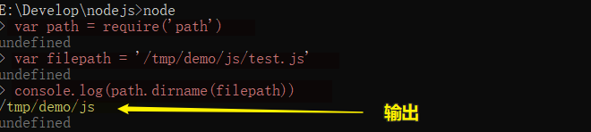
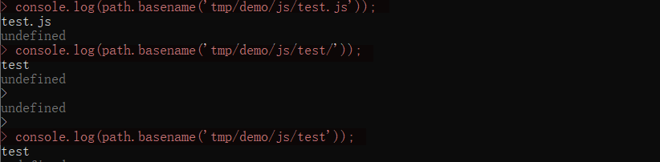
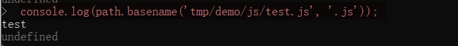
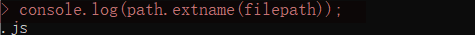
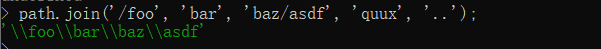

## path 模块

path 模块是 node.js 内置的 package，用来处理路径问题

## 引入模块

```javascript
const path = require('path') // 引入内置模块 path
```

## 获取规范化路径 / 路径 / 文件名 / 扩展名

```javascript
path.normalize(filepath) ------------------------------ 获取规范化路径
path.dirname(filepath)  ------------------------------ 获取路径
path.basename(filepath) ------------------------------ 获取文件名
path.extname(filepath)  ------------------------------ 获取扩展名
```

### 获取规范化路径 path.normalize()

- 规范化给定的路径，解析 '..' 和 '.' 片段
- 多个连续路径分隔符会被单个路径分隔符替代，末尾多个分隔符会被保留
- 如路径是 长度为零 的字符串，返回 '.'，表当前工作目录

```js
path.normalize('C:\\temp\\\\foo\\bar\\..\\')
// 返回: 'C:\\temp\\foo\\'
```

### 获取所在路径

:::tip

`__dirname` 是`node.js` 中的一个全局变量，用来获取`当前模块文件`所在目录的完整绝对路径

:::

```js
var path = require('path')
var filename = '/tmp/demp/js/test.js'
cosnoel.log(path.dirname(filepath))
// 输出：/tmp/demo/js
```



```js
var myPath = path.dirname(__dirname + '/test/util/helloWorld.js')
console.log(myPath)

//Users/cayley/Documents/webpack-demo/test/util
```

### 获取文件名

:::tip

严格来说，path.basename(filepath) 只是输出路径的最后一部分，并不会判断文件名

:::

```js
var path = require('path')
console.log(path.basename('tmp/demo/js/test.js')) // test.js
console.log(path.basename('tmp/demo/js/test/')) // test
console.log(path.basename('tmp/demo/js/test')) // test
```



:::info

如果不想包括文件扩展名，可使用第二个参数

:::

```js
console.log(path.basename('tmp/demo/js/test.js', '.js')) // test
```



### 获取文件扩展名

```js
var path = require('path')
var filepath = '/tmp/demo/js/test.js'
console.log(path.extname(filepath)) // .js
```



:::tip

更详细的规则是如下：（假设 path.basename(filepath) === B ）

- 从 B 的最后一个`.`开始截取，直到最后一个字符
- 如果 B 中不存在`.`，或者 B 的第一个字符就是`.`，那么返回空字符串

:::

```js
path.extname('index.html')
// returns '.html'

path.extname('index.coffee.md')
// returns '.md'

path.extname('index.')
// returns '.'

path.extname('index')
// returns ''

path.extname('.index')
// returns ''
```

## 路径组合

- path.join([...paths])

- path.resolve([...paths])

### path.join([...paths]) -- 用分隔符连接

使用特定的分隔符把连接 path 片段，并**规范化生成的路径**。 长度为零的 path 片段会被忽略。 如果连接后的路径字符串是一个长
度为零的字符串，则返回 '.'，表示当前工作目录。

```js
path.join('/foo', 'bar', 'baz/asdf', 'quux', '..')
// 输出 '/foo/bar/baz/asdf'
```



:::tip

path 定义的伪代码如下：

:::

```js
module.exports.join = function () {
  var paths = Array.prototye.slice.call(arguments, 0)
  return this.normalize(paths.join('/'))
}
```

```js
path.join('/foo', 'bar', 'baz/asdf', 'quux', '.')
//  返回 /foo/bar/baz/asdf/quux

path.join('/foo', 'bar', 'baz/asdf', 'quux', '.', 'pink')
path.join('/foo', 'bar', 'baz/asdf', 'quux', '/', 'pink')
// 返回 /foo/bar/baz/asdf/quux/pink           ----------------------- "."和"/"没什么区别
path.join('/foo', './bar', 'baz/asdf', '.', 'quux')
//  返回 /foo/bar/baz/asdf/quux

path.join('/foo', './bar', './baz/asdf', 'quux', '..')
//  返回 /foo/bar/baz/asdf

path.join('/foo', 'bar', 'baz/asdf', '.', '.')
//  返回 /foo/bar/baz/asdf

path.join('/foo', 'bar', 'baz/asdf', 'quux')
//  返回 /foo/bar/baz/asdf/quux

path.join('/foo', 'bar', 'baz/asdf', '..', '..')
//  返回 /foo/bar
```

### path.resolve([...paths]) -- 智能解析绝对路径

把一个路径或路径片段的序列解析为一个绝对路径（层级关系从左到右）

```js
// 当前工作目录与当前文件路径(F:/1/2/task6/test/dist)有区别

path.resolve();                               //  F:/1/2/task6/test 当前工作目录的绝对路径

path.resolve('./a');                          //  F:/1/2/task6/test/a

path.resolve('../a');                         //  F:/1/2/task6/a

path.resolve('.');                            //  F:/1/2/task6/test

path.resolve('..');                           //  F:/1/2/task6

path.resolve('/'));                           //  F:/

path.resolve('./a','../c/d');                 //  F:/1/2/task6/test/c/d

path.resolve('./a','./c/d');                  //  F:/1/2/task6/test/a/c/d

path.resolve('/a','../c/d');                  //  F:c/d

path.resolve('/a','./c/d');                   //  F:/a/c/d

path.resolve('./a','/b','./c/d');             //  F:/b/c/d

path.resolve('a','b','c/d');                  //  F:/1/2/task6/test/a/b/c/d

path.resolve('./a','./b','c/d');              //  F:/1/2/task6/test/a/b/c/d

path.resolve('./a','/b','c/d');               //  F:/b/c/d

path.resolve('./a/b','..','c/d');             //  F:/1/2/task6/test/a/c/d

path.resolve('./a','..','c/d');               //  F:/1/2/task6/test/c/d
```

:::tip

1. 以/开始的路径片段作为根目录，在此之前的路径将会被丢弃
2. ' . ' 返回当前工作目录的绝对路径
3. ' .. ' 返回当前工作目录上一级的绝对路径

:::

:::info

1. 路径序列从右到左处理
2. 如处理完所有 path 片段还未生成一个绝对路径，则当前工作目录会被用上
3. 生成的路径是规范化后的，且末尾的斜杠会被删除，除非路径被解析为根目录
4. 长度为零的 path 片段会被忽略
5. 没有传入 path 片段，则 path.resolve() 会返回当前工作目录的绝对路径
6. 以/开始的路径片段作为根目录，在此之前的路径将会被丢弃

:::

### 获取相对路径 path.relative(from, to)

`边界`：`from`、`to`指向同个路径，返回空字符串；若`from`或`to`任一者为空，返回当前工作路径

```js
var path = require('path')

var p1 = path.relative('/data/orandea/test/aaa', '/data/orandea/impl/bbb')
console.log(p1) // 输出 "../../impl/bbb"

var p2 = path.relative('/data/demo', '/data/demo')
console.log(p2) // 输出 ""

var p3 = path.relative('/data/demo', '')
// => 当前工作路径 'E:\Develop\nodejs'
console.log(p3) // 输出 "..\..\Develop\nodejs"
```
