## 一个完整的 Web网站 组成

- 搭建`WEB服务器`（提供网站服务的机器）
- `HTTP`（浏览器和服务端的通讯协议）
- `服务端`开发（动态网页技术）
- `数据库操作`（服务端存储数据方式）
- `AJAX`（浏览器与服务短的数据交互方式）

## 搭建 Web服务器

- `Nginx`------------------------------`反向代理`
- `Apache`----------------------------`PHP`
- `IIS`------------------------------------`ASP.NET`
- `Tomat`-------------------------------`Java`

## 安装 Apache

 在命令行中，使用管理员模式，转到Apache的安装路径下的`bin`文件夹中

```JavaScript
httpd -k install -n "<服务名称>Apache"
```

## 配置 Apache

### 卸载服务

:::tip 在命令行中，使用管理员模式，转到Apache的安装路径下的bin文件夹中
:::

```bash
httpd.exe -k uninstall -n "<服务名称>Apache"
```

### conf设置

:::tip `服务器根目录`(ServerRoot) `conf`目录下的`httpd.conf`文件
:::

```bash
Define SRVROOT "E:/Develop/Apache"
ServerRoot "${SRVROOT}"
```

### 设置主机地址

```bash
ServerName localhost
```

### 检测安装成功与否

:::tip 命令行中`bin`目录下执行
:::

```bash
https   -t # 检测是否安装成功，修改bug
```

### 启动服务

:::tip 以管理员身份使用`命令行`启动Apache服务
:::

```bash
httpd.exe -k start -n "Apache" # 启动服务
httpd.exe -k restart -n "Apache" # 重启服务
httpd.exe -k stop -n "Apache" # 停止服务
```

### 监听本机端口的使用

```bash
netstat -an
# 检查本机端口使用情况
```

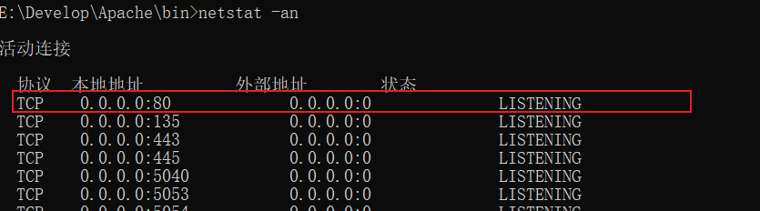

## 设置访问权限

:::tip 先禁止所有目录的访问
:::

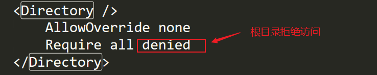

:::tip 再开放某些目录的访问权限(设置网站根目录---存放静态页面)
:::

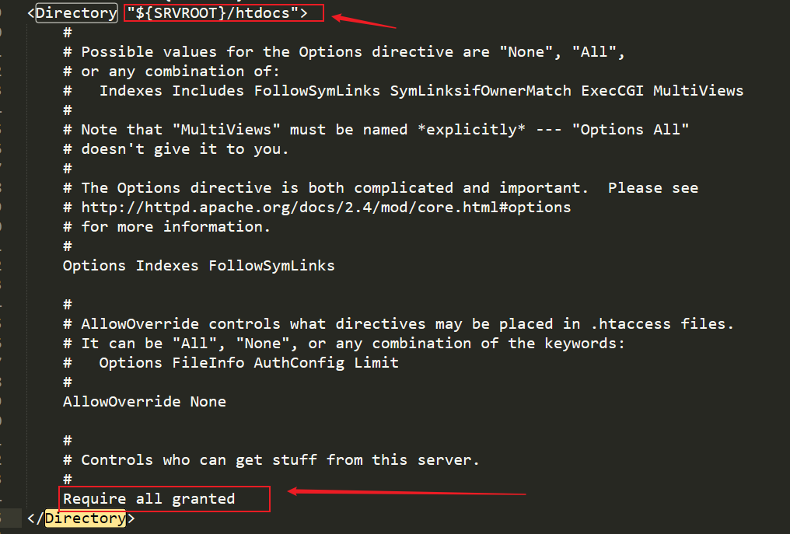

## 设置默认文档

:::tip 当客户端访问的是一个目录而非具体文件时，服务端默认返回该目录下的某个文档，即默认文档（一般为index）
:::


## 设置目录文档


:::tip 开启时
:::

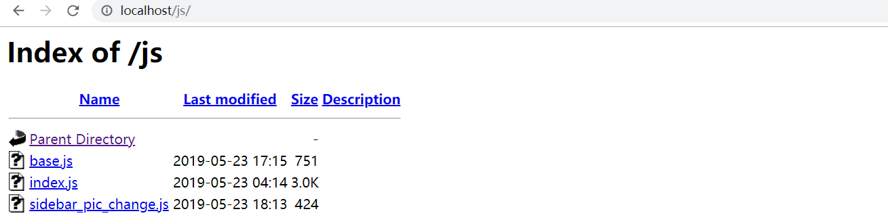

:::tip 关闭时
:::


## 配置虚拟主机

:::tip 引入配置文件
:::
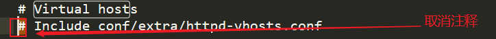
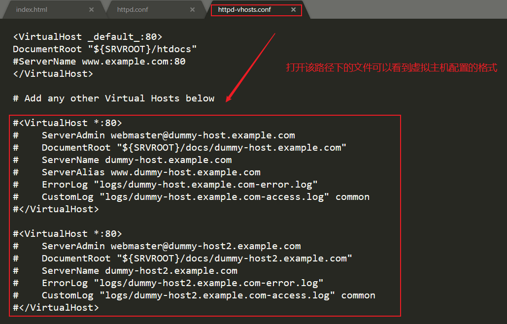
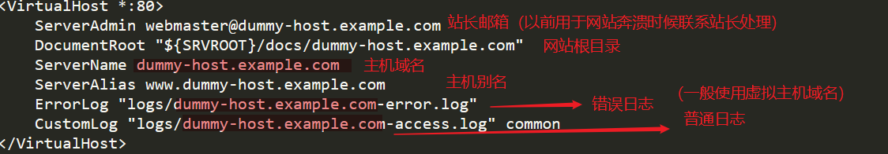
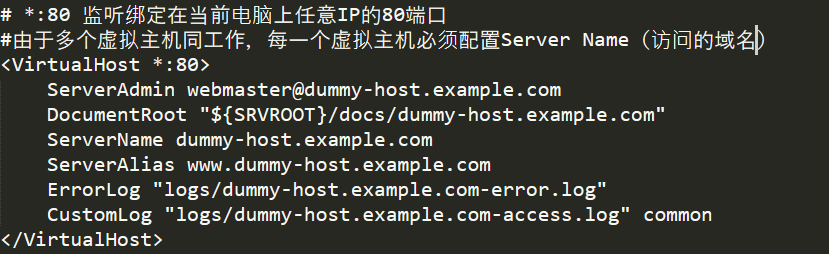

:::danger 如果使用的网站域名后缀非常奇怪，在浏览器输入的时候要写全"http://"
:::


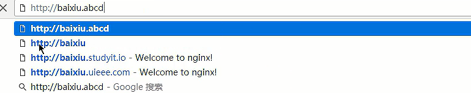

## 注意浏览器缓存

:::danger 一定要在host文件中声明域名指向

- 直接在浏览器输入之后，DNS就会有缓存,host文件中的声明就会失效
  
- 如果无法修改，右键host文件->属行->安全信息->给你的用户名赋予完全控制的权限

- 再用管理员身份运行编辑器软件打开host

:::


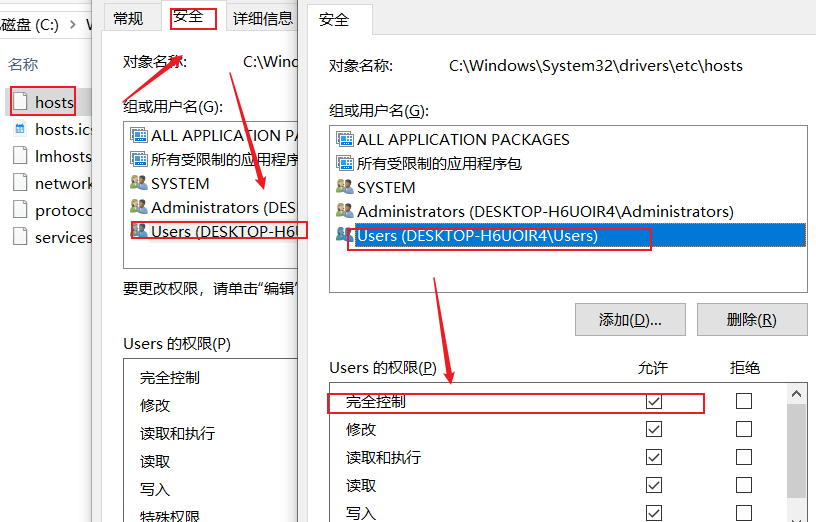

## 虚拟主机与默认主机

:::tip 虚拟主机生效之后，默认主机将自动失效
:::


## 虚拟主机的作用

:::tip 每次配置虚拟主机要配置好根目录的访问权限（SeverName要和本机host文件设置的一致）
:::
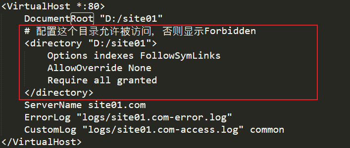/
