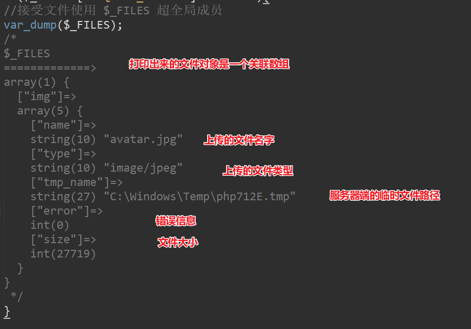

## 表单处理

收集指定用户的信息

```php+HTML
信息交互：展示信息、收集信息。
```

## 基本使用

`<form>`是HTML中专门用于提交数据的标签，通过该标签可以`收集用户输入`

一个完整的表单应包括两个部分：`表单对象`和`应用程序`

:::tip
form 标签有两个必要属性：

- action：表单提交地址（将数据交给谁）
- method：以什么形式提交表单

:::

如果希望被提交，表单元素（表单域）必须有`name`, 且表单中一定要有一个 `提交按钮`

例如，在登陆界面上收集用户输入的用户名和密码：

```html
<!DOCTYPE html>
<html lang="en">
<head>
  <meta charset="UTF-8">
  <title>Document</title>
</head>
<body>
  <form action="login.php" method="post">
    <div>
      <label for="username">username:</label>
      <input type="text" name="username" id="username">
    </div>
    <div>
      <label for="password">password:</label>
      <input type="password" name="password" id="password">
    </div>
    <div>
      <button type="submit">登录</button>
    </div>
  </form>
</body>
</html>
```

用户第一次请求得到这个表单页面，填写表单内容，点击登录，表单就会自动发送到`login.php`，接下来就是考虑如何在`login.php`中获取用户提交的数据

:::tip
PHP中有三个超全局变量专门用来获取表单提交内容
:::

- `$_GET`：获取以GET方式提交的内容
- `$_POST`：获取以POST方式提交的内容
- `$_REQUEST`：获取以GET或POST方式提交的内容

借用`$_POST`或者`$_REQUEST`就可以获取到表单提交的内容：

```php
<?php
//获取表单提及到的用户名和密码
echo '用户名' . $_REQUEST['username'];
echo '密码' . $_REQUEST['password'];
```

## 提交地址

`action`提交地址指表单填写完毕点击提交，发送请求的`请求地址`

一般都是提交给当前文件，以`便于维护`，然后在当前文件中判断是否是表单请求：

```php
if ($_SERVER['REQUEST_METHOD']==='POST') :
  echo '用户名' . $_REQUEST['username'];
  echo '密码' . $_REQUEST['password'];
endif;
```

:::tip
使用`$SERVER['PHP_SELF']`**动态获取当前页面访问路径**（避免因文件重命名/网站目录结构调整而修改代码）
:::

```HTML
    <!-- 写死action地址，当文件重命名的时候就需要修改代码 -->
   <form action="/day02/login2.php">
       <!-- ... -->
   </form>
   <!-- 通过`$_SERVER['PHP_SELF']`获取在网站中的路径，就可以轻松避免这个问题 -->
   <form action="<?php echo $_SERVER['PHP_SELF']; ?>">
       <!-- ... -->
   </form>
```

> 鲁棒性：程序应对变化的能力

## 提交方式

`method`设置表单提交的方式，常见有：`GET`和`POST`

从效果上，两者都可以将数据提交到服务端，从实现原理上，则各不相同：

- `GET`
  - 表单数据通过URL中的？参数传递到服务端
  - 可在地址中看到提交内容
  - 数据长度有限制，因为URL地址长度有限制（2000个字符）

- `POST`
  - 表单数据通过请求体传递到服务端，界面上看不到
  - 可提交任何类型的数据，包括文件
  - 由于界面上看不见，浏览器也不储存，所以更安全

:::tip
**需要结合业务场景及两种方式各自的特点，选择合适的方式使用，原则上：**

- **绝不能用GET发送密码或者其他敏感信息**
- **应清楚这次请求是去拿东西还是送东西**

:::

## 常见表单元素处理

> 对文本框文本域一类的元素，直接将`name`属性作为**键**，用户填写的信息作为`值`,发送到服务端

但是，有部分表单元素需要单独考虑：

### 单选按钮

```html
<!‐‐ 最终只会提交选中的那一项的 value ‐‐> 
<input type="radio" name="gender" value="male"> 
<input type="radio" name="gender" value="female">
```

### 复选按钮

```html
<!‐‐ 没有设置 value 的 checkbox 选中提交的 value 是 on ‐‐> 
<input type="checkbox" name="agree"> 

<!‐‐ 设置了 value 的 checkbox 选中提交的是 value 值 ‐‐> 
<input type="checkbox" name="agree" value="true"
```

如果需要提交多个选中项，可以在`name`属性后面加上`[]`：

```html
<input type="checkbox" name="funs[]" id="" value="football"> 
<input type="checkbox" name="funs[]" id="" value="basketball"> 
<input type="checkbox" name="funs[]" id="" value="world peace">
```

最终提交到服务端，通过`$_POST`接收到的是一个索引数组

### 选择框

```html
<select name="subject">   
    <!‐‐ 设置 value 提交 value ‐‐>   
    <option value="1">语文</option>   
    <!‐‐ 没有设置 value 提交 innerText ‐‐>  
    <option>数学</option>
</select>
```

### 文件域

:::tip
$_FILES超全局成员接收上传的文件
:::

- $_FILES['***']  接收到的是一个 `关联数组`
- 上传文件必须使用 method="post" ,enctype="multipart/form-data";

:::tip
enctype 默认是 urlencoded 格式 key1=value1&key2=value2
:::

- move_uploaded_file ( source_path , target_path )  ：将服务端临时文件移动到网站目录中

:::tip
is_dir('./directory') ：判断是否为目录，是==>TRUE

mkdir('./newDir') ：创建新目录
:::

```php
<?php 

function upload(){
  global $message;
  if(!isset($_FILES['avatar'])){
    //客户端提交的表单内容中根本没有文件域
    $message = "请选择需要上传的文件";
    return;
  }
  $avatar=$_FILES['avatar'];
  /*
  $avatar=====>关联数组
    array(5) {
      ["name"]=>
      string(10) "avatar.jpg"
      ["type"]=>
      string(10) "image/jpeg"
      ["tmp_name"]=>
      string(27) "C:\Windows\Temp\phpA8F2.tmp"
      ["error"]=>
      int(0)
      ["size"]=>
      int(27719)
    }
   */
  if($avatar['error']!==UPLOAD_ERR_OK){
    //服务端没有接收到上传的文件
    $message = '上传失败';
    return;
  }
  //接收到了文件
  //将文件从临时目录移动到网站范围之内
  $source=$avatar['tmp_name'];
  //=>"C:\Windows\Temp\phpA8F2.tmp"
  if(!is_dir('./uploads')){
    //目录不存在，创建目录
    mkdir('./uploads');
    return;
  }
  $target='./uploads/'.$avatar['name'];
  //=>'./uploads/avatar.jpg'
  $moved=move_uploaded_file($source, $target);
  if(!$moved){
    $message = '上传失败';
    return;
  }
  //移动成功（上传整个过程ok）
  $message = '上传成功';
}


if($_SERVER['REQUEST_METHOD']==='POST'){
//接受文件使用 $_FILES 超全局成员
  upload();

}


?>
<!DOCTYPE html>
<html lang="en">
<head>
  <meta charset="UTF-8">
  <title>Document</title>
</head>
<body>
  <!-- 如果一个表单中有文本域（文件上传），必须将表单的 method 设置为 post ，enctype 设置为 multipart/form-data -->
  <!-- enctype 默认是 urlencoded 格式 key1=value1&key2=value2 -->
  <form action="<?php echo $_SERVER['PHP_SELF']; ?>" method="post" enctype="multipart/form-data">
    <input type="file" name="avatar" id="">
    <button>上传</button>
    <?php if (isset($message)): ?>
      <p><?php echo $message; ?></p>
    <?php endif ?>
  </form>
</body>
</html>
```



### 文件上传大小

`php.ini`文件中

- upload_max_filesize = 2M
  - 允许上传的文件最大为“ 2M ” （防止服务器被攻击）

- post_max_size = 8M
  - 服务端可以接受的请求体的最大体积为”  8M “

### 注意事项

- 将表单的处理逻辑放在HTML之前，为了更灵活的控制HTML的输出
- 想要向服务端发送请求，表单元素一定要有`name`属性
- 按钮不要给`name`，否则也会也提交按钮的数据（除非界面上按钮特别多需要分清是哪个）
- 表单处理三部曲
  - 接收并校验
  - 持久化（将数据持久保存）
  - 响应 (服务端响应)
