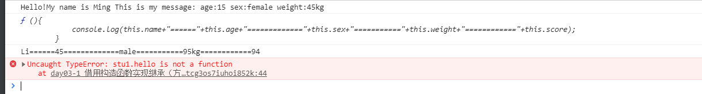
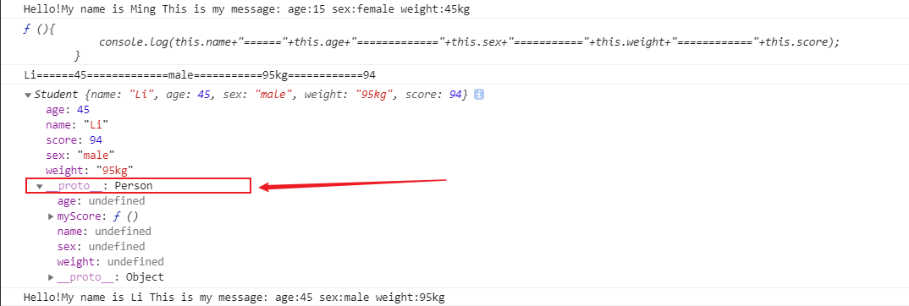
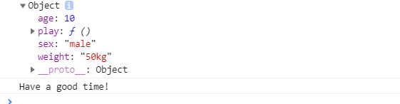

## 原型

- 构造函数中为prototype，程序员使用
- 实例对象中为__proto__，浏览器使用，不是很标准
- 实例对象中的__proto__指向该实例对象的构造函数中的prototype
- 构造函数中的prototype属性和方法，可通过实例对象调用
- 当系统内置对象的属性或者方法无法满足需求的时候，可以通过原型为内置对象添加属性或者方法

```javascript
String.prototype.ffff = function(){};
```

## 简单的原型写法

```javascript
Per.prototype={
//缺少构造器，需要手动指向构造函数
 constructor:Person
}
```

## 继承

:::tip 通过原型实现，改变原型的指向
**借用构造函数继承**的时候，不能继承方法
:::

```javascript
//自调用函数
    (function () {
        function Person(name, age, sex, weight){
            this.name = name;
            this.age = age;
            this.sex = sex;
            this.weight = weight;
        }
        Person.prototype.hello = function(){
            console.log("Hello!My name is "+this.name+" This is my message: age:"+this.age+" sex:"+this.sex+" weight:"+this.weight);
        }
        window.Person = Person;
    }());
    //test
    var per1 = new Person("Ming", 15, "female", "45kg");
    per1.hello();

    //自调用函数
    ((function(){
        
        //----START--------
        function Student(score, name, age, sex, weight){
            Person.call(this, name, age, sex, weight);//=======借用构造函数==========
            this.score = score;
        }
        //--------END-------------
        
        
        Student.prototype.myScore = function(){
            console.log(this.name+"======"+this.age+"============="+this.sex+"==========="+this.weight+"============"+this.score);
        }
        window.Student = Student;
        // Student.prototype.hello = function(){
        //     console.log("Student's hello");
        // }
    })());
    //test
    var stu1 = new Student(94,"Li",45,"male","95kg");
    console.log(stu1.myScore);//输出代码内容
    stu1.myScore();
    stu1.hello();//=========报错（该方法无法实现方法的共享）
```

:::tip 运行结果
:::



## 组合继承

> 借用构造函数继承属性，同时改变原型的指向，可以解决属性和方法的继承问题

```javascript
//自调用函数
    (function () {
        function Person(name,age,sex,weight){
            this.name=name;
            this.age=age;
            this.sex=sex;
            this.weight=weight;
        }
        Person.prototype.hello=function(){
            console.log("Hello!My name is "+this.name+" This is my message: age:"+this.age+" sex:"+this.sex+" weight:"+this.weight);
        }
        window.Person=Person;
    }());
    //test
    var per1=new Person("Ming",15,"female","45kg");
    per1.hello();

    //自调用函数
    ((function(){
        function Student(score,name,age,sex,weight){
            Person.call(this,name,age,sex,weight);//=================借用构造函数
            this.score=score;
        }
        //-------------------START---------------------
        Student.prototype=new Person();//不传值，改变原型的指向
        //-------------------end---------------------
        Student.prototype.myScore=function(){
            console.log(this.name+"======"+this.age+"============="+this.sex+"==========="+this.weight+"============"+this.score);
        }
        window.Student=Student;
    })());
    //test
    var stu1=new Student(94,"Li",45,"male","95kg");
    console.log(stu1.myScore);//输出代码内容
    stu1.myScore();
    // console.log(stu1);/////////////////==================不改变指向的时候__proto__指向Student构造函数原型
    // stu1.hello();//=========报错（该方法无法实现方法的共享）
    console.log(stu1);/////////////////==================改变指向的时候__proto__指向Person构造函数原型
    stu1.hello();//实现方法共享
```

:::tip 运行结果
:::



## 拷贝继承(直接传址，非拷贝)

:::tip 即把对象中原型的所有属性和方法使用遍历的方式复制一份给另一个对象
:::

### 方式一

```javascript
var obj1={
      name:"MIMI",
      age:20,
      sleep:function(){
          console.log("sleeping");
      }
    };
    var obj2=obj1;//栈中=====传址
    console.log(obj2.name,obj2.age);
    obj2.sleep();

```

### 方式二

```javascript
var obj1={
      name:"MIMI",
      age:20,
      sleep:function(){
          console.log("sleeping");
      }
    };
    var obj2={};//栈中=====传址
    for(var key in obj1){
        obj2[key]=obj1[key];//JS是动态类型的语言，书写键值对相当于与"."出了属性
    }
    console.log(obj2);

```

## 浅拷贝

:::tip 在堆中实现原型属性和方法的拷贝，原对象中的仍然存在部分不可拷贝的方法和属性
:::

```javascript
    ((function(){
        function Person(){

        }
        Person.prototype.age=10;
        Person.prototype.sex="male";
        Person.prototype.weight="50kg";
        Person.prototype.play=function(){
            console.log("Have a good time!");
        }
        window.Person=Person;
    })());
    var obj2={};
    for(var key in Person.prototype){
        obj2[key]=Person.prototype[key];
    }
    console.dir(obj2);
    obj2.play();

```

:::tip 运行结果
:::


