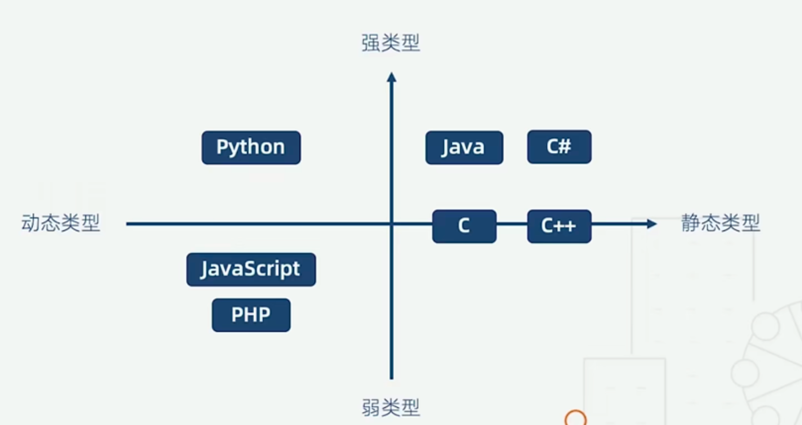

## 语言类型

### 静态类型：编译阶段确定变量类型 （C++）

1. 类型检查极度严格
2. 立即发现错误
3. 运行时性能好
4. 自文档化

### 动态类型：执行阶段确定变量类型（JS）

1. 类型检查宽松
2. bug 可能隐藏数月甚至数年
3. 运行时性能差
4. 可读性差

> 动态类型语言支持者：
>
> 性能可以改善（V8）、语言的灵活性更加重要
>
> 隐藏的错误可通过单元测试发现
>
> 文档可以通过工具生成



## TS基本使用

```zsh
## 全局安装 typescript
npm install typescript -g 

即可在全局使用 tsc 命令

## 初始化 tsconfig.json 文件
tsc --init

## 编译指定文件
tsc <path/to/your/js/file>
e.g. tsc ./src/index.js

```

### 数据类型

### ES6

1. Boolean  
2. Number
3. String
4. Array
5. Function
6. Object
7. Symbol
8. undefined
9. null

### Typescript 数据类型

在 ES6 基础上补充了

1. void
2. any
3. never
4. 元组 **限定数组个数和数组类型**
5. 枚举
6. 高级类型

### 类型注解 (变量/函数) : type

```ts
# 基础类型
let bool:boolean = true
let str: string = 'str'
let num: number = 123

# 数组
let arr: number[] = [1, 2, 3]
# 使用范型和联合类型
let arr2: Array<number | string> = [1, 2, 3, '4']

# 元组：特殊数组
let temp:[string, number] = ['1', 2] // 否则报错
temp.push(2) // 越界，可插入，但是访问不了该元素

# 函数
let add = (x: number, y: number) => x + y
let compute = (x:number, y:number) => number
let compute = (a, b)=> a + b

# 对象
let obj: {x: number, y: number} = {x:1, y:2}


# symbol 没有相同元素
let s1: symbol = Symbol()
let s2 = Symbol()
console.log(s1 === s2 || s1 == s2) // false

# 枚举
# 数字枚举
enum Roles = {
  Reporter = 1, // 默认是0，但是可指定数字，后面的元素自动递增
  Developer,
  Maintainer,
  Owner,
  Guest
}
Roles.Reporter // 1
## 字符串枚举
enum Answer = {
  N: 'failed',
  Y: 'succeed'
}
## 枚举成员
enum Char {
  a,
  b = Char.a,
  c = 1 + 2;
  d = Math.random(),
  e = '123'.length
}

# 常量枚举: 编译阶段会被移除，减少无用代码
const enum Month {
  Jan, Feb, 
}
let month = [Month.Jan, Month.Feb] // 编译时将常量枚举替换成对应的常量
```
