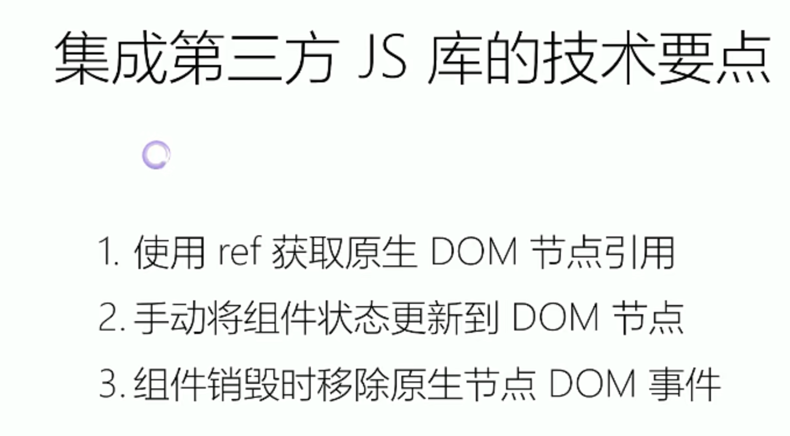

## 开发注意

1. 单一职责（每个组件只做一件事，复杂了就需要拆分）
2. DRY 原则（可计算的到不要单独存储，尽量无状态，所需数据通过 props 获得）
3. 约定：大写字母开头为自定义组件，小写 tag 是原生 DOM 节点
4. key 应该唯一，不使用随机值，使用 index 为 key 值，对性能没有优化（index 随机）
5. 执行初始化函数的时候，使用 useEffect，依赖值为该函数名，确保在函数改变的时候才会重新执行 useEffect 中的方法

## 历史背景及特性

### 历史背景

1. 传统 UI 操作关注过多细节
2. 应用状态分散，难以追踪、维护

### 特性

1. 一个新概念：**组件**
2. 4 个必须的 API
3. 单向数据流： **flux 架构**
4. 完善的错误提示

#### flux 架构（单向数据流）


## 组件方式考虑 UI 的构建方式

### React 组件（**props + state = view**）

1. 一般不提供方法，而是某种状态机
2. 可理解为纯函数（固定输入一定的到固定输出）
3. 单向数据绑定

#### React 组件：受控组件 VS 非受控组件

受控：表单状态由使用者维护（外部 props ---- 受外部控制）

非受控：表单状态 DOM 自身维护（内部 state ----- 受内部控制）

### 组件开发原则

1. 单一职责（每个组件只做一件事，复杂了就需要拆分）
2. DRY 原则（可计算的到不要单独存储，尽量无状态，所需数据通过 props 获得）
3. 约定：大写字母开头为自定义组件，小写 tag 是原生 DOM 节点

## JSX 本质是动态创建组件的语法糖

1. 声明式创建界面的直观
2. 代码动态创建界面的灵活
3. 无需学习新的模板语言

### 生命周期及使用场景

#### constructor （唯一可直接修改 state 位置）

初始化内部状态，很少使用

#### getDerivedStateFromProps（表单控件获取默认值）

当 state 需要从 props 中初始化的时候用到（不建议使用，维护 props-state 二者状态会增加复杂度）

每次 render 都会调用

#### componentDidMount（获取外部资源）

UI 渲染完成后调用，只执行一次

#### componentWillUnmount（资源释放）

组件移除的时候被调用

#### getSnapshotBeforeUpdate（获取 render 之前的 DOM 状态）

render 之前调用，state 已经更新了

#### componentDidUpdate（页面根据 props 变化重获数据）

每次 UI 更新都会调用

#### shouldComponentUpdate（性能优化）

Virtual DOM 是否会重新绘制

一般用 PureComponent 自动实现

## Virtual DOM 与 key 属性

key 的作用是 为每一个元素赋予一个确定的标识，**判断元素是新创建的还是被移动的，减少不必要的元素渲染**

1. key 值唯一
2. 不用随机值
3. 使用 index 为 key 值对性能没有优化


## 组件设计模式：高阶组件和函数组件

### 高阶组件：对业务组件的封装（一般没有自己的 UI 展现）

```tsx
const EnhancedComponent = higherOrderComponent（WrappedComponent）
// 接收组件参数，返回新的组件
```

```tsx
import React from 'react'

export default function withTimer(WrappedComponent){
  return class extends React.Component{
    state = {
      time: new Date()
      componentDidMount(){
        this.timeID = setInterval(()=> this.tick(), 1000)
      }

    componentWillUnmount(){
      clearInterval(this.timeID)
    }

    tick() {
         this.setState({
             time: new Date()
          })
      }

    render(){
         return <WrappedComponent time={this.state.time} {...this.props}>
      }
    }
  }

}
```

### 函数作为子组件（组件如何渲染，由使用者决定）----- 一种设计模式

```tsx
class MyComponent extends React.Component {
  render() {
    return (
     <div>
       {this.props.children('Nate Wang')} // 默认传递进来的是一个函数，传递值直接执行
      </div>
    )
  }
}

<MyComponent>
 {(name) => ( <div>{name}</div> )}
</MyComponent>
```

## 新的 ContextAPI 及其使用场景（共享状态，comsumer 必须包裹在 provider 中）

```tsx
const ThemeContext = React.createContext('light')

class App extends React.Component {
  render(){
    return (
     <ThemeContext.Provider value="dark">
        // 提供上下文给子组件使用
       <ThemedButton />
      </ThemeContext.Provider>
    )
  }
}


function ThemedButton(props) {
  return (
    // 消费上下文
   <ThemeContext.Consumer>
     {theme => <Button {...props} theme={theme}/>}
    </ThemeContext.Consumer>
  )
}
```

## 脚手架构建工具

**creat-react-app** 脚手架：babel + webpack config + testing + eslint

> 适合新手学习

rekit 脚手架：create-react-app + redux + react-router + less/scss + feature Oriented Architecture + Dedicated IDE

> 快速开发大型项目

**codesandbox.io** 在线编程环境

## 打包与部署

### 打包目的

1. 编译 ES6 语法特性，编译 JSX
2. 整合资源，如图片、less、sass 等
3. 优化代码体积

### 打包注意

1. 设置 nodejs 环境为 production
2. 禁止开发时专用代码，如 logger
3. 设置应用根路径 **<u>package 中的 homepage</u>**

## redux

react：state ---> dom

Redux: store ---> view

> 使组件通信更加方便

### 特性

1. Single Source of Truth 唯一状态来源
2. state + action = new state 可预测性
3. 纯函数更新 store


### 理解 Store

```tsx
const store = createStore(reducer)
## reducer 处理函数
```

store 有三个方法：

1. getState() 获取数据
2. dispatch(action) 传递
3. subscribe(listener) 监听

### 理解 Action（描述行为）

```tsx
{
   type: ADD_TODO,
    text: 'Build my first Redux app'
}
```

### 理解 Reducer(触发更新 ----- 返回一个新的 store)

```tsx
function todoApp(state = initialState, action) {
  switch(action.type) {
    case ADD_TODO:
       return Object.assign({}, state, {
          todos: [
            ...state.todos,
            {
              text: action.text,
              completed: false
            }
          ]
        })
    default:
       return state
  }
}
```


### 工具方法

#### 理解 combineReducers(方便管理多个 reducer)

将多个 reducer 整合到一个文件中统一管理

```tsx
import { combineReducers } from 'redux'
import todos from './todos'
import counter from './counter'

export default combineReducers({
  todos,
  counter
})
```

```tsx
## todos.ts
export default function todos(state: = [], action){
  switch(action.type) {
    case 'ADD_TODO':
      return state.concat([action.text])
    default:
      return state
  }
}


## counter.ts
export default function counter(state = 0, action) {
  switch(action.type) {
    case 'INCREMENT':
      return state + 1
    case 'DECREMENT':
      return state -1
    default:
      return state
  }
}
```

#### 理解 bindActionCreators(将繁复的 dispatch 封装在一个函数里调用)

```tsx
## 原本的使用逻辑
store.dispatch(plusOne()) // 每次需要触发该 action 都得写这样一句

## 进行一层封装
plusOne = bindActionCreators(plusOne, store.dispatch)

plusOne() // 此后需要调用该 action 的时候只需要执行封装好的函数即可
```

### 在 react 中使用 redux

### 实现原理（HOC）

```tsx
import { connect } from 'react-redux'

class SidePanel extends Component {
  // ...
}
function mapStatetoProps(state) {
  return {
    nextgen: state.nextgen,
    router: state.router
  }
}

function mapDispatchToProps(dispatch) {
  return {
    actions: bindActionCreators({...actions}, dispatch)
  }
}

export default connect(mapStateToProps, mapDispatchToProps)(SidePanel)
```


### 理解异步 Action、中间件（action 的设计模式）

异步 action：发送 ajax 请求


redux 中间件（middleware）：截获 action ，发出 action

**注意：**

1. 异步 action 不是特殊 action，是多个同步 action 的组合使用
2. 中间件在 dispatcher 中截获 action 做特殊处理

### 如何组织 action 和 reducer

#### 标准 redux action 导致的问题

1. 所有 action 都在一个文件里，会无限扩展
2. action、reducer 分开，实现业务逻辑的时候需要来回切换
3. 系统中有哪一些 action 不够直观

#### 新的方式：单个 action 和 reducer 放在同一文件


1. 易于开发：不用在 action 和 reducer 文件来回切换
2. 易于维护：每个 action 文件都很小，易于理解
3. 易于测试：业务逻辑只需对应一个测试文件
4. 易于理解：文件名就是 action 名

```tsx
import { COUNTER_PLUS_ONE } from './constants'

export function counterPlusOne() {
  return {
    type: COUNTER_PLUS_ONE
  }
}

export function reducer(state, action) {
  switch(acrion.type) {
    case COUNTER_PLUS_ONE:
      return {
        ...state,
        count: state.count + 1
      }
    default:
      return state
  }
}

// counterPlusOne.js
```

### 操作不可变数据 immutable data

为什么需要不可变数据？

1. 性能优化
2. 易于调试和跟踪
3. 易于推测

如何操作不可变数据

1. 原生写法：扩展符 ...、Object.assign
2. immutability-helper
3. immer（适合应用程序较小的场景）

```tsx
import update from 'immutability-helper'

const state = {
  filter:'completed',
  todos: ['Learn React']
}
const newState = update(state, { todos: { $plus: ['Learn React'] } })

-----------

import produce from 'immer'

const state = {
  filter:'completed',
  todos: ['Learn React']
}

const newState = produce(state, draftState => {
  draftState.todos.push('Learn Redux')
})
```

## React-router 路由

### 为什么需要路由？

1. 单页应用需要进行页面切换
2. 通过 URL 可定位页面
3. 更有语意的组织资源

### React Router 特性

1. 声明式路由定义
2. 动态路由
3. 三种实现方式
    - URL 路径
    - hash 路由
    - 内存路由

### 基于路由配置进行资源组织

实现业务逻辑的松耦合

易于扩展、重构和维护

路由层面实现 lazyLoad

## 选择 UI 库的考虑因素

1. 组件库是否齐全
2. 样式风格是否符合业务需求
3. API 设计是否便捷和灵活
4. 技术支持是否完善
5. 开发是否活跃

## 同构应用（SSR）


### next.js 实现同构应用

next 项目约定：

1. 页面就是 pages 目录下的一个组件（pages 目录对应路由）
2. static 映射静态文件
3. page 具有静态方法 getInitialProps

## 使用 Jest、Enzyme 等工具进行单元测试

1. react 应用很少需要访问浏览器 API
2. 虚拟 DOM 可以在 nodejs 环境运行和测试
3. redux 隔离了状态管理、纯数据层单独测试

### 单元测试涉及到的工具

1. Jest Facebook 开源的 JS 单元测试框架
2. JS DOM 浏览器环境的 NodeJS 模拟
3. Enzyme react 组件渲染和测试
4. nock 模拟 HTTP 请求
5. sinon 函数模拟和调用跟踪
6. istanbul 单元测试覆盖率

## 常用开发调试工具

1. eslint（airbnb）
2. prettier 代码格式化，保持风格一致
3. React Dev Tool
4. Redux Dev Tool

## 前端项目的理想架构

1. 可维护
2. 可扩展
3. 可测试
4. 易开发
5. 易构建

## 拆分复杂度

### 按照领域模型（feature）组织代码

<u>将**业务逻辑**拆分成**高内聚松耦合**的模块</u>

1. 初期：规模小、模块关系清晰
2. 发展：逐渐复杂，添加了很多组件
3. 收尾：文件结构、模块依赖错综复杂


### 如何组织 component、action、reducer

1. 按照 feature 组织源文件
2. 组件和样式文件同一级
3. redux 单独文件夹
4. 单元测试保持同样的目录结构放在 test 文件夹中


### 如何组织 react router 的路由配置

建议：使用 JSON 定义顶层路由


## rekit 构建项目

### 安装依赖

```zsh
npm install -g rekit  ## Install Rekit CLI
npm install -g rekit-studio  ## Install Rekit Studio
```

### 创建项目

```zsh
rekit create <app-name> [--sass]
## 默认是 less

cd app-name
npm install

## 启动项目
rekit-studio -p 3040
```

### Table 实践



